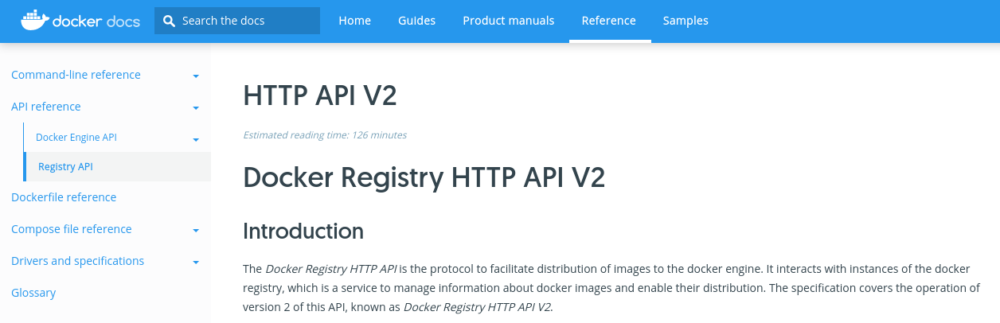
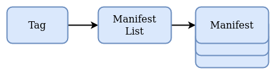
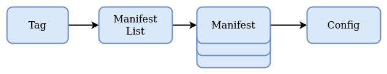
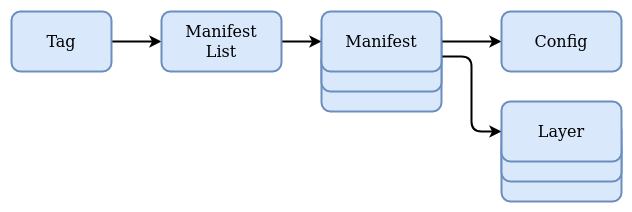
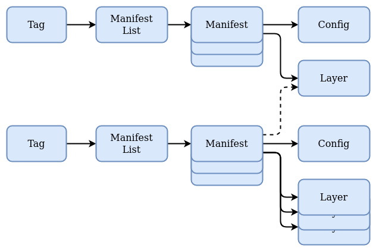

name: empty
layout: true
---
name: base
layout: true
template: empty
background-image: none
<div class="slide-footer">@sudo_bmitch</div>
---
name: ttitle
layout: true
template: empty
class: center, middle
background-image: url(img/containers_bg.png)
background-size: cover
---
name: inverse
layout: true
template: base
class: center, middle, inverse
background-image: none
---
name: impact
layout: true
template: base
class: center, middle, impact
background-image: url(img/containers_bg.png)
background-size: cover
---
name: picture
layout: true
template: base
class: center, middle
background-image: none
---
name: terminal
layout: true
template: base
class: center, middle, terminal
background-image: none
---
name: default
layout: true
template: base
background-image: url(img/containers_bg.png)
background-size: cover
---
layout: false
template: default
name: agenda

# Agenda

.left-column[
- [High Level](#high-level)
- [Image Inspect](#image-inspect)
- [Dockerfile](#dockerfile)
- [Registry API](#registry-api)
]
.right-column[
- [Manifest](#manifest) - [Demo](#manifest-demo)
- [Config](#config) - [Demo](#config-demo)
- [Layers](#layers) - [Demo](#layers-demo)
- [Recap](#recap)
]

---
layout: false
name: ttitle
template: ttitle

# Understanding the Design of Docker Images

.left-column[
.pic-circle-70[]
]
.right-column[.v-align-mid[.no-bullets[
<br>
- Brandon Mitchell
- Twitter: @sudo_bmitch
- GitHub: sudo-bmitch
]]]
???
- My twitter and github handles are what any self respecting sysadmin does
  when you get a permission denied error on your favorite username.
- This presentation is on github and I'll have a link to it at the end,
  I'll be going fast so don't panic if you miss a slide.
---
template: default

```no-highlight
$ whoami
- Solutions Architect @ BoxBoat
- Docker Captain
- Frequenter of StackOverflow
```

.align-center[
.pic-30[]
.pic-30[]
.pic-30[]
]

???

- My background is:
  - as a solutions architect for BoxBoat
  - also a Docker Captain
  - and you'll often find me answering questions on SO

---

name: high-level
class: default

# What's a Docker Image?

- Definition used to create a container
- Image is to a Container as Class is to an Object
- Filesystem and Metadata
- Filesystem is packaged as Layers
- Metadata contains defaults for containers

???

- Those that have worked with docker probably know images are used to create containers
- For developers: Image to Container as Class to Object
- Contains two parts:
  - Filesystem layers
  - Metadata that defines defaults for running containers

---

name: image-inspect
class: small

# Image Inspect

```no-highlight
$ docker image inspect nginx:latest
[
    {
        "Id": "sha256:35c43ace9216212c0f0e546a65eec93fa9fc8e96b25880ee222b7ed2ca1d2151",
        "RepoTags": [
            "nginx:latest"
        ],
        "RepoDigests": [
            "nginx@sha256:f3693fe50d5b1df1ecd315d54813a77afd56b0245a404055a946574deb6b34fc"
        ],
        "Architecture": "amd64",
        "Os": "linux",
        "Created": "2021-02-17T19:20:26.056161789Z",
        "Container": "51caab8ab3beefe704d8b6fbe7653b2c7df216cd44787aca26bc5c6a2e2e9414",
        "ContainerConfig": {
            "Hostname": "51caab8ab3be",
            "Domainname": "",
            "User": "",
...
```

???

- Inspecting the image shows various digests
- Includes the registry digest
- This output has been trimmed for space
- There's also the architecture/OS that I moved up from below

---

class: small

# Image Inspect

```no-highlight
        "Config": {
            "User": "",
            "ExposedPorts": {
                "80/tcp": {}
            },
            "Env": [
                "PATH=/usr/local/sbin:/usr/local/bin:/usr/sbin:/usr/bin:/sbin:/bin",
                "NGINX_VERSION=1.19.7",
                "NJS_VERSION=0.5.1",
                "PKG_RELEASE=1~buster"
            ],
            "Cmd": [
                "nginx",
                "-g",
                "daemon off;"
            ],
            "Volumes": null,
            "WorkingDir": "",
            "Entrypoint": [
                "/docker-entrypoint.sh"
            ],
        },
```
???

- Continuing through the inspect
- Exposed ports, environment variables, entrypoint/cmd
- All of these should look familiar if you build with a Dockerfile

---

class: small

# Image Inspect

```no-highlight
        "GraphDriver": {
            "Data": {
                "LowerDir": "/home/docker/overlay2/3e6b61bb8630114472d0e3a97d1685452731f194ea74bf77cdf4f8ad45e461d8/diff:/home/docker/overlay2/06510dab05b500c0460540beabc5465597cf63a3adaff143d271bf1326dd6748/diff:/home/docker/overlay2/727e72df9625c88c9b1d4e4d54249b16162b86171306bc5f5f768d321751c562/diff:/home/docker/overlay2/6377d181d15af6a8d71d5488c2cede728c6b3c25f0061a28365a7e18cae67691/diff:/home/docker/overlay2/277cad565215e63254896827c2d9e04f58309d04c9f845de72f79d3f8a0e7dd6/diff",
                "MergedDir": "/home/docker/overlay2/0f31e0d639be30f014498cc125e979fe9a9ed6a953bfce092c6ea9d0c0ce106a/merged",
                "UpperDir": "/home/docker/overlay2/0f31e0d639be30f014498cc125e979fe9a9ed6a953bfce092c6ea9d0c0ce106a/diff",
                "WorkDir": "/home/docker/overlay2/0f31e0d639be30f014498cc125e979fe9a9ed6a953bfce092c6ea9d0c0ce106a/work"
            },
            "Name": "overlay2"
        },
        "RootFS": {
            "Type": "layers",
            "Layers": [
                "sha256:9eb82f04c782ef3f5ca25911e60d75e441ce0fe82e49f0dbf02c81a3161d1300",
                "sha256:ffd3d6313c9b2905d7cbb9011d8a4fbb0b67d6f334a194ab2f70cf0894b7f4f7",
                "sha256:9b23c8e1e6f9c47ceb8dc619d7f63d659369dedf159e0f9735478c0e41febcc6",
                "sha256:0f804d36244da89e06210c5424c217c9ad838ce91300de213fc25d10fce53c6a",
                "sha256:9f65d1d4c869b7f2910d4c30bb2eade88975529b363089b5a27821fd4c3ff1c7",
                "sha256:2acf82036f3853e985033bab258dabbeed795a98198263fc6a327ca4d1744f0d"
            ]
        },
```
???

- Near the end of the inspect we see some internals of the overlay2 driver
- Followed by some rootfs layers, these are the so called layers of a filesystem

---

name: dockerfile
class: small

# Dockerfile

```no-highlight
FROM debian:buster-slim

LABEL maintainer="NGINX Docker Maintainers <docker-maint@nginx.com>"
ENV NGINX_VERSION   1.19.7
ENV NJS_VERSION     0.5.1
ENV PKG_RELEASE     1~buster

RUN set -x \
    ...

COPY docker-entrypoint.sh /
COPY 10-listen-on-ipv6-by-default.sh /docker-entrypoint.d
COPY 20-envsubst-on-templates.sh /docker-entrypoint.d
COPY 30-tune-worker-processes.sh /docker-entrypoint.d

ENTRYPOINT ["/docker-entrypoint.sh"]
EXPOSE 80
STOPSIGNAL SIGQUIT
CMD ["nginx", "-g", "daemon off;"]
```

???

- We can see many pieces in common from the Dockerfile to the resulting image
- The ENV is in there, along with ENTRYPOINT/CMD, exposed port, etc
  - Each of those steps just modifies the image config
- The RUN and COPY commands each add a layer, plus any layers in the base image
  - 4 copy commands, 1 run, and 1 layer from the base image = 6 layers

---

name: registry-api

# Registries

- Images are designed to be portable
- Registry API defines shipping images
- Manifests, Blobs, Digests

.pic[]

???

- To dig deeper, lets look at how we ship images, using the Registry API
- This is documented on Docker's website, OCI also has some specs on this
- Fundamentally it gets to understanding terms like manifests, blobs, and digests

---

# Definitions

|   |   |
|---|---|
| Reference: | `my-registry-server.com/project-x/image-y:tag-z` |
| Registry: | `my-registry-server.com` |
| Repository: | `my-registry-server.com/project-x/image-y` |
| Tag: | `tag-z` |

???

- First a few definitions
- Reference is a unique name for an image
  - If it doesn't have a registry, we assume Docker Hub
  - If it doesn't have a tag, we assume `latest`
- Registry is a server hosting docker images, specialized artifact server
- Repository is a path on that server
  - I include the registry in the value to disambiguate from Docker Hub
- Tag is a mutable pointer within a repository to a specific image

---

name: manifest
class: center

# Manifest

.pic-80[]

???

- Lets start the dive into the registry side by looking at manifests
- The manifest is the top level object in the registry that represents our image
- A tag can point to a manifest, but the manifest itself is represented by a sha digest
- We can also have manifest lists that point to multiple platform specific manifests

---

template: terminal
name: manifest-demo
class: center

<asciinema-player src="demo-1-manifest.cast" cols=100 rows=26 preload=true font-size=16></asciinema-player>

???

- Lets look at a manifest, the `regctl` tool is something I've been working on to access registries
- That manifest list is hard to read, raw json, lets make it pretty with `jq`
- We see this is a manifest list, lets pull a single digest for linux/amd64
- From that we see a few points to other digests, one for a config digest, and an array of layers
- The config digest has a media type that indicates it's json, the others tar+gzip
- And if we send that raw manifest through a sha256sum command, we get the same value as the digest
- When you see a registry digest for an image, it's this digest on a manifest or manifest list

---

name: config
class: center

# Config

.pic-80[]

???

- So lets extend the picture a bit, now we have a config json blob that we want to look at

---

template: terminal
name: config-demo
class: center

<asciinema-player src="demo-2-config.cast" cols=100 rows=26 preload=true font-size=16></asciinema-player>

???

- I'm going to extract that config digest using `jq`
- And to pull the config itself, we need to use the registry blob API calls, in this regctl command that's the `layer pull` command
- What we see are the same details we saw in the image inspect, config settings, there's also some image history, and we see the rootfs layers again
- As a reminder, here's the image inspect, and I can also show the history

---

name: layers
class: center

# Layers

.pic-80[]

???

- In that manifest, we also had a bunch of layers for the filesystem
- Each layer was a tar+gzip according to the media type

---

template: terminal
name: layers-demo
class: center

<asciinema-player src="demo-3-layers.cast" cols=100 rows=26 preload=true font-size=16></asciinema-player>

???

- So I'm going to use jq this time to extract the first layer digest
- And just to verify, if we pull that layer and process it with sha256sum, we see the same digest
- But let me show you something that confuses a lot of people
  - What if I compute the digest on the uncompressed layer
  - Now lets look at the rootfs layers in the config object, these are the same you see in the image inspect
  - When we pull a layer locally, it gets uncompressed, and we have a different digest
- Next lets look at what's in this tar file
  - This is a bunch of directories and files
  - From the looks of it, this is debian
- From our Dockerfile, we were using debian:buster-slim, lets look at that manifest
  - It actually has a manifest list, but regctl is doing the platform resolution for us
  - And now we see the digest is identical, it's the exact same layer
  - Despite pulling it from a different repo, on the registry and docker filesystem, we only store that once

---

class: center

# Shared Layers

.pic-80[]

???

- Our final picture gets a bit harder to draw
- We have multiple images (debian and nginx), each with manifest lists
- And each manifest within those lists has a config and set of layers
- And some of those layers may point to the same digest that was in another repository

---

name: recap

# Recap

- Understanding layers can help you build better images
- Possibility to manage images directly on the registry
- `regctl` comes from my `regclient` project: [github.com/regclient](https://github.com/regclient/regclient)

???

- By understanding how to inspect these layers, you know how to debug what is inside the layer, to understand why it changes or suddenly grows
- Hopefully you can now map a Dockerfile steps directly to what's a layer and what's a config change
- Working with images directly on a registry unlocks lots of opportunity:
  - Copy images without a docker engine
  - Work with multi-platform images (docker engine only pulls single platforms)
  - Retagging images doesn't require copying any layers
- The `regclient` project is something I've been working on, but there are similar tools out there like `reg` and `skopeo`

---

template: title
name: thanks

# Thank You

.no-bullets[
- github.com/sudo-bmitch/presentations
]

.content[
.left-column[
.pic-80[]
]
.right-column[.align-right[.no-bullets[
<br>
- Brandon Mitchell
- Twitter: @sudo_bmitch
- GitHub: sudo-bmitch
]]]
]

???

- These slides are available online in my git repo, the link is there and the QR code will take you there too
- If you are watching live, drop any questions in the chat
- If you are watching the recording, feel free to tag me on twitter, or open an issue in `regclient`
