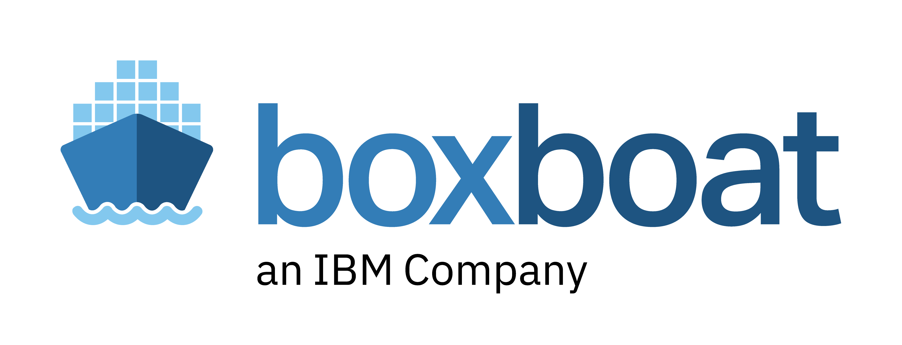
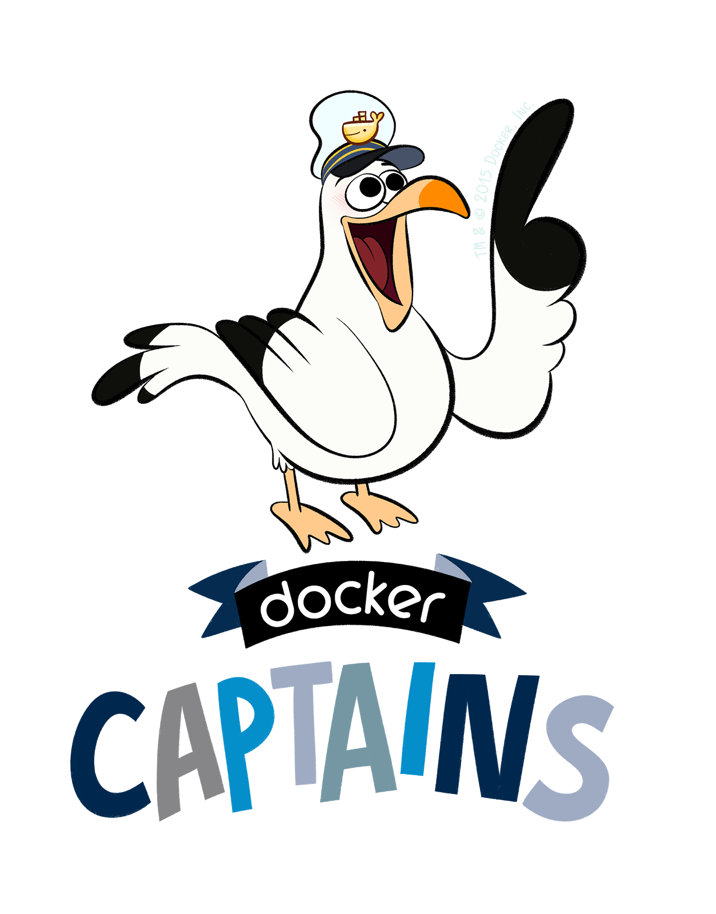
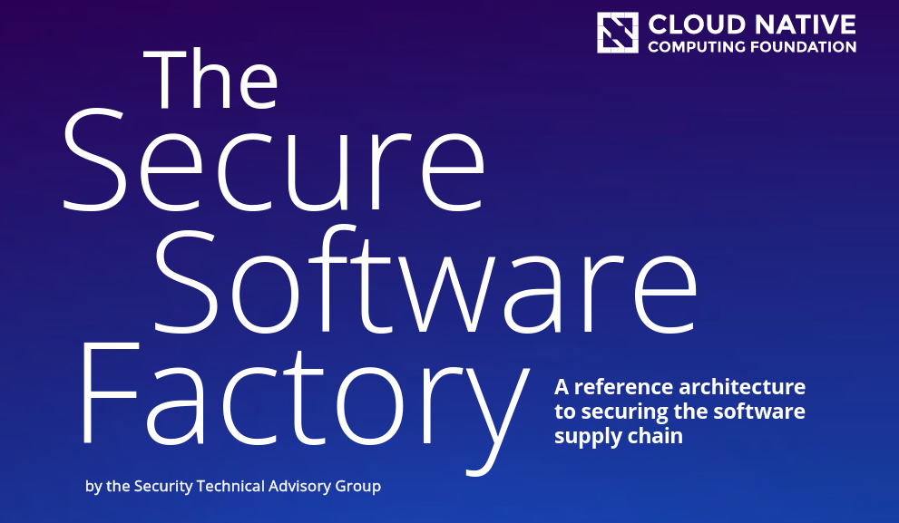
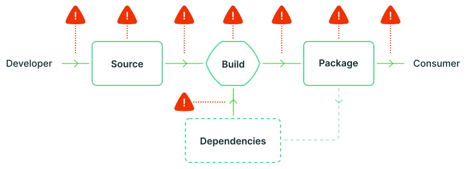
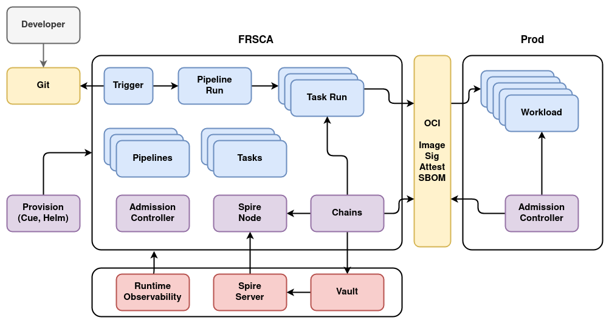

name: empty
layout: true
---
name: base
layout: true
template: empty
background-image: none
<div class="slide-footer">@sudo_bmitch</div>
---
name: ttitle
layout: true
template: empty
class: center, middle
background-image: url(img/containers_bg.png)
background-size: cover
---
name: inverse
layout: true
template: base
class: center, middle, inverse
background-image: none
---
name: impact
layout: true
template: base
class: center, middle, impact
background-image: url(img/containers_bg.png)
background-size: cover
---
name: picture
layout: true
template: base
class: center, middle
background-image: none
---
name: terminal
layout: true
template: base
class: center, middle, terminal
background-image: none
---
name: default
layout: true
template: base
background-image: url(img/containers_bg.png)
background-size: cover
---
layout: false
template: default
name: agenda

# Agenda

.left-column[
- [topic 1](#topic-1)
- [topic 2](#topic-2)
- [topic 3](#topic-3)
- [topic 4](#topic-4)
]
.right-column[
- [topic 5](#topic-5)
- [topic 6](#topic-6)
- [topic 7](#topic-7)
- [topic 8](#topic-8)
]

---
layout: false
name: ttitle
template: ttitle

# FRSCA

## Factory for Repeatable Secure Creation of Artifacts

.left-column[
.pic-circle-70[]
]
.right-column[.v-align-mid[.no-bullets[
<br>
- Brandon Mitchell
- Twitter: @sudo_bmitch
- GitHub: sudo-bmitch
]]]
???
- My twitter and github handles are what any self respecting sysadmin does
  when you get a permission denied error on your favorite username.
- This presentation is on github and I'll have a link to it at the end,
  I'll be going fast so don't panic if you miss a slide.
---
template: default

```no-highlight
$ whoami
- Brandon Mitchell
- Solutions Architect @ BoxBoat
- Docker Captain
- StackOverflow, OCI, CNCF
```

.align-center[
.pic-30[]
.pic-30[]
.pic-30[]
]

???

- Who am I?
  - By day I'm a consultant that helps paid clients transition to containers.
  - In my downtime I answer questions on StackOverflow.
  - Helping to spread knowledge about Docker through StackOverflow and
    presentations like this was my path to the Captains program.

---

name: background
template: inverse

# Background

???

- Started as a Citi project
- Contributed to the OpenSSF
- Inspired by CNCF's STAG and SLSA
- Reaction to SolarwWinds attack, how do we protect from a compromised build server

---

class: center,middle

.pic-80[]

<small>https://github.com/cncf/tag-security/tree/main/supply-chain-security/secure-software-factory</small>

???

- CNCF worked on a few white papers, including the Secure Software Factory
- Talks about the need to generate and verify provenance, show how each artifact was created with a verifiable signature
- Need to verify source, dependencies, and build environment

---

class: center,middle

.pic-80[]

<small>https://slsa.dev</small>

???

- SLSA looks at the various attacker scenarios
- The secure software factory goal is to solve these challenges from the central build server
- It needs to verify the source, verify the dependencies, and output an artifact that can be verified by consumers
- We look at what it takes to detect and prevent tampering at each of these points
  - E.g. a signed artifact cannot be tampered in transit or on the artifact server without breaking that signature

---

# SLSA Levels (spec v0.1)

| Level | Description | Example |
|-------|-------------|---------|
| 1 | Documentation of the build process | Unsigned provenance |
| 2 | Tamper resistance of the build service | Hosted source/build, signed provenance |
| 3 | Extra resistance to specific threats | Security controls on host, non-falsifiable provenance |
| 4 | Highest levels of confidence and trust | Two-party review + hermetic builds |

???

- SLSA: Supply chain Levels for Software Artifacts
- Each level adds additional requirements to improve the trust in the provenance
  1. build process must by scripted/automated and generate provenance
  2. version control, hosted build service, signed artifacts
  3. signed commits, ephemeral build nodes, non-falsifiable (signing keys only available to CI)
  4. 2 person review, hermetic, and reproducible
- Most that put effort into it are at 2, working on 3
- FRSCA is putting a lot of work into 3

---

name: frsca
template: inverse

# FRSCA

???

- So lets talk about what FRSCA is

---

# FRSCA

- Tekton Pipelines: CI
- Tekton Chains: Observer / Attestations
- Sigstore: Signing
- SPIFFE/Spire: Node and Workload Identities
- Vault: Key management
- CUE: Abstraction and policy for defining pipelines
- Kyverno: Admission Controller

---

class: center,middle

.pic-80[]

???

- Developers commit to Git
- A trigger picks up that commit and submits the PipelineRun
- The PipelineRun consists of one or more TaskRuns, an image is pushed to an OCI registry
- Chains monitors the TaskRuns and push attestations of what was executed
- Chains requests a credential from Spire which checks the K8s namespace and service account
- Chains uses that spire JWT to login to Vault, which validates the login using OIDC to Spire
- Chains sends the signing requests to Vault's Transit plugin for the image and attestations
- Vault sends back the signed data to chains, which pushes it to the OCI registry
- Production then verifies with the public key that the signature came from Vault, which is configured to only allow Chains to sign

---

# SLSA Compliance

- Version Control
- Build service that builds as code
- Tekton TaskRuns are ephemeral and isolated pods
- Provenance is created, signed, and non-falsifiable

???

- We are close to SLSA 3 compliance on the 0.1 spec
- Version Control done but signed commits and retention out of scope
- Tekton is a build service, and the job is defined as code
  - Note that code is not necessarily checked into the application repo
- Each pod is ephemeral, and isolated from other jobs
- Provenance is generated, by a service, and signed
  - Non-falsifiable since Vault only allows Chains to access that key and the private key cannot be extracted from Vault

---

# Remaining Tasks

- Verify Code signing and review
- Runtime Visibility
- Bootstrapping Images

???

- We shouldn't sign artifacts from code that hasn't been signed
- Runtime Visibility watches things like syscalls for unusual behavior of a TaskRun
  - If the code suddenly connects to servers in Russia, that's a concern
- Bootstrapping needed so we can require image signing for everything running in the cluster
  - E.g. Controllers, Kaniko, and other images need to be built by FRSCA to be used by FRSCA

---

name: demo
template: inverse

# Demo

???

- Show me the code

---

# Spire

```no-highlight
spire-server entry create \
  -node \
  -spiffeID spiffe://example.org/ns/spire/node/frsca \
  -selector k8s_psat:cluster:frsca \
  -selector k8s_psat:agent_ns:spire \
  -selector k8s_psat:agent_sa:spire-agent

spire-server entry create \
  -parentID spiffe://example.org/ns/spire/node/frsca \
  -spiffeID spiffe://example.org/ns/tekton-chains/sa/tekton-chains-controller \
  -selector k8s:ns:tekton-chains \
  -selector k8s:sa:tekton-chains-controller
```

???

- Spire gives a SVID to the tekton controller SA running in the chains NS

---

# Vault

```no-highlight
vault secrets enable transit
vault auth enable jwt

vault write auth/jwt/config \
  oidc_discovery_url=https://spire-oidc.spire.svc.cluster.local \
  default_role="spire-chains-controller"
```

???

- Vault enables transit and JWT
- JWT is configured to auth to spire-oidc

---

# Vault

```no-highlight
vault policy write spire-transit - <<EOF
path "transit/*" {
  capabilities = ["read"]
}
path "transit/sign/frsca" {
  capabilities = ["create", "read", "update"]
}
path "transit/sign/frsca/*" {
  capabilities = ["read", "update"]
}
path "transit/verify/frsca" {
  capabilities = ["create", "read", "update"]
}
path "transit/verify/frsca/*" {
  capabilities = ["read", "update"]
}
EOF
```

???

- The policy allows access to the transit key

---

# Vault

```no-highlight
vault write auth/jwt/role/spire-chains-controller \
  role_type=jwt \
  user_claim=sub \
  bound_audiences=TESTING \
  bound_subject=spiffe://example.org/ns/tekton-chains/sa/tekton-chains-controller \
  token_ttl=15m \
  token_policies=spire-transit

vault write transit/keys/frsca \
  type=ecdsa-p521

vault read -format=json transit/keys/frsca \
  | jq -r .data.keys.\"1\".public_key >frsca.pem"
```

???

- Then we setup JWT auth to map the spiffe ID to the spire transit policy
- A key is created
- And we can export the public key
- The private key is only accessible now by Chains asking transit to sign the data

---

# Tekton Chains

```no-highlight
kubectl patch configmap chains-config \
      --patch-file patch_config_kms.yaml
```

```no-highlight
data:
  artifacts.oci.signer: kms
  artifacts.taskrun.signer: kms
  signers.kms.kmsref: "hashivault://frsca"
  signers.kms.auth.address: "http://vault.vault:8200"
  signers.kms.auth.oidc.path: jwt
  signers.kms.auth.oidc.role: "spire-chains-controller"
  signers.kms.auth.spire.sock: "unix:///tmp/spire-agent/public/api.sock"
  signers.kms.auth.spire.audience: TESTING
```

???

- Finally, Chains configuration is patched to use a KMS, set to Vault
- The settings indicate the OIDC details, and how to get the JWT from Spire

---

template: title
name: thanks

# Thank You

.no-bullets[
- github.com/sudo-bmitch/presentations
]

.content[
.left-column[
.pic-80[]
]
.right-column[.align-right[.no-bullets[
<br>
- Brandon Mitchell
- Twitter: @sudo_bmitch
- GitHub: sudo-bmitch
]]]
]

???

- These slides are available online in my git repo, the link is there and the QR code will take you there too
