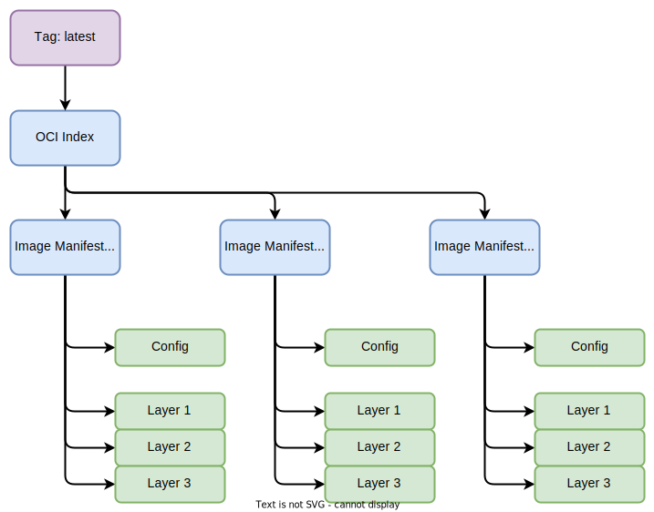
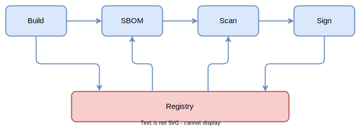
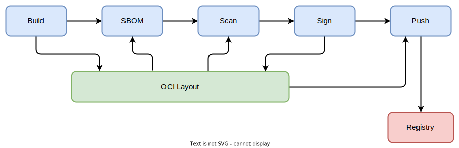

name: empty
layout: true
---
name: base
layout: true
template: empty
background-image: none
<div class="slide-footer">@sudo_bmitch</div>
---
name: ttitle
layout: true
template: empty
class: center, middle
background-image: url(img/oss-ccon-title.png)
background-image: url(img/containers_bg.png)
background-size: cover
---
name: inverse
layout: true
template: base
class: center, middle, inverse
background-image: none
---
name: impact
layout: true
template: base
class: center, middle, impact
background-image: url(img/oss-ccon-side-bar.png)
background-image: url(img/containers_bg.png)
background-size: cover
---
name: picture
layout: true
template: base
class: center, middle
background-image: none
---
name: terminal
layout: true
template: base
class: center, middle, terminal
background-image: none
---
name: default
layout: true
template: base
background-image: url(img/oss-ccon-top-bar.png)
background-image: url(img/containers_bg.png)
background-size: cover
---
layout: false
template: default
name: agenda

# Agenda

.left-column[
- [Intro](#title)
- [Containers](#containers)
- [CI/CD Pipelines](#ci-cd-pipelines)
- [OCI Layout](#oci-layout)
- [Pipeline with Layout](#pipeline-with-layout)
]
.right-column[
- [Pros and Cons](#pros-cons)
- [Workaround with Zot](#zot)
- [Example](#example)
- [Next Steps](#next-steps)
]

---
layout: false
name: title
template: ttitle

# Image Layout: Stop Putting Everything in Registries

.left-column[
.pic-circle-70[]
]
.right-column[.v-align-mid[.no-bullets[
<br>
- Brandon Mitchell
- Twitter: @sudo_bmitch
- GitHub: sudo-bmitch
]]]
???
---
template: default

```no-highlight
$ whoami
- Brandon Mitchell
- Solutions Architect @ BoxBoat an IBM Company
- Docker Captain
- StackOverflow, OCI, CNCF
- Software Supply Chain Security
```

.align-center[
.pic-30[]
.pic-30[]
.pic-30[]
]

???

- Who am I?
  - By day I'm a consultant that works in containers and security.
  - In my downtime I answer questions on StackOverflow.
  - Got into the Captains program after answering too many StackOverflow questions.
  - I've been doing a lot of work with OCI, partly because I've been developing a project called regclient.
  - I spend a lot of time dealing with Software Supply Chain Security, including CNCF Working Groups and OpenSSF Projects

---

template: inverse
name: containers

# Container Images

???

- First, a quick baseline
- But when I talk about an image, I'm not looking at `docker build`, I want to talk about what gets pushed to a registry

---

class: small

# Image Config

```no-highlight
$ regctl blob get alpine sha256:e66264b987... | jq .
{
  "architecture": "amd64",
  "config": {
    "User": "",
    "Env": [
      "PATH=/usr/local/sbin:/usr/local/bin:/usr/sbin:/usr/bin:/sbin:/bin"
    ],
    "Cmd": [
      "/bin/sh"
    ],
    "Volumes": null,
    "WorkingDir": "",
    "Entrypoint": null,
    "OnBuild": null,
    "Labels": null
...
```

???

- First part of an image is the config
- This contains all the settings, like the entrypoint, environment variables, and other metadata like labels

---

# Content Addressable

```no-highlight
$ regctl blob get alpine sha256:e66264b9877... | sha256sum
e66264b9877...  -
```

???

- This is pushed to the registry and tracked by a digest of the content
- If a byte of json, or a tar file, is changed, it will have a different digest on the registry
- If multiple things point to the same digest, you can deduplicate it

---

class: small

# Image Layers

```no-highlight
$ regctl blob get alpine sha256:2408cc74d1... | tar -tvzf -
drwxr-xr-x 0/0               0 2022-05-23 12:51 bin/
lrwxrwxrwx 0/0               0 2022-05-23 12:51 bin/arch -> /bin/busybox
lrwxrwxrwx 0/0               0 2022-05-23 12:51 bin/ash -> /bin/busybox
lrwxrwxrwx 0/0               0 2022-05-23 12:51 bin/base64 -> /bin/busybox
lrwxrwxrwx 0/0               0 2022-05-23 12:51 bin/bbconfig -> /bin/busybox
-rwxr-xr-x 0/0          837272 2022-05-09 13:27 bin/busybox
lrwxrwxrwx 0/0               0 2022-05-23 12:51 bin/cat -> /bin/busybox
lrwxrwxrwx 0/0               0 2022-05-23 12:51 bin/chattr -> /bin/busybox
lrwxrwxrwx 0/0               0 2022-05-23 12:51 bin/chgrp -> /bin/busybox
lrwxrwxrwx 0/0               0 2022-05-23 12:51 bin/chmod -> /bin/busybox
...
```
???

- The other type of data is tar files, typically compressed with gzip
- In this example, you see how alpine is built on top of busybox
- Most images will have several layers, each extending the previous one

---

class: small

# Image Manifest

```no-highlight
$ regctl manifest get alpine --platform linux/amd64 --format body
{
   "schemaVersion": 2,
   "mediaType": "application/vnd.docker.distribution.manifest.v2+json",
   "config": {
      "mediaType": "application/vnd.docker.container.image.v1+json",
      "size": 1472,
      "digest": "sha256:e66264b9877..."
   },
   "layers": [
      {
         "mediaType": "application/vnd.docker.image.rootfs.diff.tar.gzip",
         "size": 2798889,
         "digest": "sha256:2408cc74d1..."
      }
   ]
}
```

???

- After pushing the config and layer blobs, you have the digests to push a manifest
- That manifest itself is content addressable
- When you pull a pinned image, that is a manifest digest
- A tag may point to that manifest digest

---

class: small

# Multi-Platform Manifest

```no-highlight
$ regctl manifest get alpine --format body | jq .
{
  "manifests": [
    {
      "digest": "sha256:4ff3ca9127...",
      "mediaType": "application/vnd.docker.distribution.manifest.v2+json",
      "platform": {
        "architecture": "amd64",
        "os": "linux"
      },
      "size": 528
    },
    {
      "digest": "sha256:3c66139adb...",
      "mediaType": "application/vnd.docker.distribution.manifest.v2+json",
      "platform": {
        "architecture": "arm",
        "os": "linux",
        "variant": "v6"
      },
      "size": 528
...
```

???

- A multi-platform manifest is a list of descriptors to other manifests
- In there is also some metadata to pick the manifest you want from the list

---

class: center,middle

.pic-80[]

???

- Importantly, the registry cares what is in a manifest, the blue boxes, it needs to know what blobs they point to for GC and validation
- But a registry doesn't look at what's inside the blobs, the green boxes, that a manifest references
- I'll circle back to why that's important shortly

---

name: ci-cd-pipelines
template: inverse

# CI/CD Pipelines

???

- How do we use those images?
- For most of us, they're a key part of a CI/CD pipeline

---

.content[
# CI Pipelines

.left-column[
- More than Build, Ship, Run
- Linting
- Compile
- Unit tests
- Push artifacts
- Push container images
- Integration tests
]
.right-column[
.pic-80[]
]
]

???

- At a very minimum, CI pipelines these days includes some unit tests
- But there's usually a lot more, and that list is growing

---

.content[
# But Wait, There's More

.left-column[
- SBOMs
- Signing
- Attestations
- Vulnerability scanning
- Cat pics
]
.right-column[
.pic-80[]
]
]

???

- We're building SBOMs, the proverbial ingredients list of what's inside the image
- Image signing used to be an external server, now it's being pushed to the registry
- Attestations cover the CI pipeline including signed claims of steps performed by the pipeline
- Vulnerability scanning is still being standardized
  - Today, each scanner has an API, and we get admission controllers that know how to talk to specific scanners
  - If we implement it using short lived signatures as a proxy, we decouple the two, allowing scanners and admission controllers to be swapped
- All of this is being pushed to container image registries
- We can do that because it's just a blob to a registry (a blob can be anything)
- Which means we can push anything we want, even cat pictures

---

class: center,middle

.pic-50[]

???

- For anyone that thought I wouldn't show you a cat pic, you were wrong

---

# Should We Use a Registry?

- CI pipelines are designed to work with filesystems
- git clone -> lint -> compile -> unit test ...
- SBOM and vulnerability scanners pull the image layers from the registry

???

- But now we get to the big question, should we be pushing all of this to a registry?
- The short answer, with the exception of maybe the cat pictures, is yes
- But that answer has a problem, CI systems are designed to pass information between steps by the filesystem

---

class: center,middle

.pic-rounded-10[.pic-80[]]

???

- Now we're adding steps after the image build and push that pull those layers back for scanning
- That's a lot of excess network traffic

---

name: oci-layout
template: inverse

# Storing Images On The Filesystem?

???

- So how can we store these images on the filesystem?
- Some may point out the docker engine, which works for some tools
- Not all builds use the docker engine
- And images in the docker engine are only a single platform

---

class: small

# OCI Image Layout

```no-highlight
$ tree .
├── oci-layout
├── index.json
└── blobs
    └── sha256
        ├── 1f9696fa2a7e90f098d7f5da0615b853989652ab5c597d37fb84d8038fff3acf
        ├── 2408cc74d12b6cd092bb8b516ba7d5e290f485d3eb9672efc00f0583730179e8
        ├── 29779da064c4b1c0d5d77ed112b35eed8fce7e2f35d2efea6ef68cb0d805d134
        ├── 44136fa355b3678a1146ad16f7e8649e94fb4fc21fe77e8310c060f61caaff8a
        ├── 63e1ceb3d310f9e355494e88bca9a522259a0de034f6dbd7b456994f4fb00265
        ├── 93d426e205de6adaec185e0c5bfe2435dc84aaf2b4a7d5bfeb33427a873516a2
        ├── 9783610725dd9ac5eace591938aa11ce36e3520581fb804dd874b58684297e8e
        ├── c223d141ab18a7a9ce6c8f43c1963aa29e9cbca57cefb5a96370929f6596ed2d
        ├── e3ab7e61a5ef77751e4ca958bc64210e11bf454bba6d757ce6b974a4677cc4ca
        ├── f1d9bcbd77f101ed0e5956bb84e68ddb03e39540de33e9d2e475c52ff851018c
        ├── f7af0f000e0feb1f2e439e7a1cff48d5bbe329abdcdd65bc07382236b38b98c9
        └── fe7f73a32c6ec78027e2e231f5c3063dc7a8ff5f2c67edb06e5626b996cfcaaa
```

???

- So we turned to OCI and they created a new standard that I'm here to announce today
- Actually... this has been around in OCI for a long time, but I think it's underutilized
- There's a few files we'll drill into
- And then the content addressable store under the blobs folder

---

class: small

# OCI Layout

```no-highlight
$ cat oci-layout
{"imageLayoutVersion":"1.0.0"}

$ cat index.json  | jq .
{
  "schemaVersion": 2,
  "mediaType": "application/vnd.oci.image.index.v1+json",
  "manifests": [
    {
      "mediaType": "application/vnd.oci.image.manifest.v1+json",
      "digest": "sha256:f1d9bcbd77...",
      "size": 710,
      "annotations": {
        "org.opencontainers.image.ref.name": "latest"
      }
    }
  ]
}
```

???

- We have an `oci-layout` file that contains a version
- The index is the same layout as those manifest lists, with a digest and annotation for the tag
- The result represents not just an image, but a repository of images

---

# Features

- Frequently used for air-gap environments
- Can be packaged as a tar or tgz for shipping
- Layout can coexist with `docker load` metadata

???

- A key area I see this used in is air-gap environments, the directory is easy to rsync
- Packaging it as a tar file is useful for transport and IO streams (stdin/stdout)
- When exporting images from a registry, I like to also include the docker metadata so the same tar can be used with `docker load`

---

name: pipeline-with-layout
.content[
# Pipeline of Tomorrow

.left-column[
- git clone
- Lint
- Image build -> OCI Layout
- Add Attestations
- Add SBOM
- Vulnerability scan
- Add signatures
- Add cat pictures
- Push to registry
- Deploy
]
.right-column[
.pic-80[]
]
]

???

- The result is is a pipeline that builds to a Layout
- Changes are made within the pipeline to that Layout directory
- And only at the end does it get pushed to the registry

---

class: center,middle

.pic-50[]

???

- Cat pictures may be a drinking game

---

# Advantages

- Unscanned blobs are never pushed
- Unsigned images are never available to pull
- CI uses filesystem instead of network between steps

???

- If the CI pipeline pushes blobs to the registry before they are scanned
  - From a compromised node in the cluster, I can pull those blobs to load additional exploits
  - Exfiltrate data via a public registry
- If images are pushed before signing, there are race conditions where unsigned images may try to be deployed, bad UX
- Everything in the CI pipeline stays in that pipeline's filesystem until CI is ready to ship

---

class: center,middle

.pic-rounded-10[.pic-80[]]

???

- When looking at just the networking, we now only have one upload to the registry and no subsequent pulls

---

name: pros-cons
template: inverse

# Sign Me Up

???

- If I've convinced you that this is the way...
- I've got good news and bad news

---

# Some Tooling Supports This Today

- Runtimes: containerd, podman
- Build: docker buildx, buildah, buildpack, kaniko, ko
- Registries: zot
- Registry clients: crane, regclient, skopeo
- Vulnerability scanners: grype, snyk, trivy
- SBOM: syft, trivy
- Signing: ...

???

- First the good news, a lot of stuff across the ecosystem supports this today
- containerd and podman both import and export OCI layouts
- Support in build tooling is really good: buildx, buildah, buildpack, kaniko, ko
  - I think bazel has support, unsure about jib
- zot is a lightweight registry where the repositories are OCI layouts
- crane, regclient, and skopeo all copy images between a registry and OCI layout
- grype and trivy can scan single images in a layout
- snyk can scan a single image in a tar
- syft and trivy can generate an sbom from a single image in a layout
- signing... I need to work on sigstore's cosign

---

class: center,middle

.pic-80[]

???

- While I didn't explicitly list cat pictures, tooling like regclient can push any file to a registry
- That also means if the sbom or attestations are left as a file, those can be added to the Layout and pushed to the registry with the image

---

# There Are Challenges

- References are not standardized
  - `alpine:latest` (becomes `docker.io/library/alpine:latest`)
  - `oci:dirname` (confused with `docker.io/library/oci:dirname`)
  - `oci-dir:dirname`
  - `ocidir://dirname:latest`
  - `oci-layout://dirname`
- OCI Working Group for Reference Types
- Garbage Collection

???

- Now the bad news
- References aren't standardized, what's a reference?
  - "Invalid reference format", you've seen this when docker can't parse the image name
  - `alpine:latest` is a reference, it's a string that tells a runtime where to find the image
  - We have no syntax that says "pull an image from this folder on the filesystem, extracting a specific tag or digest"
  - Skopeo does `oci:dirname:latest` where you can drop `:latest` but then you need a prefix on registry pulls to avoid confusing with `docker.io/library/oci:dirname`
  - Some Anchore tools use `oci-dir:dirname` but have no way to pass a tag or digest
  - regclient went with the schema syntax to avoid confusing with registry references
  - Docker just added `oci-layout://dirname` to buildkit
- WG on Ref Types, I prefer "Referrers" to avoid confusion
  - We are still figuring out a standard way to attach additional data to an image
  - We need a common way to share SBOMs and signatures for interoperability between tools
  - There are various proposals being considered, including a tag schema and adding entries to an Index/Manifest List
- Very few tools modify an existing layout, but if you do, you should implement your own garbage collection logic

---

# Lots Of Tools Do Not Support This Yet

- Some tools only work with registries
- Some tools only support tar/tgz packaged layouts
- Almost none support a layout with:
  - A specific tag
  - A specific digest
  - Multi-platform images

???

- And then the worse news
- Not every tool supports this
  - cosign: I need to work on an issue and PR for them
- Support may only be for tar, tgz or directory, but not all
  - E.g. snyk wants a tar
  - If you're processing the same image in lots of steps, you don't want each tool extracting to a temp dir
  - If you modify/extend an image, you need it as a directory
- Layout should support multiple images, and multiple types of images, and almost no tool does that
  - All of the SBOM and scanning tools I tested required one image, for one platform, in the directory
  - This means working with the image on a registry to query a platform, or exploding the image to multiple directories

---

class: center,middle

.pic-50[]

???

- If those issues have you panicking, I do have some good news

---

name: zot
class: small

# Zot Is A Workaround

```no-highlight
$ regctl tag ls ocidir://oci-layout
latest
sha256-f1d9bcbd77....9783610725dd9ac5.sbom
sha256-f1d9bcbd77....c223d141ab18a7a9.scan

$ docker run -d -p 127.0.0.1:5207:5000 \
  -v "$(pwd)/oci-layout:/var/lib/registry/demo" \
  ghcr.io/project-zot/zot-linux-amd64:v1.4.0

$ cosign sign localhost:5207/demo:latest
...

$ regctl tag ls ocidir://oci-layout
latest
sha256-f1d9bcbd77....9783610725dd9ac5.sbom
sha256-f1d9bcbd77....c223d141ab18a7a9.scan
sha256-f1d9bcbd77....sig
```

???

- For those applications that don't support Layout, Zot is a workaround
- From my `oci-layout` directory I can spin up a zot container
- And now cosign works, the signature is visible in that registry
- And that same signature is also visible in my local oci-layout folder

---

name: example
template: inverse

# Example

???

- So lets have a look at an example in GitHub Actions

---
class: small

# Setup Build Environment

```no-highlight
- name: Check out code
  uses: actions/checkout@v3

- name: Set up Go 1.17
  uses: actions/setup-go@v3
  with:
    go-version: 1.17.x
  id: go

- name: Install regctl
  uses: regclient/actions/regctl-installer@main

- name: Set up Docker Buildx
  uses: docker/setup-buildx-action@v1

- name: Install cosign
  uses: sigstore/cosign-installer@main
```

???

- The setup is fairly standard, checkout code, install Go and other tools
- regctl here is my own project for interacting with registries and OCI layouts

---
class: small

# Test

```no-highlight
- name: Verify go fmt
  run: test -z "$(go fmt ./...)"

- name: Verify go vet
  run: test -z "$(go vet ./...)"

- name: Test
  run: make test

- name: Linting
  run: make lint
```

???

- First part of any good CI is testing

---
class: small

# Build to OCI Layout

```no-highlight
- name: Build
  uses: docker/build-push-action@v2
  id: build
  with:
    context: .
    # platforms: linux/amd64,linux/arm/v7,linux/arm64
    platforms: linux/amd64
    push: false
    labels: |
      org.opencontainers.image.source=${{ github.repositoryUrl }}
      org.opencontainers.image.revision=${{ github.sha }}
    outputs: |
      type=oci,dest=oci-layout.tar

- name: Convert to OCIDir
  run: regctl image import ocidir://oci-layout oci-layout.tar
```

???

- The build step outputs to an oci-layout.tar instead of pushing to a registry
- Unfortunately some of the later steps don't support multi-platform images
- I'm using the regctl import to extract that tar, this supports multiple images in the same oci-layout directory and gives this image a tag (latest)

---
class: small

# Post-Build Tweaks

```no-highlight
- name: Mutate
  run: |
    regctl image mod ocidir://oci-layout:latest --replace \
      --time-max "${{ steps.prep.outputs.date_commit }}" \
      --annotation "org.opencontainers.image.created=${{ steps.prep.outputs.date_commit }}" \
      --annotation "org.opencontainers.image.base.name=${{ steps.prep.outputs.base_name }}" \
      --annotation "org.opencontainers.image.base.digest=${{ steps.prep.outputs.base_digest }}" \
      --annotation "org.opencontainers.image.source=${{ github.repositoryUrl }}" \
      --annotation "org.opencontainers.image.revision=${{ github.sha }}"
```

???

- I like to adjust the output of the build a bit
- Annotations aren't generated by Docker so I add them here
- I've also been looking at reproducibility, and timestamps are a big factor there, so the time in the image config and files in each of the layers gets capped at the git commit time
- By capping this time, we still have a useful timestamp without modifying our base image layers

---
class: small

# Generate SBOM and Scan

```no-highlight
- name: SBOM
  uses: anchore/sbom-action@v0
  with:
    output-file: "sbom.json"
    image: "oci-dir:oci-layout"
    format: "cyclonedx-json"
- name: Scan
  uses: anchore/scan-action@v3
  with:
    image: "oci-dir:oci-layout"

- name: Attach artifacts to image
  id: artifacts
  run: |
    sbom_digest=$(regctl artifact put \
      --config-media-type application/vnd.oci.image.config.v1+json \
      -f sbom.json --media-type "application/vnd.cyclonedx+json" \
      --annotation org.opencontainers.artifact.type=sbom \
      --annotation org.example.sbom.type=cyclonedx-json \
      --format '{{ .Manifest.GetDescriptor.Digest }}' \
      --refers ocidir://oci-layout:latest)
    echo "::set-output name=sbom_digest::${sbom_digest}"
```

???

- I'm using syft and grype for the SBOM and Scanning here
- You could swap out CycloneDX for SPDX if you want
- The Anchore steps do not support multiple images in the layout
- The attach step is some experimental code based on the OCI WG for Referrers

---
class: small

# Sign

```no-highlight
- name: zot
  run: |
    docker run --rm -d --name zot \
      -p 127.0.0.1:5000:5000 \
      -u "$(id -u):$(id -g)" \
      -v "$(pwd)/oci-layout:/var/lib/registry/demo" \
      ghcr.io/project-zot/zot-linux-amd64:v1.4.0
    curl -s http://localhost:5000/v2/ -o /dev/null || sleep 2

- name: sign
  env:
    COSIGN_EXPERIMENTAL: "true"
  run: |
    cosign sign "localhost:5000/demo:latest"
    cosign sign "localhost:5000/demo@${{ steps.artifacts.outputs.sbom_digest }}"
```

???

- Since cosign needs a registry, I can run Zot
- Then that sign command applies to `localhost:5000`, which Zot maps to our OCI Layout

---
class: small

# Push

```no-highlight
- name: login and push
  run: |
    regctl registry login \
      -u "${{ secrets.GHCR_USER }}" \
      -p "${{ secrets.GHCR_TOKEN }}" \
      ghcr.io
    regctl image copy --digest-tags -v info \
      ocidir://oci-layout:latest \
      ghcr.io/sudo-bmitch/demo-gha-with-oci-layout:${{ steps.prep.outputs.version }}
```

???

- And once we have an image that has been scanned and signed, we can push along with the SBOM to a registry

---

name: next-steps
template: inverse

# Conclusion

???

- Lets get into some take aways

---

# Next Steps

- Get OCI to define a reference
- Get the OCI Layout supported in more tools
- Include support for tags, digests, and multi-platform images
- Support the result of the OCI Working Group on Referrers
- Update CI pipelines to use it
- The result is more efficient, modular, and secure

???

- I put the reference definition first on my priority list because that may drive how tools implement OCI Layout support
- Then we need the Layout supported in more tools, including for tags, digests, and multi-platform images
- No only do tools need to be able to read from a Layout, but SBOMs and signatures need to be attached to images using the result of the OCI WG
- CI pipelines need to be updated to use it, including the various examples everyone copies from
- The end goal being more efficient, modular, and secure
  - We should be able to swap out components without concern of breaking other parts, it's the concept of microservices
  - Security is improved by images having signatures and SBOMs before they are pushed, and not being pushed before a vulnerability scan passes

---

class: center,middle

.pic-80[]

???

- And a system that can even package cat pictures along side our images

---

template: empty
class: center, middle
background-image: url(img/ibm-sscs.png)
background-size: cover

???

- IBM has asked that you scan this QR code, which I think causes a small dinosaur to eat your phone
- And by making it to this slide, I think you're legally obligated to visit their booth (I don't recommend arguing with lawyers)

---

template: ttitle
name: thanks

# Thank You

.no-bullets[
- github.com/sudo-bmitch/presentations
- github.com/sudo-bmitch/demo-gha-with-oci-layout
]

.content[
.left-column[
.pic-80[]
]
.right-column[.align-right[.no-bullets[
<br>
- Brandon Mitchell
- Twitter: @sudo_bmitch
- GitHub: sudo-bmitch
]]]
]

???

- These slides are available online in my git repo, the link is there and the QR code will take you there too
- My presentation repo is also my pinned tweet in twitter
- If you'd like to see an example of what this looks like in code, my demo repo has a Makefile and GitHub Actions that runs this full pipeline, including lots of experimental features, using an OCI Layout

---

exclude: true

template: inverse

# Inverse slide

???

- Discussion content

---

exclude: true

# Normal Slide

- Bullets

---

exclude: true

class: center,middle

.pic-80[]

---

exclude: true

class: center,middle

.pic-80[.pic-rounded-10[]]

---

exclude: true

# Hidden Slide

- Bullets

---

exclude: true

# Code page

```no-highlight
code
goes
here
```

---

exclude: true

template: terminal
name: topic-2
class: center

<asciinema-player src="file.cast" cols=100 rows=26 preload=true font-size=16></asciinema-player>

