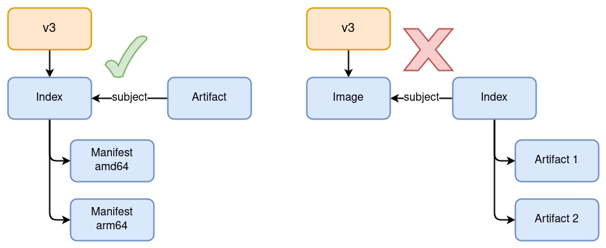
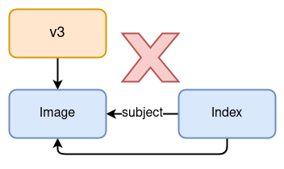
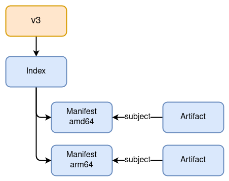

name: empty
layout: true
---
name: base
layout: true
template: empty
background-image: none
<div class="slide-footer">@bmitch@fosstodon.org</div>
---
name: ttitle
layout: true
template: empty
class: center, middle
background-image: url(img/containers_bg.png)
background-size: cover
---
name: inverse
layout: true
template: base
class: center, middle, inverse
background-image: none
---
name: impact
layout: true
template: base
class: center, middle, impact
background-image: url(img/containers_bg.png)
background-size: cover
---
name: picture
layout: true
template: base
class: center, middle
background-image: none
---
name: terminal
layout: true
template: base
class: center, middle, terminal
background-image: none
---
name: default
layout: true
template: base
background-image: url(img/containers_bg.png)
background-size: cover
---
layout: false
template: default
name: agenda

# Agenda

- [Container Images](#container-images)
- [Associating Artifacts](#associating-artifacts)
- [Referrers Response](#referrers-response)
- [Demo](#demo)
- [Status](#status)

---
layout: false
name: ttitle
template: ttitle

# Modifying the Immutable:<br>Attaching Artifacts to OCI Images

.left-column[
.pic-circle-70[]
]
.right-column[.v-align-mid[.no-bullets[
<br>
- Brandon Mitchell
- Mastodon: @bmitch@fosstodon.org
- Twitter: @sudo_bmitch
- GitHub: sudo-bmitch
]]]
???
- My twitter and github handles are what any self respecting sysadmin does
  when you get a permission denied error on your favorite username.
- This presentation is on github and I'll have a link to it at the end,
  I'll be going fast so don't panic if you miss a slide.
---
template: default

```no-highlight
$ whoami
- Brandon Mitchell
- Solutions Architect @ BoxBoat, an IBM Company
- OCI Maintainer, regclient, Docker Captain
- StackOverflow, CNCF, OpenSSF
```

.align-center[
.pic-30[]

.pic-30[]

.pic-30[]
]

???

- Who am I?
  - By day I'm a consultant that helps paid clients transition to containers.
  - I'm also a maintainer for OCI and a Docker Captain.
  - In my downtime I developer some side projects like regclient, answer questions
    on StackOverflow, and I'm often seen on CNCF and OpenSSF meetings

---

name: container-images

# Container Images

- Filesystem layers
- Created with `docker build`
- Sometimes referenced with `sha256:...`
- Inspecting images to see history and config
- Multi-platform images

???

- Most people here know what a container image is, often described as a set of filesystem layers
- You've likely run `docker build` to create them, or some other builder
- You have probably seen `sha256:...` digests to pin an image
- You've likely inspected an image and seen the command that it runs, maybe the history of how it was built, but that's not a layer
- And lately you've almost certainly noticed more multi-platform images, how does that work
- Lets open this up and see how all of it works

---

class: small

# Content Addressable Store

```no-highlight
$ ldigest=sha256:8921db27df2831fa6eaa85321205a2470c669b855f3ec95d5a3c2b46de0442c9

$ curl -s http://localhost:5000/v2/$repo/blobs/$ldigest | sha256sum
8921db27df2831fa6eaa85321205a2470c669b855f3ec95d5a3c2b46de0442c9  -
```

???

- Content in registries is content addressable, the hash in the request is the hash of the content
- This is the same pattern as Git
- Very useful for deduplication, caching, and security, avoids mutable references

---

class: small

# Layers

```no-highlight
$ curl -s http://localhost:5000/v2/$repo/blobs/$ldigest | tar -tvzf - | head
drwxr-xr-x 0/0               0 2023-01-09 07:46 bin/
lrwxrwxrwx 0/0               0 2023-01-09 07:46 bin/arch -> /bin/busybox
lrwxrwxrwx 0/0               0 2023-01-09 07:46 bin/ash -> /bin/busybox
lrwxrwxrwx 0/0               0 2023-01-09 07:46 bin/base64 -> /bin/busybox
lrwxrwxrwx 0/0               0 2023-01-09 07:46 bin/bbconfig -> /bin/busybox
-rwxr-xr-x 0/0          841392 2022-11-19 05:13 bin/busybox
lrwxrwxrwx 0/0               0 2023-01-09 07:46 bin/cat -> /bin/busybox
lrwxrwxrwx 0/0               0 2023-01-09 07:46 bin/chattr -> /bin/busybox
lrwxrwxrwx 0/0               0 2023-01-09 07:46 bin/chgrp -> /bin/busybox
lrwxrwxrwx 0/0               0 2023-01-09 07:46 bin/chmod -> /bin/busybox
```

???

- Blobs can store anything, in this case it's a filesystem layer, typically as a tar+gzip compression

---

class: small

# Config

```no-highlight
$ curl -s http://localhost:5000/v2/$repo/blobs/$cdigest | jq .
{
  "config": {
    "Env": [
      "PATH=/usr/local/sbin:/usr/local/bin:/usr/sbin:/usr/bin:/sbin:/bin"
    ],
    "Cmd": [ "/bin/sh" ],
    "WorkingDir": "",
...
    "Labels": null
  },
  "history": [
    {
      "created": "2023-01-09T17:05:20.497231175Z",
      "created_by": "/bin/sh -c #(nop) ADD file:e4d600fc4c9c29... in / "
...
}
```

???

- Registries don't care about the content of a blob, only about the digest
- So we can push other content to a blob, in this case the image config
- The config is packaged as JSON, and  contains all the settings for the image (command, environment, labels, history, etc)
- We serialize the JSON, push as a blob, and track the digest of the content

---

class: small

# Image Manifest

```no-highlight
$ curl -s http://localhost:5000/v2/$repo/manifests/$mdigest | jq .
{
  "schemaVersion": 2,
  "mediaType": "application/vnd.docker.distribution.manifest.v2+json",
  "config": {
    "mediaType": "application/vnd.docker.container.image.v1+json",
    "size": 1472,
*   "digest": "sha256:042a816809aac8d0f7d7cacac7965782ee2ecac3f21bcf9f24b1de1a7387b769"
  },
  "layers": [
    {
      "mediaType": "application/vnd.docker.image.rootfs.diff.tar.gzip",
      "size": 3370628,
*     "digest": "sha256:8921db27df2831fa6eaa85321205a2470c669b855f3ec95d5a3c2b46de0442c9"
    }
  ]
}
```

???

- Now we use a different API, manifest instead of blob, to assemble a collection of references to the config and layers
- Each of these references is called a "descriptor":
  - Media Type, Digest, Size, and optional annotations
  - Our APIs are scoped to a repository, so the descriptor must point to a blob in the same repository
- This manifest has it's own digest, that's the digest you see when pinning an image
- Importantly, registries parse manifests, and they care about the media type and schema
  - Needed for GC, UI's, and any other higher level features

---

class: center,middle

# Tags

.pic-80[.pic-rounded-10[]]

???

- If you want to pull by tag, you first push the manifest by tag
- That manifest still has a digest
- The tag is effectively a symbolic link to a manifest digest (remember, a registry as a CAS)

---

# Immutability

- Merkle tree:
  - Manifest is the root node with a hash
  - Content of the root node is the hash of each child node
- DAG: Directed Acyclic Graph
- Content Addressable Store: content of each node is referenced by hash of itself
- Result: Immutability

???

T: 5m

- The resulting structure follows a pattern:
  - Merkle Tree: each node contains the hashes of child nodes
  - DAG: there are no loops, everything must terminate
  - CAS: reference the content by the hash of itself
- Putting those together gives us immutability absent of a hash collision
- Given an image digest, you know it has not been modified
  - Building a new image may only change one layer or some config metadata, resulting in a new digest
- Common pattern: used by Git, ipfs, blockchains
  - Useful for security, but bad for what we'll talk about later

---

class: small

# Multi-platform Images

```no-highlight
$ curl -H 'Accept: application/vnd.docker.distribution.manifest.list.v2+json' -s \
  http://localhost:5000/v2/$repo/manifests/alpine | jq .
{
* "mediaType": "application/vnd.docker.distribution.manifest.list.v2+json",
  "manifests": [
    {
*     "digest": "sha256:93d5a28ff72d288d69b5997b8ba47396d2cbb62a72b5d87cd3351094b5d578a0",
      "mediaType": "application/vnd.docker.distribution.manifest.v2+json",
      "platform": {
*       "architecture": "amd64",
        "os": "linux"
      },
      "size": 528
    },
    {
*     "digest": "sha256:01a4cdaebc9c6af607753cc538c507d0867897cdf9a1caa70bbab2eb1506c964",
      "mediaType": "application/vnd.docker.distribution.manifest.v2+json",
      "platform": {
*       "architecture": "arm",
        "os": "linux",
        "variant": "v6"
...
```

???

- There's another manifest type, called a manifest list, or in OCI, an Index
- This manifest contains a list of descriptors to manifests
- Those descriptors can also have a "platform" section, so runtimes can find their platform from the list and pull the appropriate manifest
- This Index is JSON, gets serialized, and has its own digest (registries are consistent like that)

---

class: center,middle

# Multi-platform Images

.pic-80[.pic-rounded-10[]]

???

- The multi-platform manifest expands our picture to multiple manifests
- A single tag can point to the top manifest
- Runtimes then pull their individual platform

---

class: small

# Artifacts

```no-highlight
$ adigest=sha256:ea706edf61ef640bcdf3c9ac9045c28446e6b2d08541b9ad614c7267d0b87375
$ curl -s http://localhost:5000/v2/$repo/blobs/$adigest
contains electrons
```

???

- Anything can be a blob, like the string "contains electrons"

---

class: small

# Artifacts

```no-highlight
*$ adigest=sha256:ea706edf61ef640bcdf3c9ac9045c28446e6b2d08541b9ad614c7267d0b87375
$ curl -s http://localhost:5000/v2/$repo/blobs/$adigest
contains electrons

$ curl ... http://localhost:5000/v2/$repo/manifests/$amdigest | jq .
{
  "schemaVersion": 2,
  "mediaType": "application/vnd.oci.image.manifest.v1+json",
  "config": {
*   "mediaType": "application/vnd.example.ebom.config",
    "size": 2,
    "digest": "sha256:44136fa355b3678a1146ad16f7e8649e94fb4fc21fe77e8310c060f61caaff8a"
  },
  "layers": [
    {
*     "mediaType": "application/vnd.example.ebom.data",
      "size": 19,
*     "digest": "sha256:ea706edf61ef640bcdf3c9ac9045c28446e6b2d08541b9ad614c7267d0b87375"
    }
  ]
}
```

???

- And it can be wrapped with a manifest
- To use existing manifest types, we can pass a custom config media type
  - That config is just `{}` to be valid json for some registries and clients

---

name: associating-artifacts

# Challenge: Associating Artifacts with Images

- SBOMs, Attestations, Vulnerability Reports, Signatures
- How do we attach to an immutable object?

???

T: 8m

- SBOMs have been working on generation, and soon consumption, but how are we distributing them?
  - Like docker, they have "Build and Run", but we're missing the second step, "Ship"
- If distribution is custom, there will be lots of missed upstream data
- If distribution is a central database, we have scaling/trust issues
- What if we distribute using the same system we use to distribute our images?
- How do you attach the SBOM to the image... the immutable image?
- We want to link an SBOM, a signature, and other metadata to an image that already exists

---

class: small

# Modifying An Index?

```no-highlight
{
  "mediaType": "application/vnd.oci.image.index.v1+json",
  "manifests": [
    {
*     "digest": "sha256:93d5a28ff72d288d69b5997b8ba47396d2cbb62a72b5d87cd3351094b5d578a0",
      "mediaType": "application/vnd.oci.image.manifest.v1+json",
      "platform": {
        "architecture": "amd64",
        "os": "linux"
      },
      "size": 528
    },
    {
      "digest": "sha256:01a4cdaebc9c6af607753cc538c507d0867897cdf9a1caa70bbab2eb1506c964",
      "mediaType": "application/vnd.oci.image.manifest.v1+json",
*     "artifactType": "application/vnd.example.ebom.config",
*     "extends": "sha256:93d5a28ff72d288d69b5997b8ba47396d2cbb62a72b5d87cd3351094b5d578a0",
      "size": 1024,
...
```

???

- Mutating the index will mutate the digest of that index, breaking anyone that pinned to the index digest
- There's also no way to go from the digest of the image to back up to the index to find the artifact
- Something like this would only be useful for the originator

---

# How Do We Modify the Immutable

- Adding metadata to an image would modify it
- How do we attach metadata to an existing image?
- Working Group goals:
  - Efficient on registry processing, bandwidth, and round trips
  - Attaching to existing images
  - Option to detach when copying
  - Referencing images by digest or tag
  - Multiple artifacts of the same type are possible
  - Not limited to known artifact types
- Multiple solutions

???

- The image digest refers to an immutable root of Merkle DAG
- How do we extend that with metadata?
- We created a working group with a list of goals:
  - efficiency, attach and detach by downstream users
  - we can't predict how users will use this, there will be new types of artifacts
- There's actually multiple ways to do that, and OCI stepped in to standardize on one method to improve interoperability

---

class: center,middle

# Option: New Manifest, Subject Field, and API

.pic-80[.pic-rounded-10[]]

???

- First option was to create a new manifest for artifacts
- Registries validate manifests, so this is not backwards compatible
- Include a subject field in the artifact that references the original image
- Add an API to list all manifest that have a subject with a specific digest
- Pro: efficient API
- Con: no support for existing registries

---

class: center,middle

# Option: Subject Field on Existing Manifests

.pic-80[.pic-rounded-10[]]

???

- Second option looked at extending existing manifests
- OCI allows forward compatibility by allowing unknown fields
- Pro: manifests are portable across existing registries
- Con:
  - Can't call API from existing registries
  - Extending some fields creates logical loops in the DAG

---

class: center,middle

# Option: Custom Tag Syntax

.pic-80[.pic-rounded-10[]]

???

- This takes inspiration from sigstore, and defines a tag syntax for looking up manifests that refer to another
- The tag is formatted with the digest of the extended image
- Pulling tag returns an index of manifests that can be managed by clients without any change to the registry
- Each manifest entry in the Index contains annotations for client side filtering

---

template: inverse

# So which option did we pick?

???

T: 14m

- Yes
- That wasn't a yes/no question, it was an a, b, or c question... yes?
- Yes, we decided to do them all, design by committee

---

# How does this all come together?

- Add an Artifact manifest (currently deferred)
- Add a subject field to the Image and Artifact manifests
- Add a referrers API to query the subject field
- Clients manage a tag if the referrers API isn't available

???

- The result of merging everything together is:
- We did add an Artifact manifest, but this is being deferred so don't use it
- Both the Image and Artifact manifest have a subject field
- And we added both a new referrers API and a fallback to using a tag

---

class: center,middle

.pic-80[.pic-rounded-10[]]

???

- Graphically, the mash up looks like this
- I avoided drawing the subject lines all the way back to their original manifest for simplicity
- We have our image being extended on the left
- And then 0 to n artifacts, either with the artifact or image manifest, on the right
- We list those artifacts using the OCI Index, which is the manifest list in OCI
- That index is initially generated by clients using a special tag
- Every manifest with a subject pointing to a specific digest will be listed in the Index

---

class: center,middle

.pic-80[.pic-rounded-10[]]

???

- When the Referrers API is supported on the registry, the API replaces the client managed tag
- The content is identical, both return an index
- When the registry manages the response, GC is better, and race conditions are avoided

---

exclude: true
class: center,middle

# Why Not Add a Subject to the Index?

.pic-80[.pic-rounded-10[]]

???

- We get asked this fairly often
- An artifact can point to an index
- But an artifact cannot be an index

---

exclude: true
class: center,middle

# Why Not Add a Subject to the Index?

.pic-80[.pic-rounded-10[]]

???

- The reason not to do this is the risk of loops in the DAG
- An Index and Artifact manifest cannot create a loop because its child descriptors are only blobs

---

exclude: true
class: center,middle

# Garbage Collection

.pic-80[.pic-rounded-10[]]

???

- Supporting GC was a large consideration
- Typically tagged manifests are preserved
  - Registries recursively parse manifests and blobs to mark everything to preserve, and sweep anything unmarked
- Without the API, these artifacts would be referenced from a client managed tag
- With the referrers API, we need to treat the subject reference in reverse
- Because of this and similar recursive processes, we don't want loops in the DAG
- This means artifacts can be untagged, and only GC'd when the subject image is GC'd

---

name: referrers-response
class: small

# Referrers Response

```no-highlight
$ curl -I -H 'Accept: application/vnd.docker.distribution.manifest.list.v2+json' -s \
  http://localhost:5000/v2/$repo/manifests/alpine | grep Docker-Content-Digest
Docker-Content-Digest: sha256:f271e74b17ced29b915d351685fd4644785c6d1559dd1f2d4189a5e851ef753a

*$ ref_tag=sha256-f271e74b17ced29b915d351685fd4644785c6d1559dd1f2d4189a5e851ef753a

$ curl -H 'Accept: application/vnd.oci.image.index.v1+json' -s \
  http://localhost:5000/v2/$repo/manifests/${ref_tag} | jq .
{
* "mediaType": "application/vnd.oci.image.index.v1+json",
  "manifests": [
    {
      "mediaType": "application/vnd.oci.image.manifest.v1+json",
      "size": 623,
      "digest": "sha256:732eeff5c5278ab7e55be610919666567b20b6abb7e88b9845f85835f0b2d322",
      "annotations": {
*       "org.opencontainers.artifact.created": "2023-02-01T09:10:11Z"
      },
*     "artifactType": "application/vnd.example.ebom.config"
    }
...
```

???

T: 18:30

- The Referrers response is an Index (Manifest List)
- Each descriptor is a manifest with a subject field set to the digest in the request (API or tag)
- There may be lots of artifacts with the subject pointing to the same manifest
- To identify the needed artifact from the list, we pull up the artifact type and annotations
- So lets look at this manifest with the 732... digest

---

class: small

# Subject Field

```no-highlight
$ mdigest=sha256:732eeff5c5278ab7e55be610919666567b20b6abb7e88b9845f85835f0b2d322
$ curl -H 'Accept: application/vnd.oci.image.manifest.v1+json' -s \
  http://localhost:5000/v2/$repo/manifests/$mdigest | jq .
{
  "mediaType": "application/vnd.oci.image.manifest.v1+json",
  "config": { ...
*   "mediaType": "application/vnd.example.ebom.config",
  },
  "layers": [{ ...
    "digest": "sha256:ea706edf61ef640bcdf3c9ac9045c28446e6b2d08541b9ad614c7267d0b87375"
  }],
  "annotations": {
*   "org.opencontainers.artifact.created": "2023-02-01T09:10:11Z"
  },
* "subject": {
    "mediaType": "application/vnd.docker.distribution.manifest.list.v2+json",
    "size": 1638,
    "digest": "sha256:f271e74b17ced29b915d351685fd4644785c6d1559dd1f2d4189a5e851ef753a"
  }
}
```

???

- This artifact is pushed using the image manifest
- The artifactType comes from the config media type, which maps to the artifactType in the artifact manifest
- Any annotations here are pulled up
- And the subject matches
- So that's it, we have a way to extend the f27 manifest with extra metadata, without changing it
- We can add or remove these artifacts, and the referrers API needs to update

---

template: inverse
name: demo

# Demo

???

T: 20m

---

template: terminal
class: center

<asciinema-player src="demo-1-setup.cast" cols=100 rows=26 preload=true font-size=16></asciinema-player>

???

Setup:

- I will be using two registries for this
- And all media types are OCI to simplify
- The first registry is distribution, or `registry:2`, which is OCI v1.0, listening on port 5001
- And the second registry is Zot, which is OCI v1.1-rc, listening on 5002

---

template: terminal
class: center

<asciinema-player src="demo-2-attach-sboms.cast" cols=100 rows=26 preload=true font-size=16></asciinema-player>

???

Attach SBOMs:

- I'm using syft to generate the SBOMs
- The first SBOM is CycloneDX in JSON
- And I'm attaching it to the image using the `regctl artifact put --subject`
- The rest of the args define media types and annotations to document what kind of artifact this is
- The second SBOM is SPDX, also in JSON
- And it's attached the same way, with different values for the media types and annotations

---

template: terminal
class: center

<asciinema-player src="demo-3-query-sboms.cast" cols=100 rows=26 preload=true font-size=16></asciinema-player>

???

Query:

- Now that the SBOM is attached, we want to query it
- The listing shows all artifacts attached to our app images
- And since this is on an OCI v1.0 registry, that's being done using this tag
- We can even get that tag and see it's the same Index with a list of artifacts
- And it's the name of the tag that links it to our app image
- If you just want the SBOM, the `regctl artifact get` command lets you pull and artifact that has a subject of another image, and even filter based on the artifact type or annotation

---

exclude: true
template: terminal
class: center

<asciinema-player src="demo-4-curl.cast" cols=100 rows=26 preload=true font-size=16></asciinema-player>

???

Curl:

- `regctl` is automating a lot for us, so here's what curl would look like
- First we pull that tag with the digest of our app image
- We can then get the digest of one of the artifact manifests
- From that artifact manifest, we see this is the cycloneDX example, with a single layer
- And we can pull that artifact blob digest to see the layer contents which is the SBOM

---

template: terminal
class: center

<asciinema-player src="demo-5-zot.cast" cols=100 rows=26 preload=true font-size=16></asciinema-player>

???

Zot

- What happens when we upgrade to v1.1?
- First, I'll copy our app image, including the referrers, from distribution to Zot
- When I list the artifacts, the SBOMs were included in the copy
- However the tag listing doesn't include the app digest tag
- If I try to pull that special tag, it doesn't exist
- But I can query the referrers API, with the digest of our app image, and get a registry generated list of all manifests that have a subject field pointing to our app digest

---

exclude: true
template: terminal
class: center

<asciinema-player src="demo-6-oci-layout.cast" cols=100 rows=26 preload=true font-size=16></asciinema-player>

???

T: 28m

OCI Layout

- For anyone that depends on air gapped scenarios, or wants to move images without a registry (e.g. stages of a CI pipeline)
- OCI Layout is the on-disk format of storing images
- The image and artifact list are available
- But since there's no server to implement the referrers API, we use the tag of the app image digest
- The directory contents is an index.json file and blob directory
- The index.json contains a list of tags, and this directory acts like a repository on a registry server
- I can get the digest of second manifest entry, which is our artifact list
- Pulling the first manifest from the artifact list returns the cycloneDX artifact manifest
- And pulling the first layer gets the SBOM itself

---

template: terminal
class: center

<asciinema-player src="demo-7-oras-and-public.cast" cols=100 rows=26 preload=true font-size=16></asciinema-player>


???

Other Tools:

- This is also implemented by ORAS, so we can see the artifact list from them

Public:

- And this has escaped the lab, I'm just starting to include these on my image in GHCR and Docker Hub

---

name: status

# Current Status

- Artifact manifest is being deferred
  - Use the image manifest instead
- Guidance on the `artifactType` values is in progress
- Ready for testing

???

T: 25m

- The artifact manifest is being deferred from the release while we sort out various disagreements
  - Everything in these demos used the image manifest for packaging artifacts
  - Helm and cosign do this today
- Guidance for `artifactType` when you don't have a dedicated config is being worked on
  - The challenge is we want the `artifactType` to be the media type of the artifact
  - But the descriptor for the config media type points to blank content that doesn't match that media type
- Testing is recommended if your registry supports it
  - Avoid depending on this for production, especially if your `artifactType` may change
  - Expect a few months after the next RC before a GA and registry support starts

---

# Registries

- Registry support:
  - Adopted: zot
  - Blocked: Docker Hub, ECR, Harbor
- Do not filter on unknown fields (subject and config media type)
- Enable the referrers API
  - Retroactively include manifests using the tag schema

???

- Server support is mixed
  - Most have no explicit support, like `distribution/distribution`, and clients will use the fallback tag
- ECR is blocking unknown fields in the manifest
- Docker Hub is explicitly blocking the subject field
- Harbor is throwing a 401 on the referrers API to try to block clients from pushing the fallback tag
- The reason they are explicitly blocking is we require registries to include previously pushed data in the referrers API when the API is enabled
  - Rather than retroactively indexing old data, they are blocking it until this is GA by OCI and they finish their development

---

# Clients

- Client support: cosign, oras, and regclient
- Use Image manifest for portability
- Clients manage the fallback tag
- Pick appropriate artifactType values
- Use annotations responsibly

???

- Client support is slowly building
  - I was showing regctl, oras, and cosign
  - In the future, getting this integrated directly into tools like syft is the goal
  - There's also work to get tooling to support the OCI Layout used to support on-disk storage of images
- Push artifacts using the Image manifest for portability
  - The lack of portability without any new functionality was a key issue with the new artifact manifest
- The fallback tag is the client responsibility, realize there are race conditions and interoperability
- The artifactType follows the IANA media type structure, and should use a registered type when available
  - Guidance is TBD
- Manifests with too many annotations may be refused by some registries
  - Goal is to allow at least 100 referrers in a 4MB index, so exceeding 400kb of annotations is likely to break

---

template: title
name: thanks

# Thank You

.no-bullets[
- github.com/sudo-bmitch/presentations
]

.content[
.left-column[
.pic-80[]
]
.right-column[.align-right[.no-bullets[
<br>
- Brandon Mitchell
- Mastodon: @bmitch@fosstodon.org
- Twitter: @sudo_bmitch
- GitHub: sudo-bmitch
]]]
]

???

- These slides are available online in my git repo, the link is there and the QR code will take you there too
