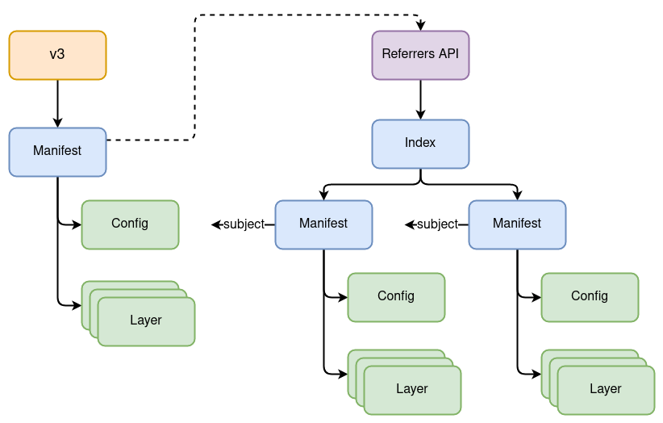

name: empty
layout: true
---
name: base
layout: true
template: empty
background-image: none
<div class="slide-footer">@bmitch@fosstodon.org</div>
---
name: ttitle
layout: true
template: empty
class: center, middle
background-image: url(img/containers_bg.png)
background-size: cover
---
name: inverse
layout: true
template: base
class: center, middle, inverse
background-image: none
---
name: impact
layout: true
template: base
class: center, middle, impact
background-image: url(img/containers_bg.png)
background-size: cover
---
name: picture
layout: true
template: base
class: center, middle
background-image: none
---
name: terminal
layout: true
template: base
class: center, middle, terminal
background-image: none
---
name: default
layout: true
template: base
background-image: url(img/containers_bg.png)
background-size: cover
---
layout: false
template: default
name: agenda

# Agenda

- [Container Images](#container-images)
- [Associating Artifacts](#associating-artifacts)
- [Referrers Response](#referrers-response)
- [Demo](#demo)
- [Status](#status)

---
layout: false
name: ttitle
template: ttitle

# Modifying the Immutable:<br>Attaching Artifacts to OCI Images

.left-column[
.pic-circle-70[]
]
.right-column[.v-align-mid[.no-bullets[
<br>
- Brandon Mitchell
- Mastodon: @bmitch@fosstodon.org
- Twitter: @sudo_bmitch
- GitHub: sudo-bmitch
]]]
???
- My twitter and github handles are what any self respecting sysadmin does
  when you get a permission denied error on your favorite username.
- This presentation is on github and I'll have a link to it at the end,
  I'll be going fast so don't panic if you miss a slide.
---
template: default

```no-highlight
$ whoami
- Brandon Mitchell
- Solutions Architect @ BoxBoat, an IBM Company
- OCI Maintainer, regclient, Docker Captain
- StackOverflow, CNCF, OpenSSF
```

.align-center[
.pic-30[]

.pic-30[]

.pic-30[]
]

???

- Who am I?
  - By day I'm a consultant that helps paid clients transition to containers.
  - I'm also a maintainer for OCI and a Docker Captain.
  - In my downtime I developer some side projects like regclient, answer questions
    on StackOverflow, and I'm often seen on CNCF and OpenSSF meetings

---

name: container-images

# Container Images

- Created with `docker build`
- Filesystem layers
- Inspecting images to see history and config
- Multi-platform images
- Sometimes referenced with `sha256:...`

???

- You've likely run `docker build` to create them, or some other builder
- Most people here know what a container image is, often described as a set of filesystem layers
- You've likely inspected an image and seen the command that it runs, maybe the history of how it was built, but that's not a layer
- Perhaps you have built multi-platform images to support other architectures like arm64 for M1 users
- You have probably seen `sha256:...` digests to pin an image
- Lets dissect this

---

class: small

# Content Addressable Store

```no-highlight
$ ldigest=sha256:8921db27df2831fa6eaa85321205a2470c669b855f3ec95d5a3c2b46de0442c9

$ curl -s http://localhost:5000/v2/$repo/blobs/$ldigest | sha256sum
8921db27df2831fa6eaa85321205a2470c669b855f3ec95d5a3c2b46de0442c9  -
```

???

- Content in registries is content addressable, the hash in the request is the hash of the content
- This is the same pattern as Git, Nix, and ipfs
- Very useful for deduplication, caching, and security, avoids mutable references

---

class: small

# Layers

```no-highlight
$ curl -s http://localhost:5000/v2/$repo/blobs/$ldigest | tar -tvzf - | head
drwxr-xr-x 0/0               0 2023-01-09 07:46 bin/
lrwxrwxrwx 0/0               0 2023-01-09 07:46 bin/arch -> /bin/busybox
lrwxrwxrwx 0/0               0 2023-01-09 07:46 bin/ash -> /bin/busybox
lrwxrwxrwx 0/0               0 2023-01-09 07:46 bin/base64 -> /bin/busybox
lrwxrwxrwx 0/0               0 2023-01-09 07:46 bin/bbconfig -> /bin/busybox
-rwxr-xr-x 0/0          841392 2022-11-19 05:13 bin/busybox
lrwxrwxrwx 0/0               0 2023-01-09 07:46 bin/cat -> /bin/busybox
lrwxrwxrwx 0/0               0 2023-01-09 07:46 bin/chattr -> /bin/busybox
lrwxrwxrwx 0/0               0 2023-01-09 07:46 bin/chgrp -> /bin/busybox
lrwxrwxrwx 0/0               0 2023-01-09 07:46 bin/chmod -> /bin/busybox
```

???

- There are two major interfaces in an OCI registry, one is for blobs
- Blobs can contain any opaque content
- In this case it's a filesystem layer, typically as a tar+gzip compression

---

class: small

# Config

```no-highlight
$ curl -s http://localhost:5000/v2/$repo/blobs/$cdigest | jq .
{
  "config": {
    "Env": [
      "PATH=/usr/local/sbin:/usr/local/bin:/usr/sbin:/usr/bin:/sbin:/bin"
    ],
    "Cmd": [ "/bin/sh" ],
    "WorkingDir": "",
...
    "Labels": null
  },
  "history": [
    {
      "created": "2023-01-09T17:05:20.497231175Z",
      "created_by": "/bin/sh -c #(nop) ADD file:e4d600fc4c9c29... in / "
...
}
```

???

- Images are not just layers, they have a configuration to identify the command to run, environment variables, labels, etc.
- To package that in a blob, OCI serializes it JSON
- As a user, we just need to know the hash/digest of that content

---

class: small

# Image Manifest

```no-highlight
$ curl -s http://localhost:5000/v2/$repo/manifests/$mdigest | jq .
{
  "schemaVersion": 2,
  "mediaType": "application/vnd.docker.distribution.manifest.v2+json",
  "config": {
    "mediaType": "application/vnd.docker.container.image.v1+json",
    "size": 1472,
*   "digest": "sha256:042a816809aac8d0f7d7cacac7965782ee2ecac3f21bcf9f24b1de1a7387b769"
  },
  "layers": [
    {
      "mediaType": "application/vnd.docker.image.rootfs.diff.tar.gzip",
      "size": 3370628,
*     "digest": "sha256:8921db27df2831fa6eaa85321205a2470c669b855f3ec95d5a3c2b46de0442c9"
    }
  ]
}
```

???

- The second major API is for manifests, and these registries will parse
- Like with the config, it is serialized JSON, and it has a content addressable hash
- This manifest assembles the config, along with a list of layers, to define our image
- Each of the references to other content is implemented using a descriptor
  - Media Type, Digest, Size, and optional annotations
  - Our APIs are scoped to a repository, so the descriptor must point to a blob in the same repository

---

class: center,middle

# Tags

.pic-80[.pic-rounded-10[]]

???

- What if we don't know the digest?
- For that we have tags, which are essentially pointers or symbolic links to a specific manifest

---

class: small

# Multi-platform Images

```no-highlight
$ curl -H 'Accept: application/vnd.docker.distribution.manifest.list.v2+json' -s \
  http://localhost:5000/v2/$repo/manifests/alpine | jq .
{
* "mediaType": "application/vnd.docker.distribution.manifest.list.v2+json",
  "manifests": [
    {
*     "digest": "sha256:93d5a28ff72d288d69b5997b8ba47396d2cbb62a72b5d87cd3351094b5d578a0",
      "mediaType": "application/vnd.docker.distribution.manifest.v2+json",
      "platform": {
*       "architecture": "amd64",
        "os": "linux"
      },
      "size": 528
    },
    {
*     "digest": "sha256:01a4cdaebc9c6af607753cc538c507d0867897cdf9a1caa70bbab2eb1506c964",
      "mediaType": "application/vnd.docker.distribution.manifest.v2+json",
      "platform": {
*       "architecture": "arm",
        "os": "linux",
        "variant": "v6"
...
```

???

- There's another manifest type, called a manifest list, or in OCI, an Index
- This manifest contains a list of descriptors to manifests
- Those descriptors can also have a "platform" section, so runtimes can find their platform from the list and pull the appropriate manifest
- This Index is JSON, gets serialized, and has its own digest (registries are consistent like that)

---

class: center,middle

# Multi-platform Images

.pic-80[.pic-rounded-10[]]

???

- The multi-platform manifest expands our picture to multiple manifests
- A single tag can point to the top manifest
- Runtimes then pull their individual platform

---

class: small

# Artifacts

```no-highlight
$ adigest=sha256:ea706edf61ef640bcdf3c9ac9045c28446e6b2d08541b9ad614c7267d0b87375
$ curl -s http://localhost:5000/v2/$repo/blobs/$adigest
contains electrons
```

???

- Anything can be a blob, like the string "contains electrons"

---

class: small

# Artifacts

```no-highlight
*$ adigest=sha256:ea706edf61ef640bcdf3c9ac9045c28446e6b2d08541b9ad614c7267d0b87375
$ curl -s http://localhost:5000/v2/$repo/blobs/$adigest
contains electrons

$ curl ... http://localhost:5000/v2/$repo/manifests/$amdigest | jq .
{
  "schemaVersion": 2,
  "mediaType": "application/vnd.oci.image.manifest.v1+json",
  "config": {
*   "mediaType": "application/vnd.example.ebom.config",
    "size": 2,
    "digest": "sha256:44136fa355b3678a1146ad16f7e8649e94fb4fc21fe77e8310c060f61caaff8a"
  },
  "layers": [
    {
*     "mediaType": "application/vnd.example.ebom.data",
      "size": 19,
*     "digest": "sha256:ea706edf61ef640bcdf3c9ac9045c28446e6b2d08541b9ad614c7267d0b87375"
    }
  ]
}
```

???

- And it can be wrapped with a manifest
- To use existing manifest types, we can pass a custom config media type
  - That config is just `{}` to be valid json for some registries and clients
- This is done today with Helm charts, cosign signatures, GitOps state with Flux

---

# Immutability

- Content Addressable Store: content of each node is referenced by hash of itself
- DAG: Directed Acyclic Graph
- Merkle tree:
  - Manifest is the root node with a hash
  - Content of the root node is the hash of each child node

???

- The resulting structure follows a pattern:
  - CAS: reference the content by the hash of itself
  - DAG: there are no loops, everything must terminate
  - Merkle Tree: each node contains the hashes of child nodes
- Putting those together gives us immutability absent of a hash collision
- Given an image digest, you know it has not been modified
  - Building a new image may only change one layer or some config metadata, resulting in a new digest
- Common pattern: used by Git, ipfs, blockchains
  - Useful for security, but it creates a challenge

---

name: associating-artifacts

# Challenge: Associating Artifacts with Images

- SBOMs, Attestations, Signatures
- How do we associate new artifacts with an existing immutable image?

???

T: 8m

- Many of the artifacts people want to create are associated with an image
- We need the ability to take a given image, and lookup the artifacts that are associated with it
- Those are artifacts like
  - SBOMs: the software bill of materials, or ingredients list of an image
  - Signatures: a cryptographic stamp of approval
  - Attestations: provenance of how the image was created
  - Other data: Dockerfile + context for rebuilding, license file for legal
- How do we associate new artifacts with an immutable image?

---

# OCI Working Group Goals

- Efficient on registry processing, bandwidth, and round trips
- Attaching to existing images
- Option to detach when copying
- Referencing images by digest or tag
- Multiple artifacts of the same type are possible
- Not limited to known artifact types

???

- OCI looked at this issue and created a working group to define a solution
- We created a working group with a list of goals:
  - efficiency, attach and detach by downstream users
  - we can't predict how users will use this, there will be new types of artifacts
- We looked at multiple solutions

---

class: small

# Option: Modifying the Index

```no-highlight
{
  "mediaType": "application/vnd.oci.image.index.v1+json",
  "manifests": [
    {
*     "digest": "sha256:93d5a28ff72d288d69b5997b8ba47396d2cbb62a72b5d87cd3351094b5d578a0",
      "mediaType": "application/vnd.oci.image.manifest.v1+json",
      "platform": {
        "architecture": "amd64",
        "os": "linux"
      },
      "size": 528
    },
    {
      "digest": "sha256:01a4cdaebc9c6af607753cc538c507d0867897cdf9a1caa70bbab2eb1506c964",
      "mediaType": "application/vnd.oci.image.manifest.v1+json",
*     "artifactType": "application/vnd.example.ebom.config",
*     "extends": "sha256:93d5a28ff72d288d69b5997b8ba47396d2cbb62a72b5d87cd3351094b5d578a0",
      "size": 1024,
...
```

???

- Some have suggested that we mutate the index
- This preserves the existing DAG model, but it modifies the index digest for each change
- Changing the digest breaks any users that depend on a specific digest (auditors)
- Unable to go from the digest of the image back to the index (may image can be listed in 0-n indexes)
- Different artifacts for the same image depending on which index is pulled
- Adding artifacts to the index would require another layer of abstraction (index nested in an index, which is no longer recognized by runtimes)
- New entries in the index could break some runtimes that are only expecting runnable images in the index
- Single platform manifests would now have an index, breaking runtimes that worked with the single platform manifest
- Something like this would only be useful for the originator at the expense of downstream users

---

class: center,middle

# Option: New Manifest, Subject Field, and API

.pic-80[.pic-rounded-10[]]

???

- We considered what ORAS did, creating a new manifest just for artifacts
- Registries validate manifests, so this is not backwards compatible
- Include a subject field in the artifact that references the original image
- Add an API to list all manifest that have a subject with a specific digest
- Pro: efficient API
- Con: no support for existing registries

---

class: center,middle

# Option: Subject Field on Existing Manifests

.pic-80[.pic-rounded-10[]]

???

- We also looked at extending existing manifests
- OCI allows forward compatibility by allowing unknown fields
- Pro: manifests are portable across existing registries
- Con:
  - Can't call API from existing registries
  - Extending some fields creates logical loops in the DAG

---

class: center,middle

# Option: Custom Tag Syntax

.pic-80[.pic-rounded-10[]]

???

- We considered what sigstore/cosign did, defining a tag syntax for looking up manifests that refer to another
- The tag is formatted with the digest of the extended image
- In our case, the tag returns an index of manifests that can be managed by clients without any change to the registry
- Each manifest entry in the Index contains annotations for client side filtering

---

template: inverse

# So which option did we pick?

???

T: 14m

- We ultimately settled on a combination of the last two

---

# How does this all come together?

- Add a `subject` and `artifactType` field to the Image and Index manifests
- Add a referrers API to query the subject field
- Clients manage a tag if the referrers API isn't available

???

- The result of merging the last two options together is:
- Added subject and artifactType to Image manifest
- And we added both a new referrers API and a fallback to using a tag

---

class: center,middle

.pic-80[.pic-rounded-10[]]

???

- Graphically, the mash up looks like this
- I avoided drawing the subject lines all the way back to their original manifest for simplicity
- We have our image being extended on the left
- And then 0 to n artifacts, using the image manifest, on the right
- We list those artifacts using the OCI Index, which is the manifest list in OCI
- That index is initially generated by clients using a special tag
- Every manifest with a subject pointing to a specific digest will be listed in the Index

---

class: center,middle

.pic-80[.pic-rounded-10[]]

???

- When the Referrers API is supported on the registry, the API replaces the client managed tag
- The content is identical, both return an index
- When the registry manages the response, GC is better, and race conditions are avoided

---

name: referrers-response
class: small

# Referrers Response

```no-highlight
$ curl -I -H 'Accept: application/vnd.docker.distribution.manifest.list.v2+json' -s \
  http://localhost:5000/v2/$repo/manifests/alpine | grep Docker-Content-Digest
Docker-Content-Digest: sha256:f271e74b17ced29b915d351685fd4644785c6d1559dd1f2d4189a5e851ef753a

*$ ref_tag=sha256-f271e74b17ced29b915d351685fd4644785c6d1559dd1f2d4189a5e851ef753a

$ curl -H 'Accept: application/vnd.oci.image.index.v1+json' -s \
  http://localhost:5000/v2/$repo/manifests/${ref_tag} | jq .
{
* "mediaType": "application/vnd.oci.image.index.v1+json",
  "manifests": [
    {
      "mediaType": "application/vnd.oci.image.manifest.v1+json",
      "size": 680,
      "digest": "sha256:71bc43bc5288af84620c535ec04f31080d09c4dce9da6c0011b425d13c25e4bb",
      "annotations": {
*       "org.opencontainers.artifact.created": "2023-02-01T09:10:11Z"
      },
*     "artifactType": "application/vnd.example.ebom"
    }
...
```

???

T: 18:00

- The Referrers response is an Index (Manifest List)
- Each descriptor is a manifest with a subject field set to the digest in the request (API or tag)
- There may be lots of artifacts with the subject pointing to the same manifest
- To identify the needed artifact from the list, we pull up the artifact type and annotations
- So lets look at this artifact manifest

---

class: small

# Subject and Artifact Type Fields

```no-highlight
$ curl ... http://localhost:5000/v2/$repo/manifests/$mdigest | jq .
{
  "mediaType": "application/vnd.oci.image.manifest.v1+json",
* "artifactType": "application/vnd.example.ebom",
  "config": {
*   "mediaType": "application/vnd.oci.scratch.v1+json",
    "size": 2,
    "digest": "sha256:44136fa355b3678a1146ad16f7e8649e94fb4fc21fe77e8310c060f61caaff8a"
  },
  "layers": [{...
      "mediaType": "application/vnd.example.ebom",
      "digest": "sha256:ea706edf61ef640bcdf3c9ac9045c28446e6b2d08541b9ad614c7267d0b87375"
  }],
  "annotations": {
*   "org.opencontainers.artifact.created": "2023-02-01T09:10:11Z"
  },
  "subject": {
    "mediaType": "application/vnd.docker.distribution.manifest.list.v2+json",
    "size": 1638,
*   "digest": "sha256:f271e74b17ced29b915d351685fd4644785c6d1559dd1f2d4189a5e851ef753a"
  }
}
```

???

- This artifact is pushed using the image manifest
- The `artifactType` is pulled up
  - Using the `artifactType` if defined, else the `config.mediaType` value
- Any annotations here are pulled up
- And the subject matches
- So that's it, we added an association to the f27... manifest, without changing it
- We can add or remove these artifacts, and the referrers API or our fallback tag needs to update

---

template: inverse
name: demo

# Demo

???

T: 20m

---

class: small

# Demo Setup

```no-highlight
repo1="localhost:5001/demo-referrers-2023"
repourl1="http://localhost:5001/v2/demo-referrers-2023"
repo2="localhost:5002/demo-referrers-2023"
repourl2="http://localhost:5002/v2/demo-referrers-2023"

mtIndex="application/vnd.oci.image.index.v1+json"
mtImage="application/vnd.oci.image.manifest.v1+json"
export COSIGN_EXPERIMENTAL=1
export COSIGN_PASSWORD=password

regctl image copy --platform linux/amd64 regclient/regctl:edge ${repo1}:app
```

???

- For this demo I'm running two registries:
  - 1 is the CNCF distribution project, without the API
  - 2 is Zot, which supports the new API
- I'll also be using cosign with experimental support for referrers
- And for the app, I'm picking a single platform OCI image manifest to simplify the demos

---

exclude: true
template: terminal
class: center

<asciinema-player src="demo-1-setup.cast" cols=100 rows=26 preload=true font-size=16></asciinema-player>

???

Setup:

- I will be using two registries for this
- And all media types are OCI to simplify
- The first registry is distribution, or `registry:2`, which is OCI v1.0, listening on port 5001
- And the second registry is Zot, which is OCI v1.1-rc, listening on 5002

---

template: terminal
class: center

<asciinema-player src="demo-2-attach-sboms.cast" cols=100 rows=26 preload=true font-size=16></asciinema-player>

???

Attach SBOMs:

- I'm using syft to generate the SBOMs
- The first SBOM is CycloneDX in JSON
- And I'm attaching it to the image using the `regctl artifact put --subject`
- The rest of the args define media types and annotations to document what kind of artifact this is
- The second SBOM is SPDX, also in JSON
- And it's attached the same way, with different values for the media types and annotations

---

template: terminal
class: center

<asciinema-player src="demo-3-query-sboms.cast" cols=100 rows=26 preload=true font-size=16></asciinema-player>

???

Query:

- Now that the SBOM is attached, we want to query it
- The listing shows all artifacts attached to our app images
- And since this is on an OCI v1.0 registry, that's being done using this tag
- If you just want the SBOM, the `regctl artifact get` command lets you pull and artifact
- We need to know our image and the artifact type, the fallback tag is used to lookup the manifest we want, and pull the artifact from the layer

---

exclude: true
template: terminal
class: center

<asciinema-player src="demo-4-curl.cast" cols=100 rows=26 preload=true font-size=16></asciinema-player>

???

Curl:

- `regctl` is automating a lot for us, so here's what curl would look like
- First we pull that tag with the digest of our app image
- We can then get the digest of one of the artifact manifests
- From that artifact manifest, we see this is the cycloneDX example, with a single layer
- And we can pull that artifact blob digest to see the layer contents which is the SBOM

---

template: terminal
class: center

<asciinema-player src="demo-5-zot.cast" cols=100 rows=26 preload=true font-size=16></asciinema-player>

???

Zot

- What happens when we upgrade to v1.1?
- First, I'll copy our app image, including the referrers, from distribution to Zot
- When I list the artifacts, the SBOMs were included in the copy
- However the tag listing doesn't include the app digest tag

---

exclude: true
template: terminal
class: center

<asciinema-player src="demo-6-oci-layout.cast" cols=100 rows=26 preload=true font-size=16></asciinema-player>

???

OCI Layout

- For anyone that depends on air gapped scenarios, or wants to move images without a registry (e.g. stages of a CI pipeline)
- OCI Layout is the on-disk format of storing images
- The image and artifact list are available
- But since there's no server to implement the referrers API, we use the tag of the app image digest
- The directory contents is an index.json file and blob directory
- The index.json contains a list of tags, and this directory acts like a repository on a registry server
- I can get the digest of second manifest entry, which is our artifact list
- Pulling the first manifest from the artifact list returns the cycloneDX artifact manifest
- And pulling the first layer gets the SBOM itself

---

template: terminal
class: center

<asciinema-player src="demo-7-oras-and-public.cast" cols=100 rows=26 preload=true font-size=16></asciinema-player>


???

Other Tools:

- This is implemented by ORAS, cosign, and trivy

Public:

- And this has escaped the lab, I include these on my images in GHCR

---

name: status

# Current Status

- Ready for testing
- Close to GA

???

T: 25m

- There have been quite a few changes since this first came out of the working group
- We removed a separate artifact manifest type because it wasn't needed and hurts portability
- We added an `artifactType` field and defined an empty JSON media type (`{}`) for artifacts that do not have a dedicated config
- There is discussion on whether clients can push artifacts before the image they reference (so image could never be pulled before the signature is available)
- Testing is encouraged, production usage is at your own risk

---

# Registries

- Adopted: zot, Harbor
- Blocked: Docker Hub, GitLab

???

- Server support is mixed
- Zot has been an early adopter
- Harbor recently released support for a previous RC (without the `artifactType` addition)
- Most have no explicit support, like GHCR and `distribution/distribution`, and clients will use the fallback tag
- Docker Hub is explicitly blocking the subject field
  - Concern about including data pushed with fallback tag, may support it when OCI GA's
- GitLab blocks unknown artifact types, they approve specific config mediaType values
- ECR is blocking unknown fields in the manifest, but they added support for artifactType and subject

---

# Clients

- Client support: cosign, notation, oras, regclient, and trivy
- Clients manage the fallback tag
- Pick appropriate artifactType values
- Use annotations responsibly

???

- Client support is slowly building
  - I was showing regctl, oras, and cosign
  - Trivy has a plugin, though it needs some work (config mediaType, pull up annotations into fallback tag), and I couldn't get their "referrer get" command to work
  - Hoping that SBOM generators, vulnerability scanners, and other tools use this directly
- The fallback tag is the client responsibility, realize there are race conditions and interoperability
- The artifactType follows the IANA media type structure, and should use a registered type when available, or get the upstream project to define one
- Manifests with too many annotations may be refused by some registries
  - Goal is to allow at least 100 referrers in a 4MB index, so exceeding 400kb of annotations is likely to break

---

template: title
name: thanks

# Thank You

.no-bullets[
- github.com/sudo-bmitch/presentations
]

.content[
.left-column[
.pic-80[]
]
.right-column[.align-right[.no-bullets[
<br>
- Brandon Mitchell
- Mastodon: @bmitch@fosstodon.org
- Twitter: @sudo_bmitch
- GitHub: sudo-bmitch
]]]
]

???

- These slides are available online in my git repo, the link is there and the QR code will take you there too
