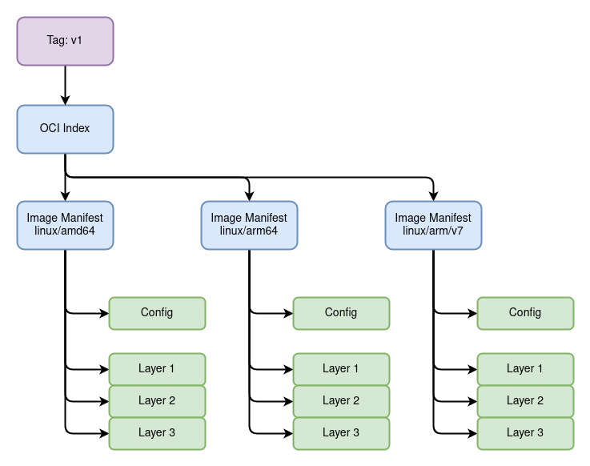
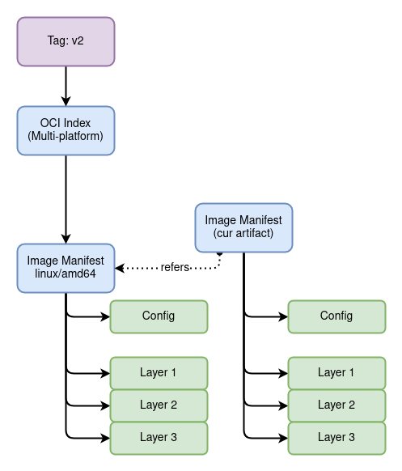
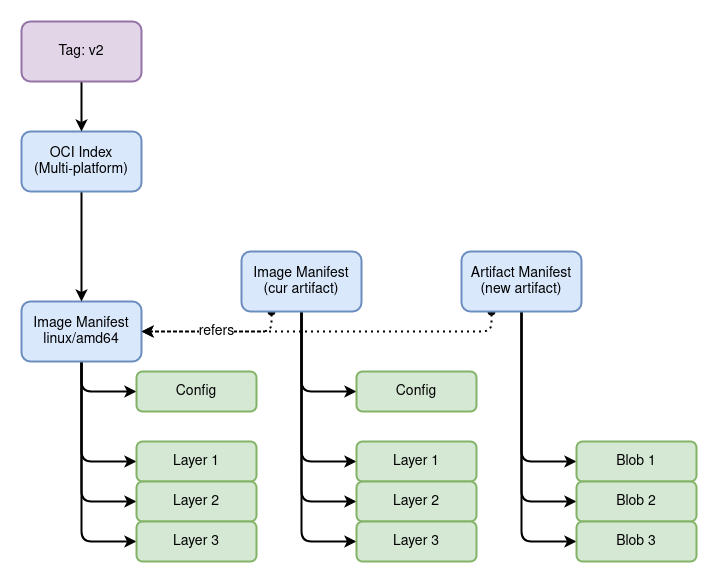
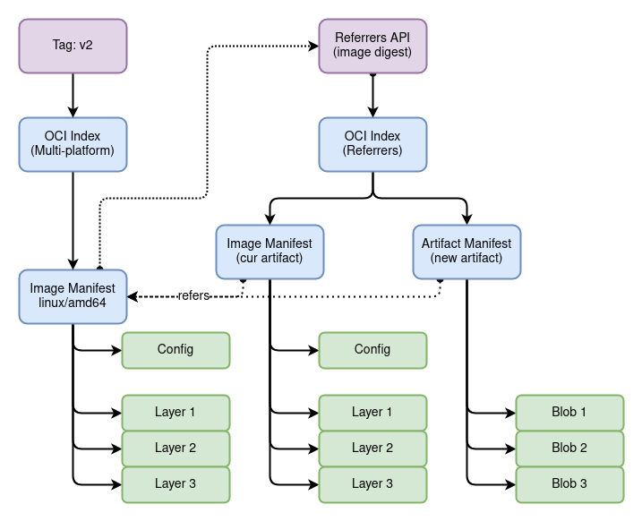

name: empty
layout: true
---
name: base
layout: true
template: empty
background-image: none
<div class="slide-footer">@sudo_bmitch</div>
---
name: ttitle
layout: true
template: empty
class: center, middle
background-image: url(img/containers_bg.png)
background-size: cover
---
name: inverse
layout: true
template: base
class: center, middle, inverse
background-image: none
---
name: impact
layout: true
template: base
class: center, middle, impact
background-image: url(img/containers_bg.png)
background-size: cover
---
name: picture
layout: true
template: base
class: center, middle
background-image: none
---
name: terminal
layout: true
template: base
class: center, middle, terminal
background-image: none
---
name: default
layout: true
template: base
background-image: url(img/containers_bg.png)
background-size: cover
---
layout: false
template: default
name: agenda

# Agenda

.left-column[
- [topic 1](#topic-1)
- [topic 2](#topic-2)
- [topic 3](#topic-3)
- [topic 4](#topic-4)
]
.right-column[
- [topic 5](#topic-5)
- [topic 6](#topic-6)
- [topic 7](#topic-7)
- [topic 8](#topic-8)
]

---
layout: false
name: ttitle
template: ttitle

# OCI Refers

.left-column[
.pic-circle-70[]
]
.right-column[.v-align-mid[.no-bullets[
<br>
- Brandon Mitchell
- Twitter: @sudo_bmitch
- GitHub: sudo-bmitch
]]]
???
- My twitter and github handles are what any self respecting sysadmin does
  when you get a permission denied error on your favorite username.
- This presentation is on github and I'll have a link to it at the end,
  I'll be going fast so don't panic if you miss a slide.
---
template: default

```no-highlight
$ whoami
- Brandon Mitchell
- Solutions Architect @ BoxBoat
- Docker Captain
- StackOverflow, OCI, CNCF
```

.align-center[
.pic-30[]
.pic-30[]
.pic-30[]
]

???

- Who am I?
  - By day I'm a consultant that helps paid clients transition to containers.
  - In my downtime I answer questions on StackOverflow.
  - Helping to spread knowledge about Docker through StackOverflow and
    presentations like this was my path to the Captains program.

---

template: inverse

# OCI Images

???

- First, a quick baseline on what's in an OCI image

---

class: small

# Image Config

```no-highlight
$ regctl blob get localhost:5000/library/golang \
  sha256:505a511fa01d77d70aea3023014a0628c41111566ae907ec3a945294f691980b | jq .
{
  "created": "2022-08-23T20:07:38.575765178Z",
  "architecture": "amd64",
  "os": "linux",
  "config": {
    "Env": [
      "PATH=/go/bin:/usr/local/go/bin:/usr/local/sbin:/usr/local/bin:/usr/sbin:/usr/bin:/sbin:/bin",
      "GOLANG_VERSION=1.19",
      "GOPATH=/go"
    ],
    "Cmd": [
      "bash"
    ],
    "WorkingDir": "/go"
  },
  "history": [
    {
      "created": "2022-08-23T00:20:40.144281895Z",
      "created_by": "/bin/sh -c #(nop) ADD file:6944d322f4c04bd2192061822af5cbec8ac0a6b4... in / "
    },
...
```

???

- Actual command that I ran was:
  `regctl image config localhost:5000/library/golang:1.19.0`
- That pulled the blob here and formatted it with just the OCI fields

---

class: small

# Layer

```no-highlight
$ regctl blob get localhost:5000/library/golang \
  sha256:1671565cc8df8c365c9b661d3fbc164e73d01f1b0430c6179588428f99a9da2e | \
  tar -tvzf - | head -15
drwxr-xr-x 0/0               0 2022-08-21 20:00 bin/
-rwxr-xr-x 0/0         1234376 2022-03-27 14:40 bin/bash
-rwxr-xr-x 0/0           43936 2020-09-24 04:36 bin/cat
-rwxr-xr-x 0/0           72672 2020-09-24 04:36 bin/chgrp
-rwxr-xr-x 0/0           64448 2020-09-24 04:36 bin/chmod
-rwxr-xr-x 0/0           72672 2020-09-24 04:36 bin/chown
-rwxr-xr-x 0/0          151168 2020-09-24 04:36 bin/cp
-rwxr-xr-x 0/0          125560 2020-12-10 08:23 bin/dash
-rwxr-xr-x 0/0          113664 2020-09-24 04:36 bin/date
-rwxr-xr-x 0/0           80968 2020-09-24 04:36 bin/dd
-rwxr-xr-x 0/0           93936 2020-09-24 04:36 bin/df
-rwxr-xr-x 0/0          147176 2020-09-24 04:36 bin/dir
-rwxr-xr-x 0/0           84440 2022-01-20 15:10 bin/dmesg
lrwxrwxrwx 0/0               0 2019-11-07 06:31 bin/dnsdomainname -> hostname
lrwxrwxrwx 0/0               0 2019-11-07 06:31 bin/domainname -> hostname
```

???

- Pulling the layer, sending through `tar -xvzf -` shows the contents of the layer

---

class: small

# Manifest

```no-highlight
$ regctl manifest get localhost:5000/library/golang:1.19.0 \
  --platform linux/amd64 --format body | jq .
{
  "schemaVersion": 2,
  "mediaType": "application/vnd.docker.distribution.manifest.v2+json",
  "config": {
    "mediaType": "application/vnd.docker.container.image.v1+json",
    "size": 7085,
    "digest": "sha256:505a511fa01d77d70aea3023014a0628c41111566ae907ec3a945294f691980b"
  },
  "layers": [
    {
      "mediaType": "application/vnd.docker.image.rootfs.diff.tar.gzip",
      "size": 55007555,
      "digest": "sha256:1671565cc8df8c365c9b661d3fbc164e73d01f1b0430c6179588428f99a9da2e"
    },
    {
      "mediaType": "application/vnd.docker.image.rootfs.diff.tar.gzip",
      "size": 5163019,
      "digest": "sha256:3e94d13e55e7a4ef17ff21376f57fb95c7e1706931f8704aa99260968d81f6e4"
...
]}
```

---

class: small

# Index

```no-highlight
$ regctl manifest get localhost:5000/library/golang:1.19.0 --format body | jq .
{
  "manifests": [
    {
      "digest": "sha256:4c00329e17be6fedd8bd4412df454a205348da00f9e0e5d763380a29eb096b75",
      "mediaType": "application/vnd.docker.distribution.manifest.v2+json",
      "platform": {
        "architecture": "amd64",
        "os": "linux"
      },
      "size": 1796
    },
    {
      "digest": "sha256:5cd53f75e749fef8e85726357cbc7765cdb1a86dad3f2d4fccfaff9307f35a32",
      "mediaType": "application/vnd.docker.distribution.manifest.v2+json",
      "platform": {
        "architecture": "arm64",
        "os": "linux",
        "variant": "v8"
      },
      "size": 1796
    },
...
```

---

class: small

# Content Addressable

```no-highlight
$ regctl manifest get --format body \
  localhost:5000/library/golang@sha256:4c00329e17be6fedd8bd4412df454a205348da00f9e0e5d7633...6b75 | \
  sha256sum
4c00329e17be6fedd8bd4412df454a205348da00f9e0e5d7633...6b75  -

$ regctl blob get localhost:5000/library/golang \
  sha256:505a511fa01d77d70aea3023014a0628c41111566ae907ec3a945294f691980b | \
  sha256sum
505a511fa01d77d70aea3023014a0628c41111566ae907ec3a945294f691980b  -

$ regctl blob get localhost:5000/library/golang \
  sha256:1671565cc8df8c365c9b661d3fbc164e73d01f1b0430c6179588428f99a9da2e | \
  sha256sum
1671565cc8df8c365c9b661d3fbc164e73d01f1b0430c6179588428f99a9da2e  -
```

---

class: center,middle

.pic-80[.pic-rounded-10[]]

???

- The result is a Merkle Tree and DAG (Directed Acyclic Graph) combination
- The registry cares about the DAG, manifests, and tags, for GC and consistency
- Blobs are free form data

---

template: inverse

# Not Just Container Images

???

- Registries started for container images, but we're growing past that

---

# A Blob is a Blob

- Arbitrary data can be pushed to a blob
- Manifests must have a known media type
- Helm Charts
- Cosign Signatures
- FluxCD State

???

- <https://github.com/fluxcd/flux2/releases/tag/v0.32.0>

---

class: small

# Helm Chart

```no-highlight
$ regctl manifest get localhost:5000/helm-charts/spire/spire:0.0.5 --format body | jq .
{
  "schemaVersion": 2,
  "config": {
    "mediaType": "application/vnd.cncf.helm.config.v1+json",
    "digest": "sha256:23b5b19b695d822e7c1e6e1bd17d49ec768ab4b4f71aeb7d20f0b378f6257298",
    "size": 139
  },
  "layers": [
    {
      "mediaType": "application/vnd.cncf.helm.chart.content.v1.tar+gzip",
      "digest": "sha256:ae2ef52c768449e51474033431f5c974a03d89278f89de0ed24f8b08d24f8447",
      "size": 6589
    }
  ]
}
```

---

class: small

# Helm Chart

```no-highlight
$ regctl blob get localhost:5000/helm-charts/spire/spire \
  sha256:23b5b19b695d822e7c1e6e1bd17d49ec768ab4b4f71aeb7d20f0b378f6257298 | \
  jq .
{
  "name": "spire",
  "version": "0.0.5",
  "description": "A Helm chart for Kubernetes",
  "apiVersion": "v2",
  "appVersion": "1.16.0",
  "type": "application"
}
```

---

class: small

# Helm Chart

```no-highlight
$ regctl blob get localhost:5000/helm-charts/spire/spire \
  sha256:ae2ef52c768449e51474033431f5c974a03d89278f89de0ed24f8b08d24f8447 | \
  tar -tvzf -
-rw-r--r-- 0/0             120 2022-03-17 17:51 spire/Chart.yaml
-rw-r--r-- 0/0            2657 2022-03-17 17:51 spire/values.yaml
-rw-r--r-- 0/0              24 2022-03-17 17:51 spire/templates/NOTES.txt
-rw-r--r-- 0/0            1786 2022-03-17 17:51 spire/templates/_helpers.tpl
-rw-r--r-- 0/0             325 2022-03-17 17:51 spire/templates/agent-account.yaml
-rw-r--r-- 0/0             866 2022-03-17 17:51 spire/templates/agent-cluster-role.yaml
-rw-r--r-- 0/0            1333 2022-03-17 17:51 spire/templates/agent-configmap.yaml
-rw-r--r-- 0/0            3609 2022-03-17 17:51 spire/templates/agent-daemonset.yaml
-rw-r--r-- 0/0             150 2022-03-17 17:51 spire/templates/bundle-configmap.yaml
-rw-r--r-- 0/0            1974 2022-03-17 17:51 spire/templates/client-deployment.yaml
-rw-r--r-- 0/0             728 2022-03-17 17:51 spire/templates/oidc-dp-configmap.yaml
-rw-r--r-- 0/0            2956 2022-03-17 17:51 spire/templates/oidc-ingress.yaml
-rw-r--r-- 0/0             890 2022-03-17 17:51 spire/templates/oidc-nginx-configmap.yaml
-rw-r--r-- 0/0             628 2022-03-17 17:51 spire/templates/oidc-service.yaml
-rw-r--r-- 0/0             326 2022-03-17 17:51 spire/templates/server-account.yaml
-rw-r--r-- 0/0            1008 2022-03-17 17:51 spire/templates/server-cluster-role.yaml
-rw-r--r-- 0/0            2006 2022-03-17 17:51 spire/templates/server-configmap.yaml
...
```

---

template: inverse

# Working Group

???

- OCI images and artifacts are all old news, why talk about this today?
- We had a working group, and we've pushed some changes
- Only just hit `main` last week, ways to go before we tag it
- And it will be some time before everyone is supporting the changes

---

# The Problem

- Many artifacts reference an image
- Images a content addressable, we don't want to change the digest
- Signatures are on a digest, so that cannot be embedded in the thing being signed
- How do we associate additional data with an images?

---

# The Goals

- Extend an existing image with new metadata
- Able to copy between registries
- Able to find a specific artifact from a list easily
- Minimize API calls
- Backwards compatibility

---

# The Solution

- Add a new `refers` field
  - An artifact manifest will have a `refers` that points to an image
- Add a new API to list the referrers
  - When pulling an image, you can list all artifact manifests with a `refers` pointing to it
  - Response is an OCI Index (list of manifests)
- Each entry in the referrers list includes data from the artifact manifest
  - Artifact Type and Annotations
  - Clients can filter for specific entries to minimize artifact pulls

???

- The refers field is a descriptor, on the artifact manifest, pointing to the image manifest
- Unique because this is the first time a child manifest point to a parent manifest
  - Extra care was needed to ensure we didn't break the DAG model
- Client filtering could look for Signatures to ignore SBOMs
- Could also look for annotations indicating a known key fingerprint and signatures that have not expired

---

# New Artifact Manifest

- Artifacts today are pushed with the Image manifest
- Removed the config descriptor
- Config mediaType => artifactType
- Ordered Layers => Optional Blob List

???

- If your artifact needs a config blob, you can include that in your blob list with a custom media type
- The config media type in the image was used to identify the type of blob before, e.g. `application/vnd.cncf.helm.config.v1+json`
- The Artifact Type pulled up in the referrers listing is this config mediaType or artifactType
- For an artifact, the different blobs aren't necessarily ordered, so we loosened that requirement in the spec
- Some some artifacts won't even have blobs, could just be annotations

---

class: center,middle

.pic-80[.pic-rounded-10[]]

???

- This is roughly what that looks like, we push a new manifest with a refers field
- The new manifest is going to be an SBOM or Signature, packaged with an image manifest
- The refers field in that artifact points back to our original image we are extending

---

class: center,middle

.pic-80[.pic-rounded-10[]]

???

- The new artifact manifest does the same thing, be without a separate config blob
- And now we call them blobs instead of layers
- It also has a refers field

---

class: center,middle

.pic-80[.pic-rounded-10[]]

???

- After pulling the image manifest, we can query the API to get a list of manifests with refers fields pointing to our image
- And from data in that list, we can pick which artifact we may want to pull

---

# Backwards Compatibility

- Registries reject unknown manifests and won't have the new API
- Continue using image manifests for some time
- If the API isn't available, clients maintain the same Index using a well known tag
- API is useful to avoid race conditions, bad clients, and GC

---

# Container Security

- Package signatures and SBOMs with the image
- Copy those artifacts with the image between registries
- Add your own artifacts to an image on your registry without changing the digest
- Package additional metadata like build attestations and reproducibility information

---

template: inverse

# regclient

???

- You may be ready for a demo, but first I'm going to throw in an ad
- It's for an open source project, so I'm not making any money here
- And it's for the project you've already seen in the previous examples

---

# regclient

- `regclient`: Go library for registry clients
- `regsync`: copy images between registries for mirrors
- `regbot`: create automations with Lua scripts (retention policies)
- `regctl`: CLI interface to `regclient`
  - Shipped as a binary, container, and GHA
  - querying a registry (fetch a digest, list tags)
  - copy/retag an image
  - export/import images using OCI Layout
  - delete tags or manifests
  - modify images
  - push/list/pull artifacts

???

- `regsync` I created when Docker introduced rate limits to maintain images local to my CI environment
  - Schedule when the images are updated from upstream
  - Options to copy lots of images from a repo, backup
- `regbot` was my answer when trying to create retention policies
  - Every policy was unique, couldn't make it a single yaml
  - So this is a Lua frontend to regclient APIs, still needs a better UX
- `regctl` is what I've been using in the demos
  - Multiple ways to install, including with a GHA
  - I've been running manifest and blob gets
  - Use it to copy multi-platform images without a docker engine
  - Retagging is fast
  - Export/import is useful for air-gapped environments
  - Only tool I know that deletes a tag, even when the registry doesn't support the newer OCI API
  - Modify images to change settings not enabled by the build tooling
  - Artifact support was developed here in parallel with the OCI WG

---

template: inverse

# Demo

???

- Lets put all this together

---

template: terminal
name: demo-mod
class: center

<asciinema-player src="demo-mod.cast" cols=100 rows=26 preload=true font-size=16></asciinema-player>

???

- first, lets modify an image
- I'll copy this from upstream
- The Index manifest shows docker media types
- The Image manifest shows no annotations
- The Config shows lots of labels that should be annotations
- The mod command has lots of options, we'll create a mod tag, convert to OCI, and promote labels to annotations
- The result now has OCI media types and annotations in the manifest
- The blob and layer digests were unchanged, but manifest digests were all updated

---

template: terminal
name: demo-artifact
class: center

<asciinema-player src="demo-artifact.cast" cols=100 rows=26 preload=true font-size=16></asciinema-player>

???

- the second demo, I'll generate some artifacts
- first I'll use syft to create some sbom files, both cyclonedx and spdx, not playing favorites
- in the repo, and for this tag, there are no artifacts
- first add the sbom, both files to the same artifact, with annotations, and a different media type per file
- we can also add anything as an artifact, in this case a string on stdin
- listing artifacts now shows our two artifacts
- we can pull a single artifact, showing our text
- and even a single blob from the sbom artifact to get spdx json
- since this registry does not have the new API yet, we see the tag with the digest
- and pulling that is the expected Index

---

template: inverse

# Wrapping Up

???

---

# Summary

- Registries can store anything in a blob
- We can associate artifacts with our image
- We can copy them together and extend existing images
- The refers listing includes enough details to select an artifact

---

# Gotchas

- The standard isn't tagged yet
- Tooling hasn't been updated to support this
- Registries need to be updated

???

- standard is not tagged yet, subject to change, potentially in non-compatible ways
- still need tooling to support this, many may be waiting for this to be tagged
- registries need to be upgraded to avoid race conditions, improve GC, and use the artifact media type

---

template: title
name: thanks

# Thank You

.no-bullets[
- github.com/sudo-bmitch/presentations
]

.content[
.left-column[
.pic-80[]
]
.right-column[.align-right[.no-bullets[
<br>
- Brandon Mitchell
- Twitter: @sudo_bmitch
- GitHub: sudo-bmitch
]]]
]

???

- These slides are available online in my git repo, the link is there and the QR code will take you there too
