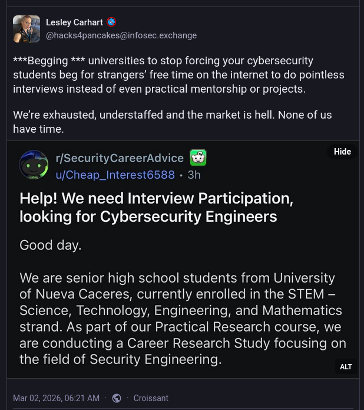

# Life of an OSS Developer

<div class="container">
<div class="col"><p data-markdown>

GWU OSCon 2026<br>
Brandon Mitchell<br>
2026-03-23

</p></div>

<div class="col" data-markdown>

</div>
</div>

Note:

- How many people here want to contribute to OSS projects?
- And how many people here maintain a popular OSS project, with >1000 users or stars?

------

## whoami

```shell
$ whoami
- Brandon Mitchell
- OSS Developer
- OCI Maintainer, regclient, Docker Captain
- Mastodon, Slack, Hacker News, Matrix, StackOverflow
```

Note:

- I'm semi-retired, at some point I'll take up some side projects
- My free time is spent as an open source developer
- My OSS focus is on the Open Container Initiative (OCI)
  - Under the Linux Foundation (LF)
  - That's the specification and some core projects used by Docker and Kubernetes
  - I'm a maintainer there, on the TOB, and my own side projects like regclient and olareg focus on it
  - I'm also a Docker Captain
- On the socials, I can be found on Mastodon, various Slacks, Hacker News, I'm trying Matrix, and I occasionally answer questions on StackOverflow
- When I'm not doing any of this, I like to go sailing on the Bay or take a bike ride on the W&OD

---

## Walk In Their Shoes

Note:

- I have a philosophy that if I were to have the same experiences and given the same opportunities of another, I would make their same choices.
  - So rather than discouraging a behavior, I think it's important to have an understanding of different groups.
- When I attended this conference last year, it was eye opening to me to see how OSS was perceived by the academic community
  - There's a lot of focus on research, grants, and an on-ramp to employment
- The goal of this talk is to share the experience of what it's like for a non-academic OSS maintainer.

---

## Software Is Unique

- Nearly free to copy
- One developer can scale to lots of users <!-- .element: class="fragment" data-fragment-index="2" -->
- Open source software increases potential users <!-- .element: class="fragment" data-fragment-index="3" -->
- ... but it also adds a pool of contributors <!-- .element: class="fragment" data-fragment-index="3" -->

Note:

- Unlike manufacturing, and lots of service jobs, software is easily replicated.
  - Paralleled by the music and movie industries.
- The ability for a developer to scale to lots of users is probably why we are paid so well.
- Open source adds more potential users, but it also adds a pool of contributors.

------

## I Want To Contribute

- I would like to contribute to your project, would someone guide me through the process?
- Please assign this issue to me
- I'm running a survey for my class
- Here's the fix to my problem that an LLM generated
- Please merge this pull request
- Why isn't there a response to all these requests?

Note:

- Maybe once a week, I see someone asking to contribute to OSS in what I'd describe as a counter-productive way.
- The focus of the maintainer is on producing value for the overall community.
- Meanwhile many of these requests are looking to extract value from OSS maintainers and projects for themselves.
- These are often requests to do unpaid work.

------

## Everyone Is Tired

 <!-- .element: height="580" -->

Note:

- This comes from the security side, but we see it all over.
- I'd like to appreciate that this is not a critique/request for the students, but of the faculty.

---

## Types of OSS Maintainer

- Company supported project
- Peripheral tool
- Personal side project <!-- .element: class="fragment" data-fragment-index="2" -->
- Retired, unemployed, students <!-- .element: class="fragment" data-fragment-index="2" -->

Note:

- Who's receiving those requests?
- A few companies will pay to have OSS developed for their core product
  - Often the employees are the maintainers, and are focused on the company rather than the community
  - Accepted changes are often based on whether it will drive more adoption of paid offerings
- Some companies sponsor OSS of what I call peripheral tools, outside of their core business
  - E.g. a video streaming company releasing their monitoring tool
- A good number of OSS maintainers are not paid, it's either
  - A side project outside of work
  - Or they are retired/unemployed/student where this doesn't directly detract from their income

------

## Maintainers Count

 <!-- .element: height="500" -->

<small>Source: <https://opensourcesecurity.io/2025/08-oss-one-person/></small>

Note:

- You likely have an expectation of OSS maintainers from large projects, those are the exception
- This is a chart of NPM maintainers per project
  - The left axis is the number of projects
  - The bottom axis is the number of maintainers
- Over 4 million projects have a single maintainer
- This is with only 900,000 NPM maintainers
  - Each NPM maintainer is, on average, managing more than 4 projects

---

## What Do Maintainers Do?

- Code
- Build process <!-- .element: class="fragment" data-fragment-index="2" -->
- Tests <!-- .element: class="fragment" data-fragment-index="2" -->
- CI and Artifacts <!-- .element: class="fragment" data-fragment-index="3" -->
- Tagging and Releases <!-- .element: class="fragment" data-fragment-index="3" -->
- Dependency Updates <!-- .element: class="fragment" data-fragment-index="4" -->
- Security Fixes <!-- .element: class="fragment" data-fragment-index="5" -->

Note:

- Coders want to code, specializing in their language and tools.
- When you release that app to the public you also need:
  - A process to build it, tests, versioned releases, generating artifacts
- Mature projects the need:
  - Maintained dependencies (often a majority of the commits)
  - Handling security reports and releasing fixes
- Compare what the developer wanted to do (code) vs what is expected, this is a lot of added overhead.
  - This isn't just OSS, the DevOps movement resulted in developers doing more in most orgs.

------

## Managing Contributions

- Contributor Policy
- "Do I want to maintain this?" <!-- .element: class="fragment" data-fragment-index="2" -->
- "Yes" is forever, "No" is temporary <!-- .element: class="fragment" data-fragment-index="3" -->

Note:

- But as an OSS maintainer, we may have external contributors.
- Often that's just requests for features or bug reports.
- When accepting change requests, hopefully the maintainer made a contributor policy.
  - This describes if and how they accept contributions.
  - Often it will guide the contributor with the development workflow to build, test, and verify the change before submitting it.
- Accepting a contribution is a commitment.
  - It's not just "is this good enough to merge?"
  - The maintainer is asking "am I willing to maintain this?"
- Maintainers that have reached their capacity will frequently ignore requests, or say "no".
  - They can later change their mind from "no to yes", but they can't easily go from "yes to no" without burning the community.

------

## Building a Community

- Identify the repeat contributors
- What is safe to delegate? Who can you trust? <!-- .element: class="fragment" data-fragment-index="2" -->
- Solo maintainers are the vast majority <!-- .element: class="fragment" data-fragment-index="3" -->

Note:

- So why not add more maintainers, spread that workload?
  - To start, you need to find repeat contributors, and most of what we see are one-off requests.
- Next, you need to trust that contributor.
  - There are malicious actors trying to take over existing projects to spread malware and backdoors (see the xz vulnerability).
  - And that contributor needs to be willing to take on more responsibility.
- For most projects, after an initial startup, maintainers leave at a faster pace than they are added.
  - For a significant majority, the project never expands beyond a single maintainer.

---

## Why Maintain OSS?

- Public recognition
- Resume
- Scratch an itch <!-- .element: class="fragment" data-fragment-index="2" -->
- Create alternative <!-- .element: class="fragment" data-fragment-index="2" -->
- Giving back <!-- .element: class="fragment" data-fragment-index="2" -->

Note:

- So now that I've done such a good job selling this, why would anyone want to do it?
- Some are looking for public recognition or resume material.
  - This can be done with your own projects, even if you later archive it.
- Many maintainers are scratching itches, building something they couldn't find elsewhere
  - Disposable AI projects may eat into this market
- Sometimes the alternatives have issues, paid, wrong license, wrong design.
- And there are those giving back after consuming OSS for their career (me).
  - Age fears don't concern me, I believe there will constantly be a new supply of experienced older OSS maintainers.
  - For younger OSS maintainers, we need to work on funding, because it is rarely a good business model.

---

## Takeaways

- OSS maintainers are often solo and unpaid
- Contributions should focus on creating value
- Instead of "no":
  > Thanks for the PR, but it's not something I'm willing to maintain.
  > I encourage you to maintain your own fork in case others find it useful.
- That "no" could later become a "yes"

Note:

- Realize that the people you may be working with are often unpaid individuals in their spare time, possibly burned out.
- Create value, don't extract it.
- Instead of only saying "no" to a contribution, I'm trying to say:
  - "Thanks for the PR, but it's not something I'm willing to maintain. I encourage you to maintain your own fork in case others find it useful."
- Maybe one day I'll change my mind, turning that "no" into a "yes".

---

# Thank You

<div class="container">
<div class="col"><p data-markdown>


</div>
<div class="col"><p data-markdown>

- Brandon Mitchell
- GitHub: sudo-bmitch
- Mastodon: fosstodon.org/@bmitch

</div>
</div>

github.com/sudo-bmitch/presentations

Note:

- These slides are also available on my GitHub repo.

<!-- markdownlint-disable-file MD025 -->
<!-- markdownlint-disable-file MD034 -->
<!-- markdownlint-disable-file MD033 -->
<!-- markdownlint-disable-file MD035 -->
