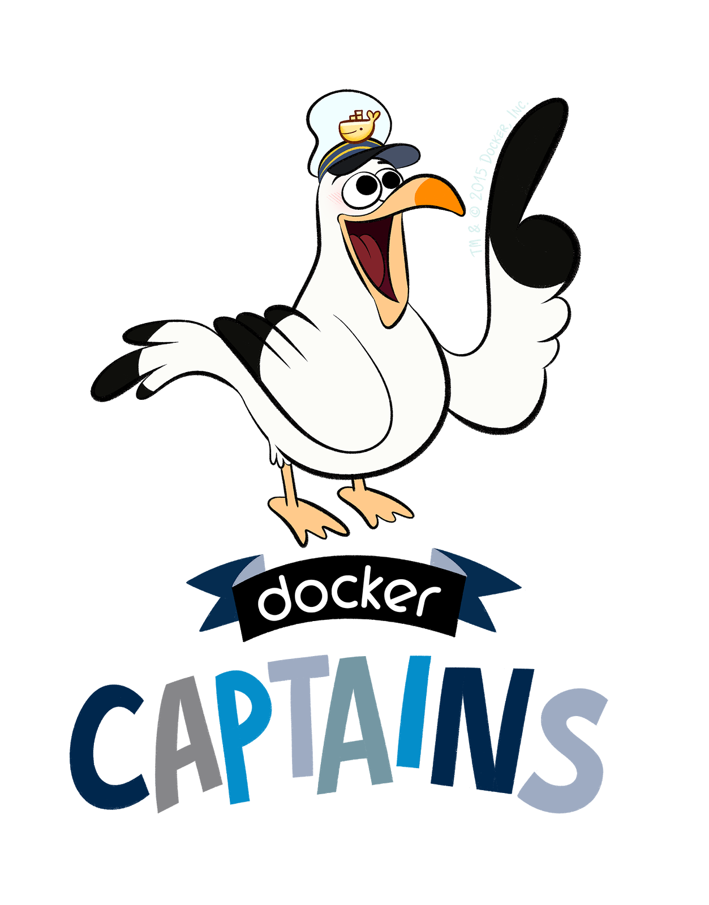

name: empty
layout: true
---
name: base
layout: true
template: empty
background-image: none
<div class="slide-footer">@sudo_bmitch</div>
---
name: ttitle
layout: true
template: empty
class: center, middle
background-image: url(img/containers_bg.png)
background-size: cover
---
name: inverse
layout: true
template: base
class: center, middle, inverse
background-image: none
---
name: impact
layout: true
template: base
class: center, middle, impact
background-image: url(img/containers_bg.png)
background-size: cover
---
name: picture
layout: true
template: base
class: center, middle
background-image: none
---
name: terminal
layout: true
template: base
class: center, middle, terminal
background-image: none
---
name: default
layout: true
template: base
background-image: url(img/containers_bg.png)
background-size: cover
---
layout: false
template: default
name: agenda

# Agenda

.left-column[
- [Why](#why)
- [Workshop](#workshop)
- [Deploy a Registry](#workshop-registry)
- [regsync config](#workshop-sync-cfg)
- [regsync once](#workshop-once)
- [regsync server](#workshop-server)
- [Using the Mirror](#workshop-dockerfile)
]
.right-column[
- [Garbage Collection](#garbage-collection)
- [regbot config](#regbot-config)
- [regbot dryrun](#regbot-dryrun)
- [regbot server](#regbot-server)
- [Registry GC](#registry-gc)
- [Cleanup](#workshop-cleanup)
- [Conclusion](#conclusion)
]

---
layout: false
name: ttitle
template: ttitle

# Maintaining a Local <br>Registry Mirror

.left-column[
.pic-circle-70[]
]
.right-column[.v-align-mid[.no-bullets[
<br>
- Brandon Mitchell
- Twitter: @sudo_bmitch
- GitHub: sudo-bmitch
]]]
???
- My twitter and github handles are what any self respecting sysadmin does
  when you get a permission denied error on your favorite username.
- This presentation is on github and I'll have a link to it at the end,
  I'll be going fast so don't panic if you miss a slide.
---
template: default

```no-highlight
$ whoami
- Solutions Architect @ BoxBoat
- Docker Captain
- Frequenter of StackOverflow
```

.align-center[
.pic-30[]
.pic-30[]
.pic-30[]
]

???

- Who am I?
  - By day I'm a consultant that helps paid clients transition to containers.
  - In my downtime I answer questions on StackOverflow.
  - Helping to spread knowledge about Docker through StackOverflow and
    presentations like this was my path to the Captains program.
  - I'm also the author of the regclient and related tools we'll discuss in this
    presentation.

---

name: why
template: inverse

# Why

???

- Why would you want to maintain your own mirror?

---

# Why

- Outages happen
- Bandwidth is expensive and slow
- Rate limits

???
- Stuff breaks, if cloudflare goes offline, DNS flakes out, BGP mis-routes traffic, we want to avoid external dependencies
- Bandwidth is also a challenge, costing money and time
- And we're hitting Docker so hard they had to put rate limits on Hub

--
- Pull through cache is unpredictable
- Ability to revert an upstream change
- Control over approved images

???
- Some of you may have already solved this with a pull through cache or automatic mirror built into your registry
- However if you want to control when changes from upstream are applied, and have the ability to revert, a pull through cache is less ideal
- And it's not the answer if you want to control what images are brought into your network

---

template: inverse

# Original Solution

???

- Many of you will have already done the original solution

---

# Original Solution

```no-highlight
docker image pull alpine:latest
docker image tag alpine:latest localhost:5000/alpine:latest
docker image push localhost:5000/alpine:latest
```

???

- You pull the image, retag it, and then push to your other registry
- But there are several issues with this

---

# Original Solution Issues

- Missing the `library`
  - `alpine:latest` is really `docker.io/library/alpine:latest`
  - So we should copy to `localhost:5000/library/alpine:latest`
- `docker pull` dereferences an image to a single platform
- Every layer is pulled
- Requires a docker engine

???

- If you want to support multiple platforms, like ARM/Mac M1 users, a pull is bad
- If the target registry already has the layers, we still pull them if the docker engine is missing those layers (e.g. ephemeral build nodes)
- I'm a fan of docker, but for copying images between registries, it's more than we need

---

template: inverse

# New Solution

???

- So I ended up writing my own solution

---

class: center, middle

.pic-80[.pic-rounded-10[]]

.small[xkcd.com/927/]

???

- I'm not the first to do this

---

# Registry Tooling

- skopeo
- crane
- regclient

???

- There are several solutions out there
- The most popular is probably skopeo from RedHat 
- There's also crane that is part of Google's go-containerregistry project
- The implementation I've been working on is called regclient
- The API itself is documented by OCI, you could write curl commands, but auth quickly gets complicated

---

class: center, middle

.pic-80[.pic-rounded-10[]]

???

- By making a solution specific to this problem, we can optimize it
- We cover multi-platform images with the loop in the  purple circle
- And we shortcut all the copy commands, either skipping them entirely or performing a server-side copy when possible
- Only when all that fails do we copy the underlying layer in the bottom right
- Importantly the very first check has a minimal impact on registries, we can check for the digest without pulling the image

---

name: workshop
template: inverse

# Workshop

???

- This talk is designed to be done as a workshop

---

class: center, middle

[https://github.com/sudo-bmitch/presentations/tree/main/reg-mirror/workshop/](workshop/README.md)

???

- Share link in chat: <https://github.com/sudo-bmitch/presentations/tree/main/reg-mirror/workshop/>
- If you'd like to do the workshop yourself, there's a link to the repo where you can go through each step
- Note that there's a compose file and other yml's in there for an easy button, but they skip a few steps we'll do in the workshop, so I'd recommend following the README.md

---

name: workshop-registry
template: inverse

# Step 1: Deploy a Registry

???

- First thing we need is a registry server
- If you already have a registry running, you can skip this step, but other commands will need

---

# Step 1: Deploy a Registry

```no-highlight
docker container run -d --restart=unless-stopped --name registry \
  -e "REGISTRY_STORAGE_FILESYSTEM_ROOTDIRECTORY=/var/lib/registry" \
  -e "REGISTRY_STORAGE_DELETE_ENABLED=true" \
  -e "REGISTRY_VALIDATION_DISABLED=true" \
  -v "registry-data:/var/lib/registry" \
  -p "127.0.0.1:5000:5000" \
  registry:2
```

???

- We're deploying the registry with the `registry:2` image
- I'm configuring storage to go to a volume
- There are a few flags to allow delete operations and disable validation on external URL's (seen with Windows images)
- Note that there's no security configured, so I'm only exposing this on localhost

---

template: terminal
name: demo-1
class: center

<asciinema-player src="demo-1-registry.cast" cols=100 rows=26 preload=true font-size=16></asciinema-player>

???
- First we run that "container run" command for "registry:2"
- It pulls a few layers
- And the registry is running, it's pretty painless (auth and maintaining it are the hard parts)

---

name: workshop-sync-cfg
template: inverse

# Step 2: Configure a Policy

???

- Next, lets specify how we want to copy images between the registries

---

# Step 2: Configure a Policy

```no-highlight
creds:
  - registry: localhost:5000
    tls: disabled
  - registry: docker.io
    user: "{{env \"HUB_USER\"}}"
    pass: "{{file \"/home/appuser/.docker/hub_token\"}}"
defaults:
  ratelimit:
    min: 60
    retry: 15m
  parallel: 2
  interval: 60m
  backup: "{{ $t := time.Now }}{{
             printf \"bkup-%s-%d%d%d\" .Ref.Tag $t.Year $t.Month $t.Day}}"
sync:
  ...
```

???

- The regclient solution to this uses a `regsync.yml` file where you can define a variety of settings
- The creds section defines how we connect to each registry
  - TLS is disabled for the local registry
  - The Hub login is injected with an env var and secret file
- The defaults apply to all sync steps
  - The rate limit stops running pulls from Hub before exceeding the rate limit
  - The interval runs this continuously when deployed in server mode
  - The backup option saves a date-stamped backup of old tags, allowing you to revert if an upstream issue is encountered

---

# Step 2: Configure a Policy (cont.)

```no-highlight
...
sync:
  - source: busybox:latest
    target: localhost:5000/library/busybox:latest
    type: image
  - source: alpine
    target: localhost:5000/library/alpine
    type: repository
    tags:
      allow:
      - "latest"
      - "3"
      - "3.13"
      - "3.14"
```

???

- Each sync entry has a type, like "image" or "repository" to copy a single image or everything in the repository
- We set a source and target
- And with the repository, I'm filtering on a specific set of tags, it allows wildcards, there's also a deny option to filter out tags
- The above example is trying to be minimal overhead on your image pulls by not copying too much

---

name: workshop-once
template: inverse

# Step 3: Test the Configuration

???

- To test the configuration, run it in the "once" mode

---

# Step 3: Test the Configuration

```no-highlight
export HUB_USER=your_username

mkdir -p ${HOME}/.docker
echo "your_hub_password" >${HOME}/.docker/hub_token

docker container run -it --rm --net host \
  -v "$(pwd)/regsync.yml:/home/appuser/regsync.yml:ro" \
  -v "${HOME}/.docker/hub_token:/home/appuser/.docker/hub_token:ro" \
  -e "HUB_USER" \
  regclient/regsync:latest -c /home/appuser/regsync.yml once
```

???

- In each of the regsync examples, I've exported my Hub user as a variable
- I've also written my token to a file. This can be a password without 2FA, but I'd recommend an access token you can get from Hub (under your profile, security settings)
- Then we run the `regclient/regsync` image
  - on the host network, so it can see `localhost`
  - With the `regsync.yml` mounted as a volume (you may need to open up read permissions if you run this on linux)
  - And passing the `once` option which performs each step immediately without waiting for the normal schedule
- You should see various images getting copied which may take a few minutes based on your network speed

---

name: workshop-server
template: inverse

# Step 4: Automate

???

- Finally to automate, it's the same command with the "server" option, and in the background

---

# Step 4: Automate

```no-highlight
docker container run -d --net host \
  --restart=unless-stopped --name regsync \
  -v "$(pwd)/regsync.yml:/home/appuser/regsync.yml:ro" \
  -v "$(pwd)/hub_token:/var/run/secrets/hub_token:ro" \
  -e "HUB_USER" \
  regclient/regsync:latest -c /home/appuser/regsync.yml server
```

???

- Assuming the `once` option worked, you'll want to automate this
- The command is mostly the same
  - I run it detached in the background with a restart option
  - I give it a name
  - Importantly, I use the `server` option to run this according to the schedule in the yml

---

template: terminal
name: demo-2
class: center

<asciinema-player src="demo-2-regsync.cast" cols=100 rows=26 preload=true font-size=16></asciinema-player>

???
- First is the regsync.yml we were discussing
- Next I set the user/pass variable and token file
- You can get your token from Hub under profile/security
- Then I run the "once" command, it copies lots of layers, configs, and manifests
- But it also skips the ones it already has, in this case latest, 3, and 3.14 were all the same image
- I then run the "server", and you can see that running with the "ps"

---

name: workshop-dockerfile
template: inverse

# Using the Mirror

???

- So great, we have a mirror, how do we use it

---

# Using the Mirror

```no-highlight
ARG REGISTRY=docker.io
FROM ${REGISTRY}/library/alpine:3.14

RUN apk add curl
ENTRYPOINT [ "curl" ]
```

```no-highlight
docker image build --build-arg REGISTRY=localhost:5000 \
  -t localhost:5000/${HUB_USER}/curl .

docker image push localhost:5000/${HUB_USER}/curl

docker container run -it --rm \
  localhost:5000/${HUB_USER}/curl https://google.com/
```

???

- Some will setup the docker engine with a mirror setting to automatically use the mirror for everything
- My preference is to be explicit, avoiding the dependency confusion attacks that hit other repositories back in 2020
- So my Dockerfile has an ARG I can override to change from Hub to my mirror
- And my build commands point to that mirror
- Note that since this is not a pull-through cache, I can push images to this mirror like any other registry, allowing you to mix mirrored and local content
- To avoid naming collisions, name images pushed to your Hub mirror with Hub username even if you only push locally

---

template: terminal
name: demo-3
class: center

<asciinema-player src="demo-3-docker-build.cast" cols=100 rows=26 preload=true font-size=16></asciinema-player>

???
- The Dockerfile has the registry as the arg
- I run the build with that arg overridden
- I can push that image to my local registry (it's not just a mirror)
- And I can run the image

---

name: garbage-collection
template: inverse

# Garbage Collection

???

- At some point, if you're running your own registry, storage will become an issue
- You may simply add more storage, but I like to have a garbage collection process to limit how much it grows

---

# Garbage Collection - regctl

```no-highlight
alias regctl='docker container run --rm --net host \
  -u "$(id -u):$(id -g)" -e HOME -v "$HOME:$HOME" -w "$(pwd)" \
  regclient/regctl:latest'

regctl registry set localhost:5000 --tls disabled
```

???

- For a few of these steps I'll be using `regctl`
- You can install it directly or run it as a container with the above alias

---

# Garbage Collection - Simulate Old Backups

```no-highlight
for day in 20210831 20210901 20210902 20210903 20210904; do
  regctl image copy localhost:5000/library/alpine:3 \
                    localhost:5000/library/alpine:bkup-3-${day}
  regctl image copy localhost:5000/library/alpine:latest \
                    localhost:5000/library/alpine:bkup-latest-${day}
  regctl image copy localhost:5000/library/busybox:latest \
                    localhost:5000/library/busybox:bkup-latest-${day}
done
```

???

- For this workshop, we don't have any backups in the registry yet
- So I'm going to copy the same image with several tags to simulate multiple backups

---

# Garbage Collection - List Tags

```no-highlight
regctl tag ls localhost:5000/library/alpine
regctl tag ls localhost:5000/library/busybox
```

???

- Note the multiple backup tags we've created

---

template: terminal
name: demo-4
class: center

<asciinema-player src="demo-4-regctl-setup.cast" cols=100 rows=26 preload=true font-size=16></asciinema-player>

???
- First let me setup "regctl", I'm changing to my alpine image because I have some cloud credential helpers that would otherwise throw some harmless errors
- Next I run the image copy in a loop
- And listing the tags on those repositories, we can see 10 backups in alpine, and 5 in busybox

---

name: regbot-config

# Garbage Collection - regbot.yml

```no-highlight
version: 1
creds:
  - registry: localhost:5000
    tls: disabled
defaults:
  parallel: 1
  interval: 60m
  timeout: 600s
scripts:
...
```

???

- Then we need a configuration file for regbot
- regbot way my take on a way to build image retention policies
- The first few sections of the regbot.yml will look similar to regsync.yml
- We don't have the Hub login here since we're only modifying the local registry
- Then, since every GC policy can be unique, the rest of this file will be user defined scripts written in Lua

---

class: small

# Garbage Collection - regbot.yml (cont)

```no-highlight
...
scripts:
  - name: delete old backups
    script: |
      reg = "localhost:5000"
      backupExpr = "^bkup%-(.+)%-(%d+)$"
      backupLimit = 3
      -- list all repos, could replace this with a fixed list
      repos = repo.ls(reg)
      table.sort(repos)
      -- loop over each repo
      for k, r in pairs(repos) do
        -- list all tags in the repo
        tags = tag.ls(reg .. "/" .. r)
        table.sort(tags)
...
```

???

- I define a single script, and it starts by defining 3 variables
  - the registry is `localhost:5000`
  - backupExpr is similar to a regex for matching backup tags
  - limit is how many backups to keep, in this case 3, so we'll delete 2 of our 5 backups
- For those that have never seen Lua, the lines starting with `--` are comments
- Then I list all the repositories, loop over that repository list
- And then list all the tags per repository
- Note: the `repo.ls` call won't be implemented by all registries, but will work for `registry:2` to list the repos

---

class: small

# Garbage Collection - regbot.yml (cont)

```no-highlight
...
        backupTags = {}
        for k, t in pairs(tags) do
          -- search for tags matching backup expression (e.g. bkup-latest-20210102)
          if string.match(t, backupExpr) then
            tOrig, tVer = string.match(t, backupExpr)
            -- backupTags is a nested table, e.g. backupTags[latest]={.. backup tags for latest ..}
            if not backupTags[tOrig] then
              backupTags[tOrig] = {}
            end
            table.insert(backupTags[tOrig], t)
          end
        end
...
```

???

- We then loop over each of those tags and build a list of backups for each original tag (like latest, 3, 3.14)

---

class: small

# Garbage Collection - regbot.yml (cont)

```no-highlight
...
        for tOrig, tVers in pairs(backupTags) do
          -- if any original tag has too many backups
          if #tVers > backupLimit then
            -- delete the first n tags to get back to the limit, sorted to delete oldest backups first
            table.sort(tVers)
            delVers = {unpack(tVers, 1, #tVers - backupLimit)}
            for k, t in pairs(delVers) do
              -- log("Deleting old backup: " .. reg .. "/" .. r .. ":" .. t)
              tag.delete(reg .. "/" .. r .. ":" .. t)
            end
          end
        end
      end
```

???

- And finally, for any entry in that backup list with too many tags, we delete tags to get back below the limit
- By sorting the list, and using a backup named with y-m-d, we can delete the oldest first
- This is all way too complicated in my opinion, I've got plans to package some common routines in regbot so you'd only need to pass the variables and call one function to skip all this code, but that's not done yet
- Note: the OCI tag delete API isn't supported in many registries, so regclient hacks a solution by pushing a fake image manifest and deleting that

---

name: regbot-dryrun

# Garbage Collection - regbot dry-run

```no-highlight
docker container run -it --rm --net host \
  -v "$(pwd)/regbot.yml:/home/appuser/regbot.yml" \
  regclient/regbot:latest -c /home/appuser/regbot.yml once --dry-run
```

???

- Next, lets test the regbot script
- Since this can delete tags, I start with a dry-run

---

# Garbage Collection - regbot once

```no-highlight
docker container run -it --rm --net host \
  -v "$(pwd)/regbot.yml:/home/appuser/regbot.yml" \
  regclient/regbot:latest -c /home/appuser/regbot.yml once
```

???

- Assuming the dry-run looks good, we can rerun without the `--dry-run` flag

---

name: regbot-server

# Garbage Collection - Automate

```no-highlight
docker container run -d --restart=unless-stopped --name regbot --net host \
  -v "$(pwd)/regbot.yml:/home/appuser/regbot.yml" \
  regclient/regbot:latest -c /home/appuser/regbot.yml server
```

???

- Then, like we automated regsync, we can automate regbot

---

template: terminal
name: demo-5
class: center

<asciinema-player src="demo-5-regbot.cast" cols=100 rows=26 preload=true font-size=16></asciinema-player>

???
- Here's the regbot.yml we described
- I run the dry-run first
- That looks good, deleting 6 images, 2 per tag
- We remove the dry-run to actually delete those tags
- And then run as a server to have this continuously cleaning up

---

name: registry-gc

# Garbage Collection - Registry GC

```no-highlight
docker exec registry /bin/registry garbage-collect \
  /etc/docker/registry/config.yml --delete-untagged
```

???

- Deleting a tag doesn't delete the underlying image data
- For that, we need to trigger a GC in the registry
- Currently, this is not safe to run during an image push, so
  - place registry in read-only mode
  - stop the registry (and run this command as a separate `registry:2` container on the same volume)
  - run during idle time (overnight)

---

# Garbage Collection - Verify

```no-highlight
regctl tag ls localhost:5000/library/alpine
regctl tag ls localhost:5000/library/busybox
```

???

- To verify the tags were deleted, I'll use another `regctl` command to list the current tags in each repo

---

template: terminal
name: demo-6
class: center

<asciinema-player src="demo-6-registry-gc.cast" cols=100 rows=26 preload=true font-size=16></asciinema-player>

???
- First we run the exec and kickoff the garbage-collection
- There's a lot of output from that, I thought I'd scroll back to find the beginning, but that's too long
- So instead, here's the tags for the alpine, notice we went from 10 to 6 backup tags, 3 per parent tag
- And the same on busybox, going from 5 to our target 3 tags

---

name: workshop-cleanup
template: inverse

# Cleanup

???

- For those running on your laptop, here are the steps to remove everything we just created

---

# Cleanup

```no-highlight
docker container stop registry regsync regbot
docker container rm registry regsync regbot
docker volume rm registry-data
```

???

- This will delete the containers, eliminating the periodic regsync updates
- It also stops the registry and deletes the registry data

---

template: terminal
name: demo-7
class: center

<asciinema-player src="demo-7-cleanup.cast" cols=100 rows=26 preload=true font-size=16></asciinema-player>

???
- Just like we described, we stop the 3 containers, and then remove them
- To double check, there was only the one volume, so I delete that
- And we can see there are no more containers running

---

name: conclusion
template: inverse

# Wrapping Up

???

- That was a lot of commands, lets do a quick recap of what happened

---

# Wrapping Up

- Started a local registry
- Copied images matching upstream names
- Build using this registry via ARG
- Push images to the local registry under our namespace
- Delete old unneeded images and garbage collect the registry

???

- Review what we did
- Created our registry, which was just a container
- We copied images with the repo matching upstream
- That allowed us to build images with our registry by only changing the registry name
- Since we are running a full registry, we could also push images, and we used our namespace to avoid name collisions
- And then the hard part was a garbage-collection process

---

template: title
name: thanks

# Thank You

.no-bullets[
- github.com/regclient/regclient
- github.com/sudo-bmitch/presentations
]

.content[
.left-column[
.pic-80[]
]
.right-column[.align-right[.no-bullets[
<br>
- Brandon Mitchell
- Twitter: @sudo_bmitch
- GitHub: sudo-bmitch
]]]
]

???

- These slides are available online in my git repo, the link is there and the QR code will take you there too
