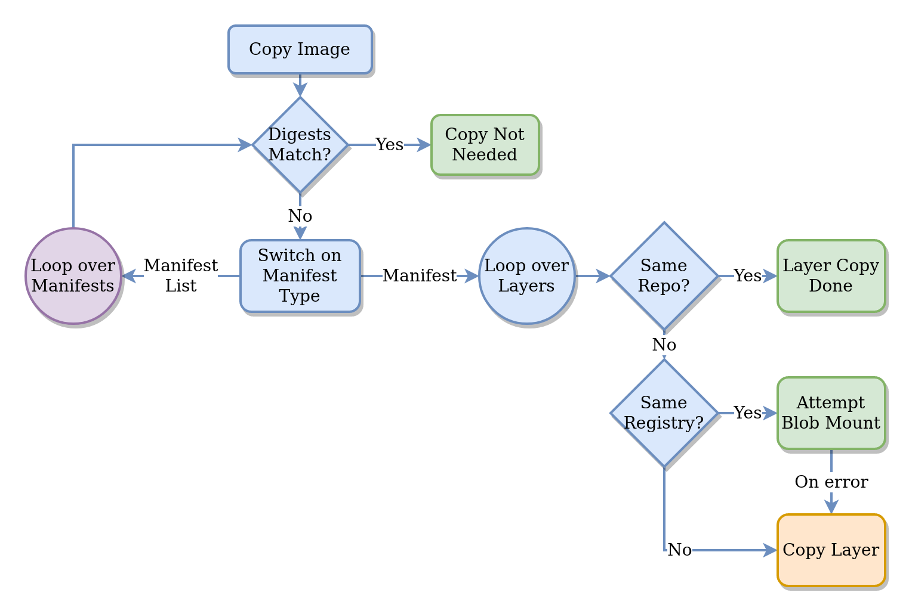

name: empty
layout: true

---

name: base
layout: true
template: empty
background-image: none
<div class="slide-footer">@sudo_bmitch</div>

---

name: title
layout: true
template: empty
class: center, middle
background-image: url(img/books2-bg.jpeg)
background-size: cover

---

name: inverse
layout: true
template: base
class: center, middle, inverse
background-image: none

---

name: impact
layout: true
template: base
class: center, middle, impact
background-image: url(img/books2-bg.jpeg)
background-size: cover

---

name: picture
layout: true
template: base
class: center, middle
background-image: none

---

name: terminal
layout: true
template: base
class: center, middle, terminal
background-image: none

---

name: default
layout: true
template: base
background-image: url(img/books2-bg.jpeg)
background-size: cover

---

layout: false
template: default
name: agenda

# Agenda

.left-column[
- [Challenges](#challenges)
- [Other Options](#other-options)
- [regctl](#regctl) - [demo](#regctl-demo)
- [regsync](#regsync) - [demo](#regsync-demo)
]
.right-column[
- [Using Mirrors](#using-mirror) - [demo](#using-mirror-demo)
- [regbot](#regbot) - [demo](#regbot-demo)
- [Summary](#summary)
- [Fin](#thanks)
]

---
template: title

.left-40-column[
.pic-circle-70[]
&nbsp;&nbsp;&nbsp;&nbsp;&nbsp;&nbsp;&nbsp;&nbsp;<br>
]
.right-60-column[.align-left[.no-bullets[
# regclient
### Tooling to Work with Registries
### Brandon Mitchell
Twitter: @sudo_bmitch <br>
GitHub: sudo-bmitch
]]]

???

- I point out my github here and on the last slide because this entire
  presentation is online, including the demos and speaker notes.
- In case you miss it, it's almost the same as my twitter handle, and that's
  on the bottom of most slides so you can properly tag me when publicly shaming
  me.

---

template: default

```no-highlight
$ whoami
- Solutions Architect @ BoxBoat
- Docker Captain
- Frequenter of StackOverflow
```

.align-center[
.pic-30[]
.pic-30[]
.pic-30[]
]

???

- Who am I?
  - By day I'm a consultant that helps paid clients transition to containers.
  - In my downtime I answer questions on StackOverflow.
  - Helping to spread knowledge about Docker through StackOverflow and
    presentations like this was my path to the Captains program.
  - Captains is a community evangelists program of non-employees, paid in swag
    and a bit of access to insiders.
  - I'm also the author of the regclient and related tools we'll discuss in this
    presentation.

---
name: challenges
template: impact

# Challenges

???

- Lets start off by talking about some challenges that I've encountered

---

# Retagging Images

```no-highlight
docker image pull $repo:ci-1234
docker image tag $repo:ci-1234 $repo:stable
docker image push $repo:stable
```

???

- I do a lot of work with CI pipelines, and a common step is to retag images
- Retagging is used to label that an image passed unit tests or is the current staging release
- This could also be used to mark v1.2.3-rc3 as v1.2.3, v1.2, and v1

---

# Mirroring Images

```no-highlight
docker image pull $upstream:latest
docker image tag $upstream:latest $local:latest
docker image push $local:latest
```

???

- Additionally I locally mirror images from an upstream registry.
- This avoids Hub rate limits, minimizes risk from external outages, and is a promotion policy from dev to prod and DR

---

# Deleting Images

```no-highlight
docker ??? #@$!@#
```

???

- And all the docker commands to manage registries are push and pull, what if we want to delete? We're left with expletives.
- We can docker prune local images, but we're forced into curl or other API tools to prune an image in a registry.

---

# These Solutions Have Issues

- Require a docker engine = privileged
- Ephemeral nodes pull everything, even if nothing has changed
- Docker only pulls a single platform
- Curl commands need to implement authentication

???

- Rootless is becoming a thing, but for the most part, people run privileged DinD containers to run docker commands in CI
- CI is increasingly based on ephemeral nodes, so the pull command always downloads all the layers, even if the target repo already has those layers
  - I've previously presented on how you could pull from the local registry first to reduce the number of layers pulled across the internet
- Multi-platform images get dereferenced to the architecture of the pulling engine
- Docker supports both basic and bearer authentication, bearer auth gets a token from another URL
  - curl commands are often registry server specific

---

name: other-options
template: impact

# Search for Better Options

---

# Search for Better Options

- Hostile competitors
- Unmaintained
- Part of a larger project

???

- RH has skopeo that does a lot of what I'm looking for, but they are pushing to eliminate docker from their stack, in favor of podman, buildah, cri-o.
- Others made a half functioning project but then abandoned it, so it's missing support for new features.
- Others included it in bigger projects for things like image building or a runtime.

---

# Search for a Library

- `docker/distribution` appears designed for internal usage
- containerd focuses on pulling images
- Everyone seems to be creating their own partial library

???

- Everything I found either wasn't designed for external usage or was focused on solving a specific registry use case rather than being a general purpose client.

---

class: center

# So I Made My Own

.pic-80[]

<sub>https://xkcd.com/927/</sub>

???

- I created regclient.
- That library is still being developed, so if you depend on it, vendor that dependency.
- Significant redesigns may happen as I improve OCI support, add testing, document, etc.
- So why talk about a half finished library?

---

class: center

# Merchandising?

.pic-80[]

<sub>Spaceballs</sub>

???

- No, I'm not trying to sell anything.

---

class: center

# Developers?

.pic-80[]

???

- And I'm not going to beg for a bunch of developers to finish it for me.

---

template: impact

# Tools

???

- Instead I want to talk about some tools I've made that are built on top of this library
- While I plan to adjust things with the library underneath, these tools should be fairly stable.

---

name: regctl
template: impact

# regctl

???

- First up, regctl (pronounced with cuddle because, well, pandemic, we've all been separated for too long)

---

# regctl

- Provides CLI access to registries using the registry API
- Packaged as a binary you can download or image to run
- Includes an Alpine based image for CI pipelines

???

- A CLI to access and manage images on registries
- This replaces those docker and curl commands that had so many issues
- I ship each tool as a binary and image, pick what makes sense
- One variation of the image includes Alpine for the CI pipelines that need a shell for multiple steps

---

# regctl Commands

```no-highlight
$ regctl --help
...
  image       manage images
  layer       manage image layers/blobs
  registry    manage registries
  repo        manage repositories
  tag         manage tags
```

???

- The project uses cobra and a noun/verb syntax
- At the top level we can interact with registries, repos, tags, images, and layers

---

# regctl Commands

```no-highlight
$ regctl registry --help
...
  config      show registry config
  login       login to a registry
  logout      logout of a registry
  set         set options on a registry
```

???

- I use docker credentials if they can be found/parsed
- Otherwise the registry commands let you login/logout, and configure TLS/https settings

---

# regctl Commands

```no-highlight
$ regctl repo --help
...
  ls          list repositories in a registry

$ regctl tag --help
...
  delete      delete a tag in a repo
  ls          list tags in a repo

$ regctl layer --help
...
  pull        download a layer/blob
```

???

- Then a bunch of the commands just have one or two actions.
- `repo ls` isn't supported by all registries, notably Hub disables that feature.
- `tag ls` shows the tags within a repo
- `tag delete` is better than the image manifest delete, but there actually isn't an API for this. Instead we overwrite the existing tag with a temporary manifest and then delete that.
- `layer pull` lets you retrieve any single layer or blob. These are often TGZ's, but could also be something like the image config json.

---

# regctl Commands

```no-highlight
$ regctl image --help
...
  copy        copy or retag image
  delete      delete image
  digest      show digest for pinning
  export      export image
  inspect     inspect image
  manifest    show manifest or manifest list
  ratelimit   show the current rate limit
```

???

- The image command is where lots of action happens
- `image copy` is useful to retag, promote between repos, or mirror between registries
- `image delete` destroys the manifest, there can be multiple tags pointing to one manifest
- `image digest` gets the sha value without pulling the image
- `image export` outputs a tar file that can be loaded with `docker load`
- `image inspect` shows the image config without pulling any layers, showing labels
- `image manifest` shows the manifest (or list). Useful for debugging multi-platform images
- `image ratelimit` shows the current rate limit usage (on Hub) without pulling any images

---

class: center

.pic-80[.pic-rounded-10[]]

???

- This is the workflow for performing a copy
- Same command to retag, promote, or mirror
- Purple circle shows how multi-platform images are supported
- Green boxes avoid any layer download
- Only when all other options fail do we pull/push the layer
- Retags are instant
- Copies between repos on same registry are done server side

---

template: terminal
name: regctl-demo
class: center

<asciinema-player src="demo-1-regctl.cast" cols=100 rows=26 preload=true font-size=16></asciinema-player>

???

- I'm going to run this demo in its own docker network.
- On that network I'll have a registry, configured to persist images in a volume, allow deletes, and validation is removed to support external windows image references.
- All of the regctl commands will be run from a container using a function, could have also downloaded the binary. The regctl config stores registry settings like logins and TLS options.
- Listing registry:5000 fails because I didn't configure TLS on the local registry
- I can set those options in the regctl config, and login to Hub with `registry`
- Copy the regctl image directly from registry to registry, showing info logs to see each of the layers being copied
- Copy same image to another repo on the same registry
- Retag the "latest" image to "stable"
- `repo ls` shows these repositories, note this API won't work on many registries, including Hub
- `tag ls` shows the tags within a repo, no need to go to a web page
- `image manifest` is the building block of all images, a json config and series of layers, all referenced by sha digests
- Using `--list` to show multi-platform images, we didn't just copy one platform, feature over `docker pull/push`
- `image inspect` in regctl is very similar to docker, but don't need to pull the layers to see this data
- `--format` can be used to pick out just the data we want, like a version number.
- `tag delete` removes a single tag, this API doesn't actually exist so we push a blank image to the tag and delete that blank manifest
- I'll put the stable tag back to the difference with a full image delete
- For that I need a digest, we could use this to pin images we deploy. The `tr` command is working around a TTY complication since we are running this in a container with `-it`.
- The digest we got from latest is the same as from stable, these are two tags pointing to the same manifest digest we copy them
- Deleting an image by digest with `image delete`
- And now listing the tags in that repo shows both tags or pointers to the same digest are gone, other tags would have remained if we had different digests.
- `image ratelimit` shows our rate limit on Hub or any other registry that implements those standard http headers in the future
- We use the rate limit every time we get an image manifest. If we just run a head request, like copying an image that already exists, or the image digest for the manifest list, we don't use any pulls. `image inspect`, `image manifest`, etc each use a pull, and `image copy` will use a pull per platform.

---

name: regsync
template: impact

# regsync

???

- One of the useful features of regctl is the image copy
- regsync is designed for creating and maintaining local mirrors without scripting regctl commands

---

# regsync

- Why create a mirror?
- Upstream outages happen
- Upstream images can change unexpectedly
- Bandwidth cost time and money
- Hub rate limits

???

- My DockerCon 2020 talk was about creating pull through caches and mirrors
- The conclusion was that a mirror was often the best option, but required some automation to maintain, which regsync tries to solve
- Mirrors solve:
  - Outages: We've seen outages from BGP, S3, etc, avoid external dependencies
  - Changes: Don't depend on latest, but if you do, update on your schedule
  - Bandwidth: How many times do you pull the same image? Ephemeral builders, large cluster
  - Rate limits: Hub limits how often you can pull images, with a mirror we can still use a stale local copy

---

# regsync

- Automates the copying of images
- Runs as a standalone binary or in a container
- Uses a yaml configuration file with templating support
- Run sync steps immediately or on a schedule
- Can copy one or more tags
- Can delay for rate limits
- Can backup old image before overwriting
- Structured logging integrates with aggregators

???

- regsync handles simplifies maintaining a mirror
- A mirror without automation quickly becomes stale, vulnerabilities, missing features
- I tend to run this as a container, but the binary is also available
- Yaml is hopefully easy to maintain, and templating in the config is useful to inject credentials from environment variables or a secret file
- In CI pipelines I use the "immediate" option
- As a daemon I run with a schedule
- Schedule could be every 15 minutes, could be at the start of each sprint, could be a cron schedule for Monday morning
- For multiple tags, there's a list of include/excludes that supports regex
- For rate limits, you specify a minimum threshold and it won't start a copy below that (multi-platform copy may use more than one pull). Saves pulls for other development needs.
- Backups are useful when you update "latest" and it breaks your environment
- Logging on all commands is designed to be exported to an aggregator, I show the text format in demos but you can switch that to json

---

class: small

# regsync Config

```yaml
creds:
  - registry: docker.io
    user: "{{env \"HUB_USER\"}}"
    pass: "{{file \"/var/run/secrets/hub_token\"}}"
defaults:
  ratelimit: { min: 100, retry: 15m }
  interval: 60m
  backup: "bkup-{{.Ref.Tag}}"
sync:
  - source: alpine
    target: registry:5000/library/alpine
    type: repository
    tags:
      allow:
      - "3"
      - "3.\\d+"
```

???

- Three sections to the config, creds, defaults, and sync
- Creds identify how to connect/login to a registry, there you can see templating to pull in creds from the environment and a secrets file
- Defaults are mostly for settings that apply to every sync but could be overridden
- I'm setting the minimum rate limit and how often to recheck that limit if we drop below
- The interval is how often to run each sync if we run this as a daemon
- Backup allows us to copy images to another repo or tag before overwriting
- In sync, there's an array of copies, each with a source and target
- We can copy a single image (tag) or the whole repo
- When copying a repo, the tags allows us to limit which tags to copy, using regex
- Here I'm copying all of the Alpine 3 and 3.x tags, but not 3.x.y, and not any other tag

---

template: terminal
name: regsync-demo
class: center

<asciinema-player src="demo-2-regsync.cast" cols=100 rows=26 preload=true font-size=16></asciinema-player>

???

- For the demo, we're using almost the same yaml from the previous slide
- I have creds set to turn off TLS/https for the local registry
- There's a parallel option to run more than one sync concurrently, I avoid that for the demo, but having 2-3 going concurrently could speed up syncs
- Big difference is a few more sync actions for the busybox and regctl images
- Then I'm going to run this in the "once" option like I would in CI, didn't really need the `-it` but it's nice to be able to cont-c, it's on the registry net, mounts the yml and token as volumes (could be configs/secrets), user injected as an env var
- Output from the sync shows layers being copied and copies skipped when layers already exist in the registry
- After that sync finishes, repo ls shows all the busybox and alpine repo, and we can list the tags
- To run this as a daemon using the schedule, it's a few different flags to docker and the "server" option, no syncs will run until 60 minutes passes

---

name: using-mirror

# Using a Mirror

```no-highlight
ARG registry=docker.io
ARG tag=3
FROM ${registry}/library/alpine:${tag}
```

```no-highlight
docker image build \
* --build-arg registry=localhost:5000 \
  -t localhost:5000/example/app:${ver} .
```

???

- To use a mirror, I make my Dockerfile portable
- `docker.io` is Docker Hub, and `library` is the repo "user" for all official images
- So `docker.io/libary/alpine:3` is the same as `alpine:3`, which explains why I used `library` in the path of my sync commands, I want to keep these paths the same
- When I build this image locally, I can pass a build arg to change the registry to my mirror

---

template: terminal
name: using-mirror-demo
class: center

<asciinema-player src="demo-3-using-mirror.cast" cols=100 rows=26 preload=true font-size=16></asciinema-player>

???

- So a quick demo showing the usage of that mirror, here's the Dockerfile, I'm just running a date command for an example
- In the build command you have the build arg overriding the registry
- I also push to my same registry, since this isn't a pull-through cache, we can push and pull as long as we use a name that doesn't collide with upstream
- To avoid name collisions, I'd recommend using your own user or organization name from the upstream reop

---
name: regbot
template: impact

# regbot

???

- regbot is what happens when I try to figure out how to do registry pruning

---

# regbot

- How do you define a configuration file for registry image pruning?
- Prune all CI builds before a certain date
- Prune everything matching an expression, but keeping the most recent 10 images
- Check a label to see if the image is from an old sprint
- Delete local images when upstream mirror deletes the original

???

- There are a lot of different kinds of cleanup policies
- People will always have other policies not included
- A limited config file forces users to modify their pipelines/workflows/registry to match

---

# regbot

- Use the much of the config syntax from regsync
- Take the flexibility of scripting regctl commands
- Add Lua for a scripting language

???

- The config syntax of regsync was useful for defining registry credentials and scheduling
- Behind regctl is regclient, so I used a bunch of the regclient API calls
- Lua is an embedded scripting language, runs the script natively in Go
- Instead of scheduling image copies, regbot schedules Lua scripts

---

# Lua

.left-column[
- Go native, not even CGo
- Variables
- Tables(arrays, key/value)
- Conditionals
- Loops
- Math
- String parsing and matching
- Date and time
]
.right-column[
- Extendable with our own API calls
- Repository list
- Tag list
- Tag delete
- Rate limit
- Image manifest
- Image config
- Image copy
- Image delete
]

???

- What we get, on the left side is a bunch of built in features of Lua
  - Variables, Arrays, Key/Value maps, Conditions, Loops, etc
- On the right side are a bunch of API calls from regclient we can call
  - List our tags, check rate limits, inspect images, copy, delete, etc

---

class: small

# regbot Config

```yaml
creds:
  - registry: docker.io
    user: "{{env \"HUB_USER\"}}"
    pass: "{{file \"/var/run/secrets/hub_token\"}}"
defaults:
  interval: 60m
scripts:
  - name: mirror minor versions
    timeout: 59m
    script: |
      imageList = {"library/alpine", "library/debian"}
      localReg = "registry:5000"
      tagExp = "^%d+%.%d+$"
      minRateLimit = 100
      maxKeep = 3
      -- ...
```

???

- The config will look similar, same creds and similar defaults
- Instead of running syncs, there's a list of scripts
- And my goal is to document some common scripts that are configured with variables
- In this case, I'm looking for the last 3 images matching the "x.y" semver, copying from Hub to `registry:5000`, and pausing when the rate limit drops below 100

---

class: small

# regbot Config

```yaml
    script: |
      for k, imageName in ipairs(imageList) do
*       tags = tag.ls(upstreamRef)
        for k, t in pairs(tags) do
*         if string.match(t, tagExp) then
            table.insert(matchTags, t)
          end
        end
*       table.sort(matchTags, orderSemVer)
        for k, t in ipairs(matchTags) do
          upstreamRef:tag(t)
          localRef:tag(t)
*         if not image.ratelimitWait(upstreamRef, minRateLimit) then
            error "Timed out waiting on rate limit"
          end
*         image.copy(upstreamRef, localRef)
        end
      end
```

???

- And then below in the script, you'll see calls to:
  - `tag.ls` to list tags
  - `string.match` to look for the `x.y` tags
  - `table.sort` using a semver function to put the matching tags in semver order
  - `image.ratelimitWait` to pause when we are below the rate limit
  - `image.copy` to copy an image

---

class: small

# regbot Config

```yaml
  - name: delete old builds
    script: |
      -- ... variables set above ...
      timeRef = os.time() - (86400*maxDays)
      cutoff = os.date(dateFmt, timeRef)
      ref = reference.new(imageName)
      tags = tag.ls(ref)
      for k, t in pairs(tags) do
        if string.match(t, tagExp) then
          ref:tag(t)
          ic = image.config(ref)
          if ic.Config.Labels[imageLabel] < cutoff then
            tag.delete(ref)
          end
        end
      end    
```

???

- Another script for a retention policy
- Specify a cutoff date in the user's format and number of days
- Loop through each tag within a repo
- Process only tags matching an expression
- Retrieve the image config (aka inspect the image)
- Compare a label containing the build date with the cutoff calculated above
- Delete tags from before that cutoff

---

template: terminal
name: regbot-demo
class: center

<asciinema-player src="demo-4-regbot.cast" cols=100 rows=26 preload=true font-size=16></asciinema-player>

???

- Demonstrating this, here's a regbot.yml file that includes
  - creds to setup the local registry and Hub access
  - defaults with the number to run in parallel, an interval for running a daemon, and timeout per script
  - 3 scripts: first to mirror the last 3 minor versions, next to maintain a mirror of the last 3 nightly images and delete old nightly images, and last to delete old CI images by a label. Each script has a set of variables to make it easier to reuse.
- regctl is used to setup a repo to cleanup, based off of an old regctl image. There's a latest, stable, and 3 CI tags. I also copy the debian image because some script commands assumed this repo already exists.
- Running regbot looks a lot like regsync, I use the `once` and `--dry-run` options to only show the result without deleting or pulling images
  - This shows the Alpine and Debian minor images getting copied, the Debian nightly getting copied, and 3 CI images getting deleted.
- To run this in a CI pipeline, it would be the `once` command without the dry run
- To have this run according to the schedule, I change some docker flags and switch `once` to `server`
- Listing the repos shows the debian repo was added
- Listing the tags from each shows
  - alpine was unchanged since we copied those tags before
  - debian has 3 minor versions and 3 nightly builds
  - the example repo no longer has the 3 CI builds since their date stamps were before the cutoff

---

name: summary
template: impact

# Wrapping Up

???

- So what's left?

---

# Future Plans

- Improve handling of other registries
- Handle more media types
- Add OCI Distribution support
- Helm charts, CNAB, Notary v2
- Import/export workflows to support offline registries
- Create a pull through cache

???

- Lots of registries don't support all API's, e.g. push layers with or without chunking, or lacking HEAD, need to gracefully fallback to other APIs
- Some old images have different media types, and newer features are showing up with new media types
- OCI Distribution is working towards 1.0, want to support that early
- Artifacts like Helm charts and CNAB are being added to registries, and Notary v2 looks to be implemented mostly in the registry, want to support all these objects
- Export is working enough to side load an image into docker, want to expand that to export multi-platform images, import images, and support different formats like OCI
- Pull through cache is a bigger long term goal, current cache doesn't handle user auth nicely, not configurable with retention policies

---

# Try It Out

- github.com/regclient/regclient
- hub.docker.com/u/regclient
- Quick start guides for regsync and regbot

???

- Github and Docker Dub references to the project
- Quick start guides are in the github docs and on Hub repo for regsync and regbot

---

template: title
name: thanks

# Thank You

.no-bullets[
- github.com/sudo-bmitch/presentations
]

.content[
.left-column[
.pic-80[]
]
.right-column[.align-right[.no-bullets[
<br>
- Brandon Mitchell
- Twitter: @sudo_bmitch
- GitHub: sudo-bmitch
]]]
]

???

- These slides are available online in my git repo, the link is there and the QR code will take you there too
