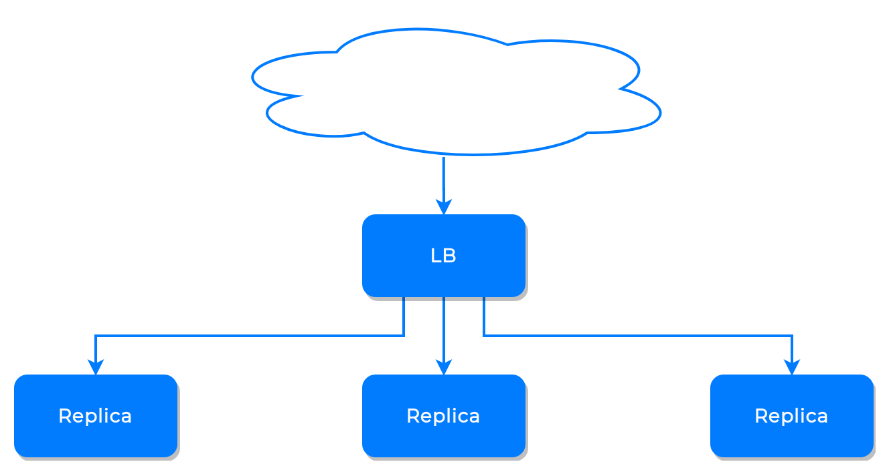
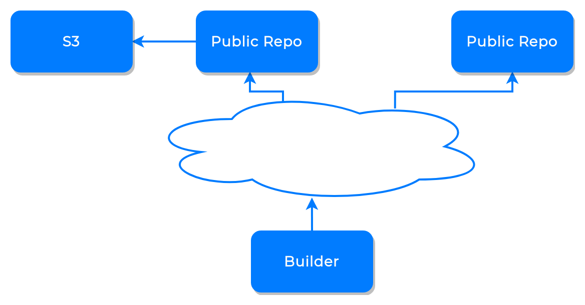
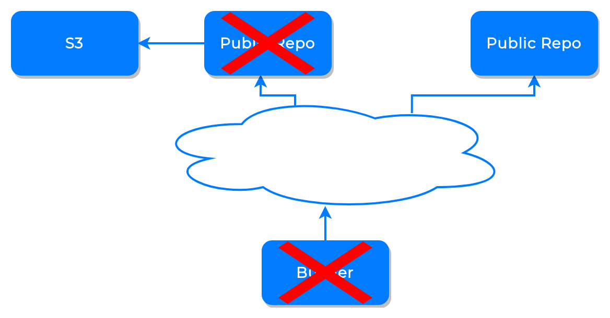
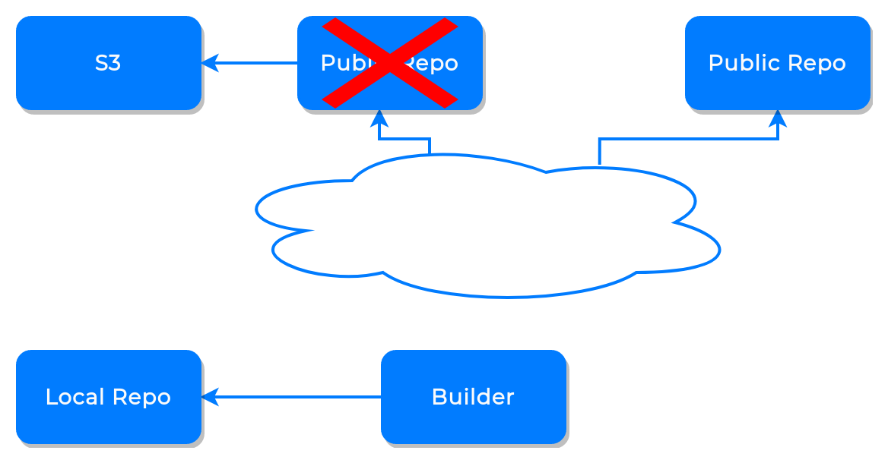
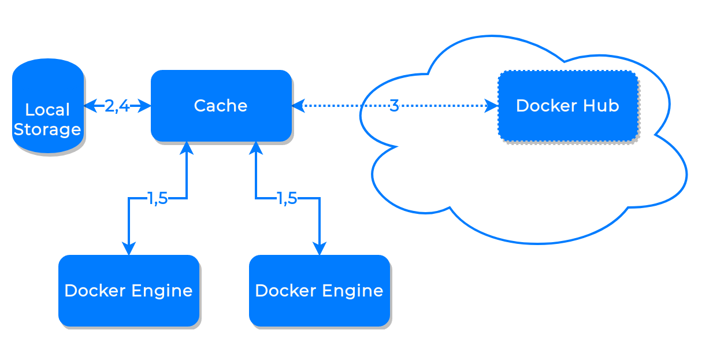
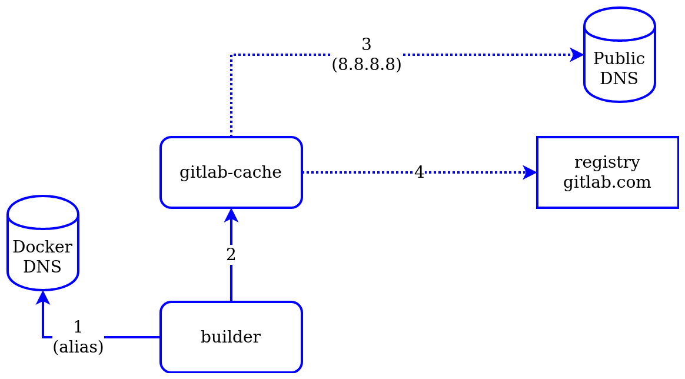
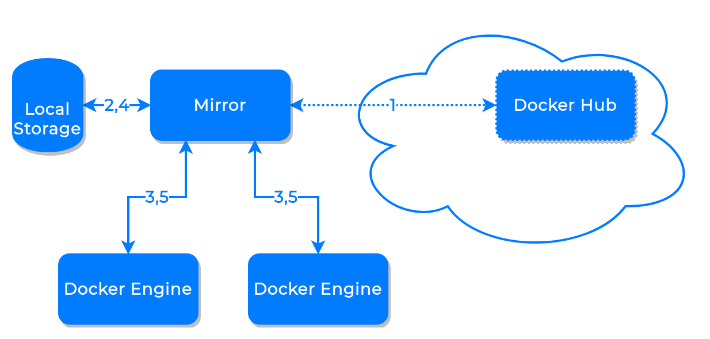

name: empty
layout: true
---
name: base
layout: true
template: empty
background-image: none
<div class="slide-footer">@sudo_bmitch</div>
---
name: title
layout: true
template: empty
class: center, middle
background-image: url(img/dc2020-title-bg.png)
background-size: cover
---
name: inverse
layout: true
template: base
class: center, middle, inverse
background-image: url(img/dc2020-white-bg.png)
background-size: cover
---
name: impact
layout: true
template: base
class: center, middle, impact
background-image: url(img/dc2020-bg4.png)
background-size: cover
---
name: picture
layout: true
template: base
class: center, middle
background-image: none
---
name: terminal
layout: true
template: base
class: center, middle, terminal
background-image: url(img/dc2020-code-bg.png)
background-size: cover
---
name: default
layout: true
template: base
background-image: url(img/dc2020-bg2.png)
background-size: cover
---
layout: false
template: default
name: agenda

# Agenda

.left-column[
- [Caching](#caching)
- [Caching Demos](#demo1)
- [Caching Limitations](#cache-limitations)
- [Caching Other Registries](#other-registries)
]
.right-column[
- [Caching Gitlab Demo](#demo7)
- [Mirroring](#mirroring)
- [Manual Mirroring](#manual-mirror-reasons)
- [Summary](#summary)
]

---
template: title

.left-40-column[
.pic-circle-70[]
&nbsp;&nbsp;&nbsp;&nbsp;&nbsp;&nbsp;&nbsp;&nbsp;<br>
]
.right-60-column[.align-left[.no-bullets[
# How to Use Mirroring and Caching to Optimize Your Image Registry
### Brandon Mitchell
Twitter: @sudo_bmitch <br>
GitHub: sudo-bmitch
]]]
???
- Welcome internet! For those watching live I hope you're enjoying your DockerCon 2020 experience.
- Our talk today will be covering mirroring and caching of your image registry, explaining why you want this and what it will take to implement.
- I'm BMitch, by day I help clients make the transition to containers, and in my free time I often do the same on stackoverflow. I'm also a member of the Docker Captains program. After you help enough people with their docker questions, and do a presentation or two you get invited into that.
- I point out my github here and on the last slide because this entire presentation is online, including the demos and speaker notes.

---
template: impact

# Ephemeral Build Server?

???

- Perhaps this applies to you, your build server itself is ephemeral. You are building with gitlab runners or jenkins agents or similar that get cleaned up periodically, perhaps after every build.

---
template: impact

# Cluster Pulling Remote Images?

???

- Or you may have an office, data center, home lab, etc that has multiple docker engines pulling images over the same network connection.

---
template: impact

# Worry About Upstream Image Changes?

???

- Or perhaps you've been building images for long enough to experience the frustration when someone upstream changes their image in a way that broke your usage. Anyone that has ever used the "latest" tag for long enough eventually has a story to tell of how it broke something, but really any tag that's not a sha256 checksum can be replaced upstream.

---
template: impact

# Build and Deploy Infrastructure Tolerant of Upstream Outages?

???

- Or perhaps you want your infrastructure to be tolerant of outages outside of your network. We see outages happening all the time. It used to be ships in the Med cutting lines with their anchors. Lately it's been BGP routes sending all the traffic for a major CDN to some business in PA. And when S3 went down we realized just how dependent so much of the internet is on one AWS service.

---

class: center

# Production Resilience

.pic-80[.pic-rounded-10[]]

???

- In production, we get fault tolerance by running multiple replicas behind a LB, spreading the load into multiple AZ's, horizontally scaling

---

class: center

# Build Infrastructure

.pic-80[.pic-rounded-10[]]

???

- But our build systems are inverted, we often depend on multiple internet resources to run a build. With containers the main resource we use is Docker Hub for our base images.

---

class: center

# Build Outage

.pic-80[.pic-rounded-10[]]

???

- In this case, we can't just replicate multiple build nodes to get redundancy, because the risk is all of those external systems we depend on. When they get overloaded, or perhaps something they depend on goes down (perhaps they use S3), or a network connection between you and that public registry goes down, our local builds and deploys fail.

---

class: center

# Build Resilience

.pic-80[.pic-rounded-10[]]

???

- To add resilience in this case, we need a local registry that has the same availability as the rest of our build and deploy infrastructure. Removing the dependency on external resources that we can't control.

---

template: impact

# Faster Builds and Less Bandwidth

???

- This added resilience comes with some benefits, our builds can run faster, and we can spend less time and money on bandwidth

---

template: inverse

# Registry Mirroring and Caching

???

- If you haven't already guessed by the title or this intro, we're going to talk about how registry mirroring and caching can help

---

template: inverse

.align-left[
```no-highlight
$ whoami
- Solutions Architect @ BoxBoat
- Docker Captain
- Frequenter of StackOverflow
```
]

.align-center[
.pic-30[]
.pic-30[]
.pic-30[]
]

???

- Who am I?
  - By day I'm a consultant that helps paid clients transition to containers, 
  - In my downtime I answer questions on StackOverflow
  - Helping to spread knowledge about Docker through StackOverflow and presentations like this was my path to the Captains program
  - Captains is a community evangelists program of non-employees, paid in swag and a bit of access to insiders
  - Other captains got into the program by writing books, creating training content, blogs, videos, podcasts, etc

---

template: inverse
name: caching

# Caching

???

- I'm going to break this talk into two parts.
- For the first part, lets see how docker's pull through cache mechanism works.

---

class: center

# Caching is the Easy Button

.pic-40[.pic-rounded-20[]]

<sub>https://commons.wikimedia.org/wiki/File:Easy_button.JPG</sub>

???

- The reason I start with caching is because it's the easy option
- There's much less to maintain, unlikely to break
- And if there is a failure, docker falls back to using Hub

---

class: center

# Cache Architecture

.pic-80[.pic-rounded-10[]]

???

- The cache sits between the local docker engine and Docker Hub
- You want to configure local filesystem storage, though that isn't required
- When the engine pulls an image (1), it checks for the image layers locally (2)
- If those layers aren't local, it pulls from the upstream registry (3)
- Those layers are then added to the local storage cache (4) and returned to the engine (5)
- With multiple engines pulling similar images, you eliminate duplicate layer pulls to the upstream registry (3)
- This could be multiple nodes in a cluster/office/datacenter/VMs
- Or it could be ephemeral build engines that create an empty DinD instance for each build

---

# Cache Implementation

Either the dockerd CLI:

```no-highlight
dockerd --registry-mirror <cache-url>
```

Or /etc/docker/daemon.json

```no-highlight
{ "registry-mirrors": [ "<cache-url>" ] }
```

Plus a registry:

```no-highlight
docker run -e REGISTRY_PROXY_REMOTEURL=<upstream-url> registry:2
```

???

- You need two things for the cache:
  1. Point the docker engine to that cache with the registry-mirrors setting
     - Either on the CLI or in the daemon.json file
  2. Run a registry with the pull through cache configuration
     - `registry:2` includes this with a config file or env var

---

template: terminal
name: demo1
class: center

<asciinema-player src="demo-1-registry-mirror-flag.cast" cols=100 rows=26 preload=true font-size=16></asciinema-player>

???

- In my demos I'll be switching from this list of commands to copy-and-paste them
- I'm going to create a shared network for DNS, and two containers, a registry and a DinD instance
- The DinD entrypoint passes the registry-mirror flag to dockerd inside the container
- I'll pull the logs of the registry up in a split-screen
- Then I'll run a docker pull in the DinD instance
- Looking at the logs, we see the registry container errored,
  but we still got the image, so it failed back to hub

---

template: terminal
name: demo2
class: center

<asciinema-player src="demo-2-proxy-arg.cast" cols=100 rows=26 preload=true font-size=16></asciinema-player>

???

- What we were missing in the last example was the pull through cache flags settings on the registry
- So I'm going to run a stop/rm on the old registry, and replace it with an instance that sets the PROXY REMOTEURL config
- I'm also setting the STORAGE FILESYSTEM option and passing that as a volume, that way our cached data will persist beyond the lifetime of this registry container
- Again I'll show the registry logs in the split screen and run the pull
- This time we see the pull showed the layers being pulled through the cache

---

template: terminal
name: demo3
class: center

<asciinema-player src="demo-3-time-diff.cast" cols=100 rows=26 preload=true font-size=16></asciinema-player>

???

- Lets compare the speedup vs pulling over my home network here
- First I'll pull the ubuntu image which isn't in the DinD instance or registry cache
- Next, lets stop and replace that DinD instance including the volume for the docker engine's images
  - This simulates an ephemeral builder, but could also be another server in the datacenter
- Pull again and we can see how much faster that second pull runs, under 2 seconds compared to 16 seconds before, we're no longer pulling these layers over my ISP's network

---

template: terminal
name: demo4
class: center

<asciinema-player src="demo-4-priv-repo.cast" cols=100 rows=26 preload=true font-size=16></asciinema-player>

???

- Does this work with private repos?
- I've got my credentials in a .env file that isn't pushed to github
  - Pro-tip, don't commit passwords to github repos, or show them on an internet streamed video
- I'm going to exec into the DinD builder instance, retag that ubuntu image, and push to my private repo
  - This doesn't use the pull-through cache, since it's a push
- Pulling fails, we need to update the registry configuration
- Updating the registry with credentials involves a few more settings using that same .env
  - You can see a PROXY USERNAME and a PROXY PASSWORD setting added
  - Second pro-tip, use 2fa and a token rather than your actual password, tokens are only good for push/pull, not for administering your account from the web
- Now we can pull that image again, the logs show it was successful
- To see if it's really working, lets recreate our DinD builder container again
- You can see this is actually taking some time, because it's the first time we pulled the layers through that pull through cache, before the ubuntu layers were reused from the docker engine itself so it didn't need to pull the layers
- Note that we never logged in from this second DinD instance, anyone that can reach your pull through cache can retrieve private images if you run the cache with credentials
- Recreating the DinD instance one more time, and doing a pull now that the layers were added to the pull through cache shows the expected speed-up

---

template: terminal
name: demo5
class: center

<asciinema-player src="demo-5-tls.cast" cols=100 rows=26 preload=true font-size=16></asciinema-player>

???

- What if we pull directly from the cache? I'm going to try pulling the debian image.
  - If you look fast, you'll see the HTTP isn't HTTPS error, we need to configure TLS.
- I've got a script to create the certificates with some openssl commands.
  - The name on the cert is the container's DNS, hub-cache
- And we need to recreate both the cache and the DinD containers
  - The cache needs to have the certificate injected as a volume, and then there's some HTTP TLS settings
  - The DinD instance needs to trust that certificate, so I include the CA in /etc/docker/certs.d
  - I also changed the registry mirror flag from http to https
  - Doh, can't do a volume mount with a colon in the path using the "-v" syntax, switch to the mount syntax, you can see that extra colon before the port number in the path, and colons are delimiters in the "-v"
- Now, lets make sure that all worked, I try pulling my private ubuntu image, and it works
- Next, lets pull directly from the cache, and we get an error, hmm...
- Lets try pulling our private image directly from the cache, that worked, so why not ubuntu?
- Turns out we need to include the repo name that you normally don't see "/library" if you're pulling directly.
- I promise there's a good reason for this demo, but we need to get through one more before I put it together.

---

template: terminal
name: demo6
class: center

<asciinema-player src="demo-6-compose.cast" cols=100 rows=26 preload=true font-size=16></asciinema-player>

???

- Those CLI options are getting ridiculous, lets stop all these manually created containers and convert them.
- The compose file has a lot in it, but nothing that we haven't seen in our manual commands, these compose files are also in the presentation repo.
- The compose up works as expected, and now we can easily scale up our DinD builder containers
- If you've never used it before, the "--index" option lets you pick one instance from a scaled compose project
- I tried to run these pulls concurrently, but I didn't type fast enough
- Just to prove there's nothing up my sleeves lets run one more pull from the empty 3rd instance
- So we've got this converted to compose, that's a lot of back to back demos that probably moved to fast, lets step back for a second

---

template: inverse
name: cache-limitations

# So What's the Catch?

???

- The easy button was pretty easy, but this is a two part talk, so there's got to be a reason for the second part

---

# Cache Limitations

- The "registry-mirror" setting only applies to Docker Hub
- Only caches pulls not pushes
- Pulls still check the image manifest on Hub
- Credentials are in the cache server
- Docker implementation only supports one authentication method

???

- Only applies to docker hub, but we can workaround this
- And since we aren't caching pushes, new images created locally need to be sent over the network twice, once to push, and a second time to pull
- The third downside is we still query docker hub to see if the upstream image changed since the last pull. So an unexpected upstream change can break our builds and deploys, and an outage can also break us
- Credentials to private repos means any user with access to the cache can pull your private images
- Pull through cache only supports bearer tokens for private registry auth, doesn't work with basic auth
  - I found that out when trying to get this to work with Github's registry

---

name: other-registries

# Options to Cache Other Registries

- Configure a squid HTTP caching proxy
- Pull directly from the cache
- Use DNS and TLS certs to send pulls to the proxy

???

- Wait, I was trying Github, but just said we can only set registry-mirror for Docker hub
- There are a few options for other registries
- One is to skip the pull through cache entirely, you could setup something like Squid to proxy
- We can use the trick from a few demos ago, and pull directly from that cache
- Or we can hijack DNS/TLS to make docker think our cache is the upstream server
- Not listed here is containerd has some new options to allow caching for other registries which gives hope that we'll have that available in the future as docker offloads more functionality to containerd

---

template: terminal
name: demo7
class: center

<asciinema-player src="demo-7-gitlab-cache.cast" cols=100 rows=26 preload=true font-size=16></asciinema-player>

???

- First, lets demo how we can pull directly from a cache, we did this with docker hub already
- I need to update my certificates to include the new pull through cache name
- And in the compose file,
  - The first change you'll see is a gitlab-cache volume
  - The DinD builder has the certificate mounted for a second hostname, gitlab-cache
  - And in the services, we define a gitlab cache, with the upstream hostname, creds, TLS cert
- Lets start this project, and then exec into the builder
- In that builder, I'm going to login to the gitlab registry, pull, retag, and push the debian image
  - So far, none of this has used our cache
- And then I'm going to run that pull directly to gitlab, success
- The downsides of this:
  - We need to use our cache name for the registry in all of our Dockerfiles/deployments that pull
  - If the cache goes down, docker won't fall back to the upstream registry

---

# Intercepting DNS

```no-highlight
version: '3.7'
services:
  gitlab-cache:
    image: registry:2
    networks:
      cache:
*       aliases:
*       - registry.gitlab.com
    dns:
*   - 8.8.8.8
*   - 8.8.4.4
```

???

- So I'll give you an option that avoids needing to change the Dockerfiles and deployments
- We can hijack DNS and TLS
- In the docker network, we can define a DNS alias so all lookups on that docker network resolve to our container
- And in our container, we can override DNS to not use docker's DNS, so we can still resolve that upstream hostname
- Lets see a picture to make that a bit more clear...

---

class: center

# Intercepting DNS

.pic-80[.pic-rounded-10[]]

???

- The builder is still using docker's internal DNS, that's what tells you gitlab-cache can be found on a specific IP address
- Docker's DNS is told to resolve registry.gitlab.com to the gitlab-cache container IP for containers on this shared docker network
- On the gitlab-cache container, it's using the quad-8 DNS to resolve registry.gitlab.com to it's real IP so it can do the pull through cache for that host
- If the cache container goes away, so does the network alias, and the builder can talk directly to gitlab
- Lets see a demo of this working...

---

template: terminal
name: demo8
class: center

<asciinema-player src="demo-8-gitlab-dns-tls.cast" cols=100 rows=26 preload=true font-size=16></asciinema-player>

???

- The first thing we need to do is setup the TLS certificate so docker trusts our cache with the hijacked hostname
  - Actually, the very first thing I need to do is exit this container I'm still inside
- Then in the compose file:
  - We no longer have a port on the gitlab-cache certificate, the container will be listening on 443
  - We added another entry to /etc/docker/certs.d for the new hostname
  - No changes to hub-cache
  - In the gitlab-cache, HTTP ADDR is set to listen on 443
    - Network has an alias
    - And DNS is overridden to 8.8.8.8
- Lets start this project up, and exec into the builder
- Our pull works with the registry.gitlab.com registry, but the push fails since this is a pull through cache
- However, if that cache container stops
  - Our network alias goes away, and we go back to talking directly to the real registry.gitlab.com
  - Pull goes directly to registry.gitlab.com
  - That requires that we login before doing a push (I allowed public pulls for this repo)

---

template: impact

# I Want More

???

- We've partially solved the issue with other upstream registries
- But there were other issues:
  - Credentials in the cache server
  - Upstream changes breaking the builds (don't use "latest")
  - Upstream outages breaking the builds

---

template: inverse
name: mirroring

# Mirroring

???

- So now it's time for part 2 of the talk
- Lets see how mirroring differs and can help with these issues

---

class: center

# Mirror Architecture

.pic-80[.pic-rounded-10[]]

???

- The mirror architecture looks almost identical to the cache architecture
- However, the order, seen in the numbers on the arrows, are different
- Before using the mirror, we first pull images we need locally from Hub and store locally
- Then when nodes pull from the mirror, we only use our local store, if it's not there, the pull fails

---

# Running a Registry

- Docker image

```no-highlight
docker container run -p 5000:5000 registry:2
```

- Harbor

- Many Artifact Repositories

???

- For a mirror we need a couple things, the first thing is a registry to act as the mirror
- You can easily run your own registry
  - There's docker's registry image we've been using
  - Harbor is a CNCF project that includes features many want with a registry (user management, vulnerability scanning)
  - The API is an open spec so many other artifact repositories include a docker registry option (Nexus, Artifactory)
- If your builds or deploys are in the cloud, this can be your cloud provider's registry

---

# Manually Mirroring

```no-highlight
docker image pull ${image}
docker image tag ${image} local-mirror:5000/${image}
docker image push local-mirror:5000/${image}
```

???

- The second thing we need for a mirror is a script to populate that mirror
- It can be as easy as 3 commands:
  - pull from upstream
  - retag with the local registry name
  - push of that tag to your local mirror
- My own command for this is a bit more complicated...

---

# Manual Mirror Script

```no-highlight
docker image pull "$localimg"
docker image pull "$remoteimg"

remoteid=$(docker image inspect "$remoteimg" --format '{{.Id}}')
localid=$(docker image inspect "$localimg" --format '{{.Id}}')

if [ "$remoteid" != "$localid" ]; then
  docker image tag "$localimg" "$localimg.$datestamp"
  docker image tag "$remoteimg" "$localimg"
  docker image push "$localimg.$datestamp"
  docker image push "$localimg"
fi
```

???

- This more complicated version pulls both, local first since shared layers will go over the faster connection
- Compares the image id's from each image
- If the image id's are the same, the mirror is already up to date and we can skip this
- And if the image id's are different, I backup the old image first, then replace the tag in the local registry with the remote image we just pulled
- In this case I'm using a date stamp, but that could be a job number in your CI system for easier backout options

---

template: inverse
name: manual-mirror-reasons

# Why All the Complication?

???

- So this is no longer the easy button
- You've now got a CI job or something running a shell script
- You need to have that list of images in advance
- Why not use one of the easier options?

---

# Advantages of Manually Mirroring

- Over Automatically Syncing Repos:
  - Changes to images happen on your schedule
  - Backout option exists with breaking changes

- Over Pull Through Cache
  - Those reasons plus...
  - Pushing locally built images to the registry
  - Upstream outage doesn't stop local builds/deploys

???

- There are automatic mirroring options out there, Harbor has one built in to their registry, it's very nice, but I don't use it
  - Controlling when changes happen is huge, I want to run this in my CI pipeline at the start of a sprint rather than risk the cron job triggering on a Friday afternoon
  - The bigger reason is that I want that backup, the mirroring options I've seen just overwrite the tag with the upstream update
- All those reasons apply to pull through caches too, plus...
  - We can push our local images to a local registry acting as a mirror, with different image names/repos
  - The biggest reason of all... upstream outages don't break our builds and deploys

---

# Risks of Manually Mirroring

- Images go stale if you do not automate the script
- Adding new images is an added process
- Recovering from a mirror outage requires populating images
- FROM line in images needs to point to mirror

```no-highlight
ARG REGISTRY=docker.io
FROM ${REGISTRY}/alpine:3.9
...
```

```no-highlight
docker build --build-arg REGISTRY=local-mirror:5000 .
```

???

- I've seen too many clients that pull the base image once and never update it. Devs and Sec will equally dislike the team running builds and deploys with a 6 month old mirror.
  - The solution is to make sure the mirror update is automated, my preference is in the CI pipeline
- I also include that mirroring job in a git repo the devs can update with pull requests, allowing them to add new images easily
- Recovering from an outage...
  - With a cache, rm on the volume and restart, it will self populate.
  - With a mirror, the order changed. You need to run that mirroring script again before builds and deploys will work.
- In the FROM lines,
  - I recommend a build arg to allow the registry name to be easily changed
  - Default to the upstream public location
  - The CI workflow overrides that arg with the local mirror value
- Pro-tip, make the mirror's repo layout align with the upstream image names.
  - This allows easily swapping of the registry server with only a single variable change, instead of a variable per image. (Learn from my mistakes.)
- While I say this is all done in my CI, the mirror itself in my environments is a long running deployed service.
  - If you must make the mirror ephemeral, make the data store volumes persistent between builds
  - For deploying, that mirror should be near the cluster you're deploying into, minimize the network traffic

---

name: summary

# Summary

### Both
- Saves bandwidth
- Faster builds

### Pull Through Cache
- Easy to create
- Little maintenance

### Managed Mirror
- Control changes
- Tolerate upstream outages

???

- I personally like the mirror option, but I don't mind the extra effort and I like the added safety of knowing upstream changes and outages won't break my infrastructure
- If you don't want that management effort, at least try out a pull through cache
- Both of these save your (and Docker's) bandwidth, and speed up your builds

---

template: title
name: thanks

# Thank You

.no-bullets[
- github.com/sudo-bmitch/presentations
]

.content[
.left-column[
.pic-80[]
]
.right-column[.align-right[.no-bullets[
<br>
- Brandon Mitchell
- Twitter: @sudo_bmitch
- GitHub: sudo-bmitch
]]]
]

???

- Thank you, you've been a great audience, I didn't hear a single one of you so much as cough
- For those watching this live, I'll stay around in the chat for a bit to answer any questions
- And again these slides are available online in my git repo, the link is there and the QR code will take you there too
- With that, I hope you can improve your builds and deploys, saving time and money.
- Enjoy the rest of the virtual conference, be sure to check out the other talks.
- Stay safe and healthy, take care.

