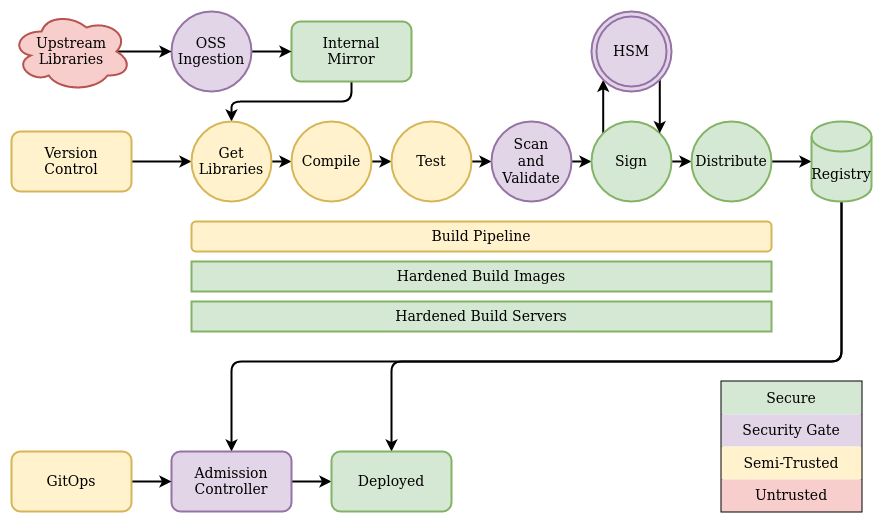
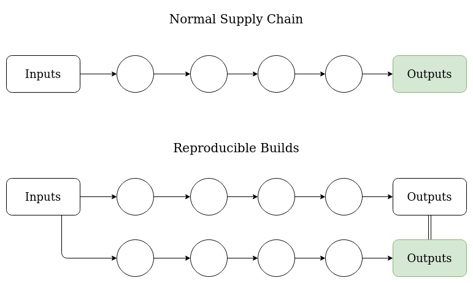
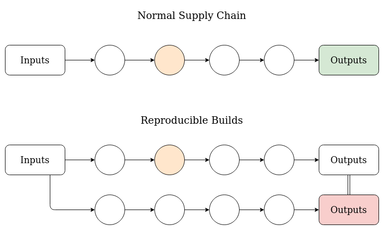

name: empty
layout: true
---
name: base
layout: true
template: empty
background-image: none
<div class="slide-footer">@sudo_bmitch</div>
---
name: ttitle
layout: true
template: empty
class: center, middle
background-image: url(img/containers_bg.png)
background-size: cover
---
name: inverse
layout: true
template: base
class: center, middle, inverse
background-image: none
---
name: impact
layout: true
template: base
class: center, middle, impact
background-image: url(img/containers_bg.png)
background-size: cover
---
name: picture
layout: true
template: base
class: center, middle
background-image: none
---
name: terminal
layout: true
template: base
class: center, middle, terminal
background-image: none
---
name: default
layout: true
template: base
background-image: url(img/containers_bg.png)
background-size: cover
---
layout: false
template: default
name: agenda

# Agenda

.left-column[
- [Intro](#ttitle)
- [What are Supply Chain Attacks](#background)
- [State of the Tooling](#tooling)
- [Reproducible Builds](#reproducible)
- [Conclusion](#summary)
]

---
layout: false
name: ttitle
template: ttitle

# State of the Secure Software Supply Chain

.left-column[
.pic-circle-70[]
]
.right-column[.v-align-mid[.no-bullets[
<br>
- Brandon Mitchell
- Twitter: @sudo_bmitch
- GitHub: sudo-bmitch
]]]
???
- My twitter and github handles are what any self respecting sysadmin does
  when you get a permission denied error on your favorite username.
- This presentation is on github and I'll have a link to it at the end.
---
template: default

```no-highlight
$ whoami
- Solutions Architect @ BoxBoat
- Docker Captain
- Frequenter of StackOverflow
```

.align-center[
.pic-30[]
.pic-30[]
.pic-30[]
]

???
- Who am I?
  - By day I'm a consultant that helps paid clients transition to containers.
  - In my downtime I answer questions on StackOverflow.
  - Helping to spread knowledge about Docker through StackOverflow and
    presentations like this was my path to the Captains program.

---

name: background
template: inverse

# What are Supply Chain Attacks

???

- Before securing the supply chain, lets recap what a supply chain attack is

---

.no-column[
# Attackers Have a Variety of Methods
]
.left-40-column[
- Physical compromise
- Phishing and social engineering
- Unpatched applications
- Zero days
- Malicious insider
- Supply chain attacks
]
.right-60-column[
  .pic[.pic-rounded-10[]]
  .center[.small[unsplash.com/photos/FXFz-sW0uwo]]
]

???

- What is a supply chain attack? First, attackers have a variety of methods
- Physical compromise or evil maid attacks
- Phishing and social engineering to get users to run malicious content
- Find patched security holes and scan for who hasn't patched (equifax)
- Zero days
- Malicious insider
- Supply chain attacks

---

.left-column[
# Supply Chain Attack

- Colonial Pipeline
- Find a soft upstream target before production
- Build servers and dependencies
]
.right-column[
  .center[.pic[]]
  .center[.small[xkcd.com/2347]]
]
???

- Physical example of this is Colonial Pipeline:
  - to impact transportation you don't attack every vehicle
  - or every gas station
  - or even the pipeline.
  - Instead you find a reused password for the VPN interface to the billing system.
- Attackers find a soft target upstream rather than compromising the target directly
- In software, rather than compromising the production servers, you can compromise the build servers or upstream dependencies
- Or as xkcd shows, you find the lone developer of openssl that every other project depends upon

---

.right-column[
  .center[.pic-70[.pic-rounded-10[]]]
  .center[.small[unsplash.com/photos/JYPDh4ter10]]
]
.left-column[
# Supply Chain Attacks in the News

- Dependency Confusion Attacks
- Various NPM library attacks
- SolarWinds
- Log4j
]
???

- Dependency confusion attacks showed up from researchers registering names in public repositories for things like Python and Node that were being used by companies internally
  - the tooling preferred those public repositories
- There have been multiple attacks on NPM and similar package managers to replace popular packages with a new version containing a trojan
  - This could be a developer turned bad, OSS developer adding a new maintainer, or a developer that themselves gets hacked (e.g. credential stuffing)
- SolarWinds attacked the build infra itself, resulting in signed malicious programs from a trusted vendor
  - Some look down on SolarWinds for getting hacked, but this was an APT that didn't want to be detected, can you say for sure you aren't already compromised by a similar attack?
- Log4j wasn't even an attack, but it shows how a vulnerability upstream ripples through
--

.left-column[
- White House Executive Order
]
???

- As a result, we've seen the White House EO to improve supply chain security
--

.left-column[
- Nothing new: Ken Thompson's 1984: Reflections on Trusting Trust
]
???

- And none of this is new, back in 1984 Thompson was asking how can we know compilers are trusted

---

.no-column[
# Securing the Supply Chain
]

.left-40-column[
- Validate inputs
- Harden build infrastructure
- Verify the process
- Signing result
- Distribution
- Admission control
]
.right-60-column[
  .pic[.pic-rounded-10[]]
]
???

- Validating the inputs
  - Multiple approvers on every commit (2 person rule)
  - Scanning and verifying external libraries/tools
- Hardening the build infrastructure
  - Build infrastructure needs to be as secure as prod
  - Solving the "lower turtle" problem
  - Builder -> CI -> Orchestrator -> OS -> Cloud -> Hardware -> Physical
- Verifying the build process
  - "How do we know you did what you said you did?"
- Signing the build result or using a transparency log
  - Often uses a long lived signing key
- Distributing artifacts
  - Including the image/binary, SBoMs, attestations, and signatures
  - Often see Content Addressable Storage and Directed Acyclic Graphs (Merkle Trees)
- Admission control: Verifying artifacts and signatures before deploying
  - Need to prevent rollback, replay, dependency confusion attacks, and malicious mirrors
  - Revoking the key or signatures can be difficult, especially for disconnected environments
    - Fail open or closed if checking the revocation status fails? Open is insecure, Closed results in outages.
    - Apple keyboards were slow after resuming a few years back trying to verify the signature hadn't been revoked

---

name: tooling
template: inverse

# State of the Tooling

???

- There's no one tool that does everything
- A lot of the tooling is under active development or only recently released

---

# SBoMs

- Software Bill of Materials
- Two standards:
  - [SPDX](https://github.com/spdx): Linux Foundation, focused on licensing
  - [CycloneDX](https://github.com/CycloneDX): OWASP, focused on security
- Should cover artifact built, dependencies, build infra, runtime infra
- Some tooling to generate, working on distributing and ingesting
- This whole space is under very active development

???

- Software Bill of Materials is basically the ingredients label for your application
- Lists all the libraries, along with a unique version for your app to later track
- Competing standards are extending into each other
  - SPDX started with licensing, adding security
  - CycloneDX started with security, adding licensing
- You don't just want an SBoM for your artifact/image, you also want one for the build infrastructure, you'll have them for every dependency you ingest, and particularly for a SaaS, you'll have them for your runtime infrastructure
- It's not just generating the SBoM, you need to distribute it and use it, and those are very much under development
  - SBoMs themselves should be static/reproducible, but a vulnerability scan using the SBoM data may change as new vulnerabilities are discovered, and it does us no good if we don't have a way to get the SBoMs to the scanners or if we don't have scanners that use SBoM data
  - SBOMs are what we need to say "where is Log4j in this org?"

---

# Attestation

- Verifying truth and authenticaty
- [in-toto](https://github.com/in-toto/in-toto): verify each build step was performed, development
- [Spiffe/Spire](https://github.com/spiffe/spire): verify trust in the agents and workloads, stable

???

- Attestation is a way to verify truth and authenticity
- in-toto
  - Syntax for attesting each build step, and then verifying all needed attestations are provided
  - Does not protect against malicious attestor, or compromised build node
  - There's a lot of enhancement requests that would dramatically alter this project
  - python, golang, and the spec frequently go out of sync
- Spiffe/Spire
  - Provides short term keys to attested agents and workloads
  - Agents could be attested to server by Hardware (TPM/HSM/TEE), Cloud APIs, or other methods. Given SVIDs for associated workloads
  - Workloads attested to Agent with OS (pid), K8s, docker, and similar. Given their individual SVID (x509 cert or JWT token)

---

# Signing

- KMS and HSM
- [Vault](https://www.vaultproject.io/): transit plugin gives a software equivalent to HSMs
- [TUF](https://github.com/theupdateframework): framework for signing, stable
- [Cosign](https://github.com/sigstore/cosign): image and artifact signing, early stable
- [Rekor](https://github.com/sigstore/rekor): transparency logs, development
- [Notary v2](https://github.com/notaryproject/notaryproject): signs artifacts, design/prototype

???

- KMS: key management service
  - often provided by clouds to perform signing without exposing private keys
- HSM: hardware security module
  - physical way to secure keys, see also TPM
- Vault (Hashicorp)
  - Secrets management platform
  - Transit plugin turns vault into a KMS
  - Vault conveniently integrates with OIDC for auth which can be provided by Spire
- TUF - The Update Framework
  - Used for securely pushing software updates in multiple ecosystems
  - Prevents rollback, replay, fast forward, and similar attacks
  - Handles revoking of keys and signatures
  - Hierarchical set of keys with different roles (root, target, snapshot, timestamp)
  - Hierarchical metadata being signed with each key (each target, multiple targets assembled into snapshot, snapshots are timestamped)
- Cosign
  - Google/sigstore project for image signing
  - Pushes signed data to registry as separate tag
  - Also integrates with their Rekor project for transparency logs / time stamping
  - The 1.0 release feels rushed, still a lot of big features being developed (changing signature contents, signature envelope, and multiple signatures doesn't have a good workflow)
- Rekor
  - Google/sigstore transparency log
  - Allows build tooling to push immutable tamper resistent entries that can be later queried
  - Not 1.0, public instance is not stable, no SLO, periodically reset without notice
- Notary v2
  - History: Notary v1 not adopted by the community
    - usage was client side (not server enforced)
    - client side had a poor on-boarding experience (first unsigned image typically resulted in it being disabled)
    - resulted in an alternate view of image tags (may not align with latest unsigned tags)
    - trust on first use means trust on every use when your nodes are ephemeral
  - Moving signing data into OCI registry, likely with OCI artifacts + reference type
  - Ability to copy artifacts and signatures between registries
  - Support for disconnected environments
  - Still in design and prototype phase
  - Driven by MS/AWS, requires a custom forked registry, works with Azure

---

# Admission Control

- [OPA/Gatekeeper](https://github.com/open-policy-agent/gatekeeper), stable
- [Kyverno](https://kyverno.io/), stable
- [Connaisseur](https://github.com/sse-secure-systems/connaisseur), stable

???

- OPA/Gatekeeper
  - Open Policy Agent with their Rego language provides a way to verify policies
  - Gatekeeper applies OPA as a Kubernetes admission controller
  - Functionality being added for image signing
- Kyverno
  - Another admission controller that works with yaml files instead of the Rego DSL
  - sigstore/cosign is adding a webhook (cosigned) to make integration easier
- Connaisseur
  - Focused on just verifying image signing regardless of how images were signed (nv1, cosign, nv2 is planned)

---

# Related Projects / Groups

- [OCI](https://github.com/opencontainers/), stable with new development
- [CNCF Security TAG](https://github.com/cncf/tag-security) and Supply Chain WG
- [OpenSSF](https://openssf.org/)
- [SLSA](https://github.com/slsa-framework/slsa)

???

- OCI
  - Transitioning from a follower, defining standards for what Docker already created, to a leader, creating new standards
  - Image and Distribution specs are 1.0
  - Artifacts
    - syntax for pushing non-images to a registry
    - not supported by every registry, in particular, Docker Hub
    - needs to be extended to handle artifacts that don't look like images (config + layers)
  - Reference Types
    - still in development
    - would allow signatures to define their association with a parent image manifest
    - multiple signatures could be pushed per image and queried
- CNCF Security TAG and Supply Chain WG
  - White paper produced on Secure Supply Chain Best Practices
  - Now working on a Secure Software Factory Reference Architecture
- OpenSSF
  - Linux Foundation, Open Source Security Foundation
  - Multiple working groups for improving security
- SLSA (Supply chain Levels for Software Artifacts) (from Google)
  - Creating tiers for documenting the security of each artifact
  - From scripted builds and dependency provenance (1) to two person review with hermetic reproducible builds (4)
  - Newer project (June 2021), considered alpha

---

name: reproducible
template: inverse

# Reproducible Builds

???

- One other key area to look at in SSC is reproducibility

---

class: center,middle

# Hardened Supply Chain vs Reproducible Builds

.pic-80[.pic-rounded-10[]]

???

- Reproducible builds take a normal supply chain, and repeat it in a different environment
- The outputs should be identical, though this is difficult
  - Timestamps
  - Externalities (`:latest`, `apt-get update`)
  - Host dependencies (much easier when host is a pinned container image)

---

class: center,middle

# Hardened Supply Chain vs Reproducible Builds

.pic-80[.pic-rounded-10[]]

???

- Hardened chain has lots of links, any one link fails can corrupt the result
  - There's always a lower turtle, CI image, K8s admin, OS, Hardware, Physical
- Reproducible requires an attacker to perform the same compromise to each builder
  - If we're talking OSS, that means compromising builders in completely different organizations
  - Assumes attacker doesn't compromise common build tooling used by each reproducible builder
  - Therefore you'll want to bootstrap, the tooling should be reproducible, and inputs validated

---

# Reproducible Builds

- [reproducible-builds.org](https://reproducible-builds.org)
- Nix
- Bazel
- Buildpacks

???

- Reproducible Builds website is a great resource for what's needed
- Various projects:
  - Nix
  - Bazel
  - Pants
  - Buildpacks
  - Kaniko
- A big challenge is redesigning builds around reproducible tooling, most don't use Dockerfiles
- I've been looking at ways to take a standard Dockerfile and make it reproducible

---

name: summary
template: inverse

# Wrapping Up

???

- In summary...

---

# Wrapping Up

- This was not an exhaustive list
- Secure supply chains are a complex process
- Multiple tools need to integrated
- Many of them are still being developed
- Help wanted

???

- This presentation attempted to hit many of the popular OSS tools, but couldn't cover them all
- Building a secure supply chain is a complex process
- There are a lot of tools that need to work together
- Many of them are under active development and are looking for contributors
- Unlike the orchestrator and service mesh competitions, there are going to be multiple winners

---

template: title
name: thanks

# Thank You

.no-bullets[
- github.com/sudo-bmitch/presentations
]

.content[
.left-column[
.pic-80[]
]
.right-column[.align-right[.no-bullets[
<br>
- Brandon Mitchell
- Twitter: @sudo_bmitch
- GitHub: sudo-bmitch
]]]
]

???

- These slides are available online in my git repo, the link is there and the QR code will take you there too
