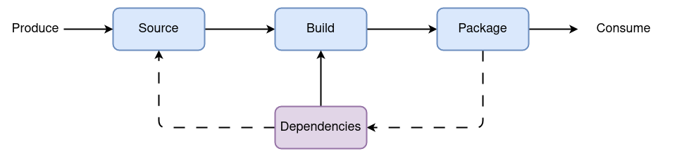
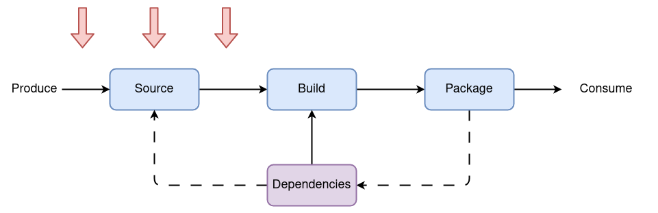
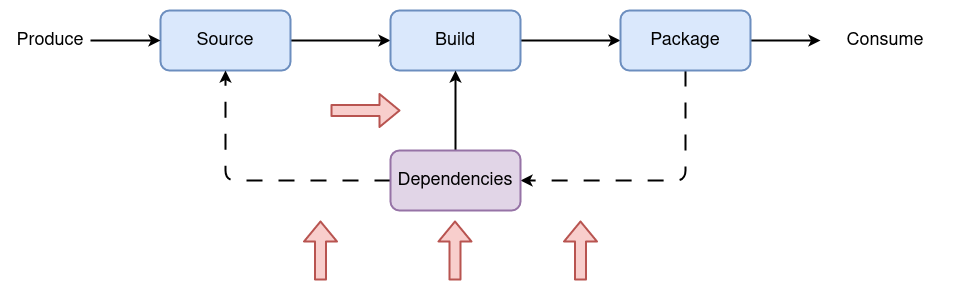
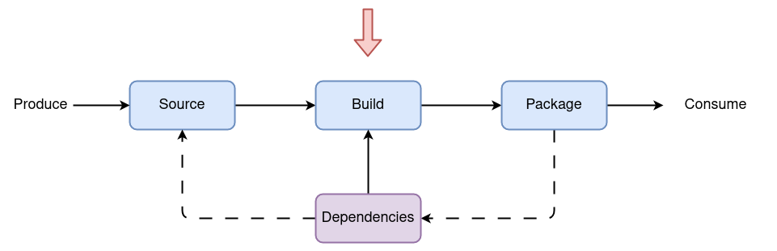
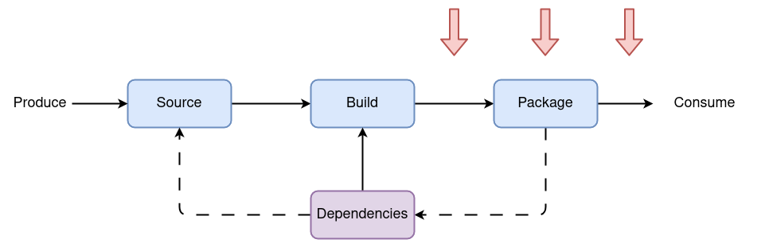

name: empty
layout: true
---
name: base
layout: true
template: empty
background-image: none
<div class="slide-footer">@bmitch@fosstodon.org</div>
---
name: ttitle
layout: true
template: empty
class: center, middle
background-image: url(img/containers_bg.png)
background-size: cover
---
name: inverse
layout: true
template: base
class: center, middle, inverse
background-image: none
---
name: impact
layout: true
template: base
class: center, middle, impact
background-image: url(img/containers_bg.png)
background-size: cover
---
name: picture
layout: true
template: base
class: center, middle
background-image: none
---
name: terminal
layout: true
template: base
class: center, middle, terminal
background-image: none
---
name: default
layout: true
template: base
background-image: url(img/containers_bg.png)
background-size: cover
---
layout: false
template: default
name: agenda

# Agenda

.left-column[
- [Source](#source)
- [Dependencies](#dependency)
- [Build](#build)
- [Packaging](#package)
- [Tools](#tools)
- [Next Steps](#next-steps)
]

---
layout: false
name: ttitle
template: ttitle

# Blueprint for the<br>Secure Software Supply Chain

.left-column[
.pic-circle-70[]
]
.right-column[.v-align-mid[.no-bullets[
<br>
- Brandon Mitchell
- Mastodon: @bmitch@fosstodon.org
- Twitter: @sudo_bmitch
- GitHub: sudo-bmitch
]]]
???
- My twitter and github handles are what any self respecting sysadmin does
  when you get a permission denied error on your favorite username.
- This presentation is on github and I'll have a link to it at the end,
  I'll be going fast so don't panic if you miss a slide.
---
template: default

```no-highlight
$ whoami
- Brandon Mitchell
- Solutions Architect @ BoxBoat, an IBM Company
- OCI Maintainer, regclient, Docker Captain
- StackOverflow, CNCF, OpenSSF
```

.align-center[
.pic-30[]

.pic-30[]

.pic-30[]
]

???

- Who am I?
  - By day I'm a consultant that helps paid clients transition to containers.
  - I'm also a maintainer for OCI and a Docker Captain.
  - In my downtime I developer some side projects like regclient, answer questions
    on StackOverflow, and I'm often seen on CNCF and OpenSSF meetings

---

template: inverse

# Software Supply Chain

???

- This is focused on supply chain security, which encompasses a lot

---

class: center,middle
# From Commit to Deploy

.pic-80[.pic-rounded-10[]]

???

- It stops short of the code itself and hardening the production environment
- It covers everything after the code is written until it gets deployed in prod
- For development, look towards OWASP for secure coding practices
- For production, look towards CIS benchmarks, NSA guidelines, and other hardening guides from various tools
- Developers produce code on the left, push the source to a VCS (Git) server, build it in CI, push to an artifact repo (registry), and it's consumed by production
- On the bottom is the return flow of dependencies from other builds, we ingest external dependencies, include them in our builds, and select (hopefully pin) those dependencies into our source

---

template: inverse
name: source

# Source

???

- Lets start with the source

---

class: center,middle
# Source Attacks

.pic-80[.pic-rounded-10[]]

???

- Lastpass was hacked by going after employee's home machine
- Attacks here are focused on the commit to the VCS (Git) server
- A compromised developer system may have the code changed on commit
- A compromised VCS server could allow malicious commits to be injected
- Checkout from the build server could be tampered

---

# Source Security

- Secure developer environments
- Signed commits
- Two-person review of merge requests
- Verify commit hashes
- SAST scanners
- Shift-left

???

- Developer security: don't develop from a compromised machine, isolate work from personal, avoid phishing, patch
- Signed commits with a gpg/ssh key and/or 2fa, higher confidence they came from a developer
- Branch protection + two person review gets multiple people verifying every change
- Build servers should be checking out specific hashes to avoid race conditions
- SAST scanners prevent bad coding practices from being released
- Shift-left means give the developers:
  - access: to create environments
  - visibility: to security issues
  - not responsibility: still need ops and sec teams

---

template: inverse
name: dependency

# Dependencies

???

- Next, lets look at where a vast majority of the code we build comes from, I'd estimate >90%

---

class: center,middle
# Dependency Attacks

.pic-80[.pic-rounded-10[]]

???

- Left-pad, upstream maintainer deletes their package
- Typo-squatting, pushing dependencies with a similar name "requests" vs "request"
- AI "hallucination" attacks, registering made up packages suggested by copilot
- Dependency confusion attacks, targeted at a company, discover an internal name and register that in a global package repo
- Malicious OSS dev, takeover maintainer role (volunteer, discarded email domain), pushes a bad release
- Log4j, software has vulnerabilities that need to be patched, still lots of projects building from vulnerable log4j releases

---

# Dependency Security

- Ingest dependencies and scan
- Ingest SBOMs and SLSA attestations
- Vulnerability scanners
- Pinned dependencies

???

- S2C2F (secure supply chain consumption framework) is focused here
- Running your own artifact repo protects from upstream deletions
- Scan before making it available
- Avoid slowing the release of upstream patches
- Private artifact server allows better network isolation on build server (egress rules)
- Attestations tell you the provenance of a dependency, identify the source
- SBOMs are the ingredients label for software, listing dependencies (does this contain log4j?)
- Vulnerability scanners help discover those vulnerabilities
- Pinned dependencies to control upgrades and improve reproducibility, you don't want "from latest"
- Ensure you have a method to update those pins, do not want to miss security updates (dependabot, renovate, `go get -u -t ./...`, sudo-bmitch/version-bump)
  - Not just the `go.mod`, it's also Makefile, Dockerfile, shell scripts

---

template: inverse
name: build

# Build

???

- Now for the place so many focus on, the build environment

---

class: center,middle
# Build Attacks

.pic-80[.pic-rounded-10[]]

???

- SUNBURST, attack on SolarWinds
  - Build server was compromised, changes injected while the compiler was running
- Hacked Jenkins servers for credentials

---

# Build Security

- Hardened build environments
- Unforgeable provenance
- Ephemeral and isolated builders
- Generate Attestations, SBOMs, VEX reports
- Hermetic
- Reproducible

???

- SLSA 1.0 (supply chain levels for software artifacts) focused on the build environment
- Treat the build environment like prod, because prod trusts it
  - Hardened, limited access
  - Trusted boot / TPM / Confidential compute
- Unforgeable provenance: Secrets for generating provenance should not be able to be extracted by a malicious build and reused
  - do not mount passwords and signing keys in build pipelines, two options
  - Like Lets Encrypt: cosign keyless uses OIDC to prove identity, fulcio for short lived key, rekor for transparence log
  - Do all signing by an external observer (Tekton Chains), KMS (Cloud or Vault Transit), HSM
- Use containers for builders
  - Ephemeral so one build doesn't influence a later one
  - Isolated to one build doesn't influence a concurrent one
- Produce build provenance (attestations) that can be verified by others
- Provide SBOMs to document commit and dependencies, used by vulnerability scanners
- VEX (vulnerability exploitability exchange) is used to indicate what discovered vulnerabilities are exploitable
  - VEX reports are living, updated as exploits are discovered, while build SBOMs and Attestations should be static
  - Some VEX findings can be programmatically reported, e.g. if a vulnerable method is never called, or user input data never reaches a function
- Hermetic runs without network access, isolated from internet
  - Partial solution with CAS hash pinning or limit to self hosted artifact repository
- Reproducible should be verified in a separate trust zone (client, separate cloud builder)
  - Difficult to implement (timestamps, env, paths, hostnames)
  - Difficult to attack directly (coordinated breach)
  - Moves attack risk upstream (compiler image, dependencies, source code)
  - Partial solution with semantically equivalency, bits changed, but changes are all expected

---

template: inverse
name: package

# Package

???

- Once built, we need to ship it

---

class: center,middle
# Package Attacks

.pic-80[.pic-rounded-10[]]

???

- Leaked passwords or compromised accounts allow attackers to push their own packages
- Package mirrors are attacked to serve malicious code, or replay old versions with vulnerabilities
- Typosquatting on similar names, `eocker.io`

---

# Package Security

- Content Addressable Store
- Signing
- Version Pinning

???

- Container registries and git are content addressable, name of the content is hash of that content + merkle tree
- sigstore/cosign (or notation) to prove artifact was generated by the builder you trust
- Signing key/credential should only be accessible by the builder (keyless+OIDC, or KMS/HSM)
- Validate the signature, not with TOFU, since TOFU always trusts on ephemeral nodes
- With reproducible builds, validate multiple signatures for same artifact
- Pinning to a hash is best, and to immutable tags is second best

---

# Production

- Harden Infrastructure
- In GitOps, Git is Production
- Admission Controllers
- Vulnerability Scanning

???

- For hardening production, look towards CIS benchmarks, NSA guidance, CNCF Security TAG white papers
  - Limit who has access (authentication) and what they can do (authorization)
  - Observability: monitoring, logging, tracing
  - Network isolation: both ingress and egress
- When controlling access with GitOps, that Git repo is your production access
  - Anyone with access to push to the git repo is potentially a cluster admin
  - Same for VCS, dependency ingestion, and build servers, they're all production
- Admission controllers can limit what is deployed, check signatures, pin images, assist with multi-tenancy
  - sigstore/policy-controller, kyverno, OPA/gatekeeper
  - CRI-O is also adding signature verification to runtime directly
- Vulnerabilities are discovered after software is deployed, this is why we need SBOMs and VEX reports
  - This is also why we need a database of this metadata, e.g. Dependency Track and GUAC
  - Do not blindly block the deploy of vulnerable software, compare to what is currently deployed (may solve 2 of 3 existing production issues)
  - Need a way to defer fixes without permanently ignoring issues, this is for pruning unmaintained prod apps
  - VEX is used to permanently ignore non-issues

---

template: inverse
name: tools

# Tools

???

- Lets get into the tech

---

# Tools

- Best Practices Badge: self assessment
- Scorecard: reviews GitHub configuration and source code issues
- Sigstore: signing binaries, container images, attestations, and other artifacts
- SLSA Github Generator: GHA for building with SLSA provenance
- GUAC: Graph for Understanding Artifact Composition
- FRSCA: Factory for Repeatable Secure Creation of Artifacts
- Sterling Toolbelt

???

- Best Practices Badge: self assessment, go through a web form to review a project to get a badge
- Scorecard looks for binary artifacts, branch protection, CI, code review, fuzzing, pinning, sast
  - action or standalone binary/container
- sigstore includes cosign, policy-controller, fulcio, and rekor
  - policy-controller, is a nice admission controller for verifying signatures
- SLSA Github Generator: include their GHA in your workflow, runs a set of complex jobs to build the app with signed SLSA provenance, and the GH token / identity when you are in an include is the SLSA generator repo itself, allowing others to verify the signature is from a trusted pipeline
- GUAC: in development, Graph DB that ingests SBOMs, attestations, etc for complex queries
- FRSCA is an attempt/example to implement the SLSA requirements
- Sterling Toolbelt (fmr Toolchain): attempting to tie together the various tools, less opinionated follow on to FRSCA, likely to focus on integration than implementation

--
- Everyone of these tools is under OpenSSF

???
- These are all OpenSSF projects, part of LF, just like CNCF
  - Open Source Security Foundation, not cloud specific

---

# OWASP Tools

- Dependency Check: SCA looks for common vulnerabilities
- ZAP: DAST tool for web sites
- Dependency Track: ingest and query SBOMs

???

- OWASP: Open Worldwide (fmr Web) Application Security Project
  - Strong web focus from their history
  - Many of the tools are Java and feel a bit bloated/stale
  - Their Top-10 lists are highly quoted, and worth reviewing
  - Lot of focus on training developers, less on tools
- Dependency Check is a SCA (Software Composition Analysis), bit like a SAST, for finding known CPE's, Java focused (ANT, Maven, Jenkins)
- ZAP (Zed Attack Proxy) is used to craw websites looking for vulnerabilities, train it via a proxy with your browsing
- Dependency Track, bit of a bloated Java app to manage data from SBOMs

---

# CNCF Tools

- Networking / Service Mesh: Istio, Linkerd, Envoy, Cilium
- SPIFFE / SPIRE: Secure Production Identity Framework for Everyone / SPIFFE Runtime Environment
- Tekton Chains: SLSA Observability of Tekton Pipelines
- Notary: image signing
- TUF: The Update Framework
- in-toto: Attestation format
- Admission: Open Policy Agent (Gatekeeper) and Kyverno
- Runtime: Falco
- Observability: Prometheus, OpenMetrics, Fluentd, OpenTelemetry, Jaeger

???

- CNCF tools lean towards production hardening
- Service Meshes are so last year, but still useful to harden prod networking
- SPIFFE is the spec, SPIRE is the implementation, short lived identity tokens for machines/apps
- Chains: don't put access to signing inside the pipeline itself, run as an external observer
- Notary: finally releasing the notation project (fmr Notary v2), AWS/MS/Docker partnership
- TUF: hierarchical set of keys and a format for signed metadata, complex and mostly an implementation detail users don't want to see
  - Sigstore opted for KMS or short lived keys based on an identity as the preferred options
- in-toto has a format for defining attestations, materials, command, product
  - in-toto attestations prove that someone with the key signed a claim, be careful to not assume too much
- OPA is more flexible but less focused on K8s
- Kyverno is a pain to upgrade (kubectl apply throws errors for too many attestations)
- Falco: Sysdig project for monitoring syscalls (exec, file open, network connect)
- Observability: important for hardening production, metrics, logs, and traces

---

# More Tools

- Vulnerability Scanners: Anchore, Blackduck, Clair, Scout, Snyk, Trivy
- Vault: Hashicorp Secrets manager
- KMS / Vault Transit: Secure key storage
- eBPF: Linux kernel extension without modules

???

- There are lots of vulnerability scanners, many commercial, each maintaining their own DB (hence the cost)
- Vault with short lived secrets is a nice model, there's a way to inject these in k8s, but better if the app is natively updating itself
- KMS: don't ever give out the private key, give access to that key to trusted identities
- eBPF is becoming the preferred foundation for runtime security, detect processes executed, files opened, network connections created

---

# Standards

- SLSA: Supply Chain Levels for Software Artifacts
- S2C2F: Secure Supply Chain Consumption Framework
- SPDX: SBOM format from LF
- CycloneDX: SBOM format from OWASP
- VEX: Vulnerability Exploitability Exchange
- OSV: Open Source Vulnerability Database
- OCI Referrers: Associate metadata with container images

???

- SLSA: from Google, defines requirements for levels of artifact security + an attestation format based on in-toto
- S2C2F: from MS, focuses on ingesting dependencies, getting less traction
- SBOMS:
  - SPDX: from LF, started with licensing, working on a 3.0 release with modular spec
  - CycloneDX: from OWASP, first focused on vulnerabilities, becoming a kitchen sink
  - Consumers will likely have their own preferences, and producers will want to support both
  - My concern: mixing mutable vulnerability data with static SBOM data
- VEX:
  - VEX itself is NIST/CISA effort
  - OpenVEX is a minimal implementation, from Chainguard under OpenSSF
  - scanners can query an SBOM to report vulnerable package is included
  - VEX indicates if the app is vulnerable, is the code called, with input that would trigger an exploit
- OSV: a spec, a public DB, and a scanner for OSS issues
- OCI: Referrers API allows various metadata to be associated with container images on a registry
  - distribution is a significant issue for most artifact sources, how do you get an SBOM for an alpine package or NPM library?

---

template: inverse
name: next-steps

# Next Steps

???

- Lets talk about next steps

---

# Next Steps

- Good news:
  - Lots of tooling exists
  - Secure your own projects

???
- Definitely take the time to update your own projects with secure solutions

--
- Bad news:
  - Work in progress
  - Help wanted

???
- So much of this is under very active development and help is wanted
  - Projects like OpenVEX and GUAC were recently donated to OpenSSF
  - Sterling Toolbelt is getting started
  - Distribution (how to lookup metadata from various artifact sources - npm, pip, deb, rpm, etc) is an open challenge
  - Much of this is under OpenSSF, there's also CNCF TAG Security, K8s SIG-Security, OWASP, and other OSS projects

---

class: center,middle

# Software Supply Chain

.pic-80[.pic-rounded-10[]]

???

- Make sure you cover the full end-to-end

---

template: title
name: thanks

# Thank You

.no-bullets[
- github.com/sudo-bmitch/presentations
]

.content[
.left-column[
.pic-80[]
]
.right-column[.align-right[.no-bullets[
<br>
- Brandon Mitchell
- Mastodon: @bmitch@fosstodon.org
- Twitter: @sudo_bmitch
- GitHub: sudo-bmitch
]]]
]

???

- These slides are available online in my git repo, the link is there and the QR code will take you there too
